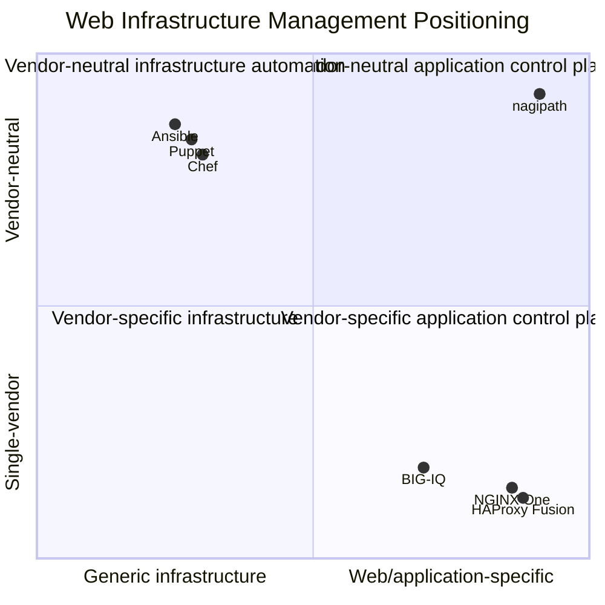
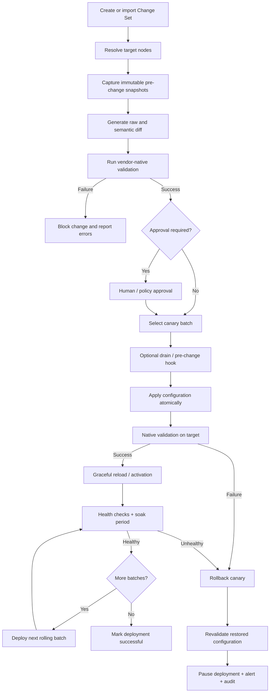
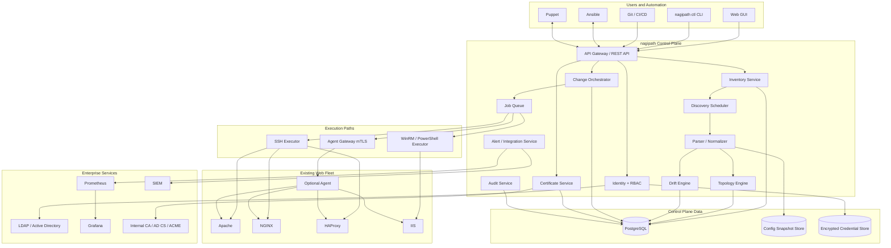
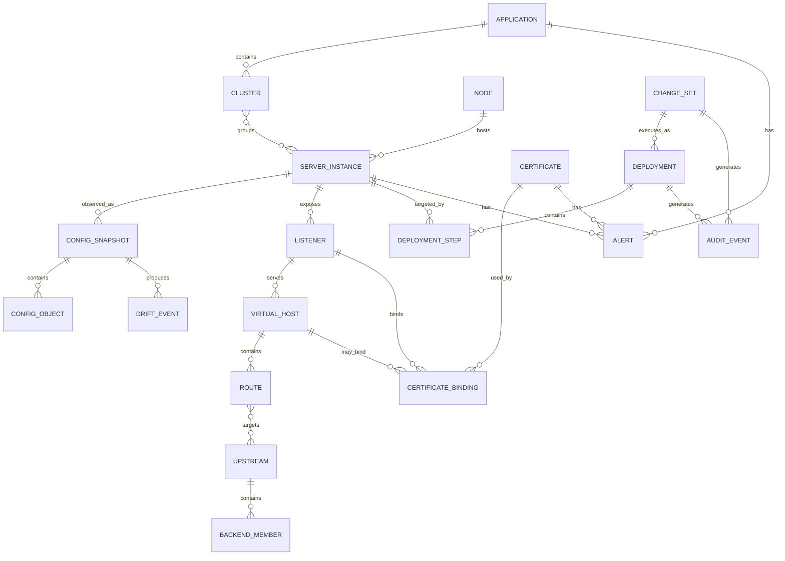
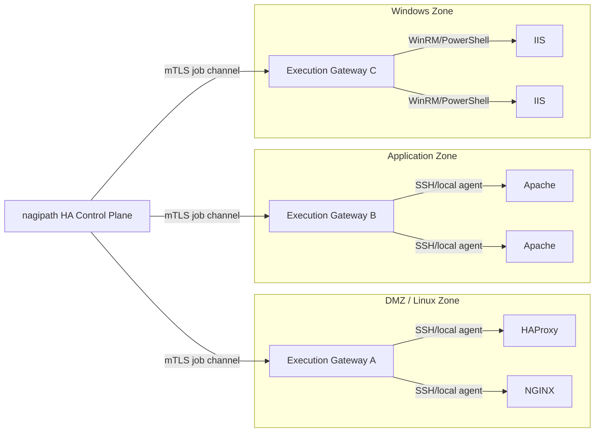
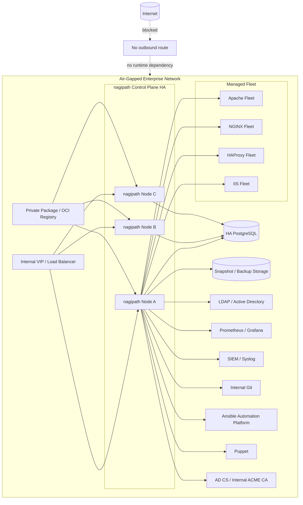
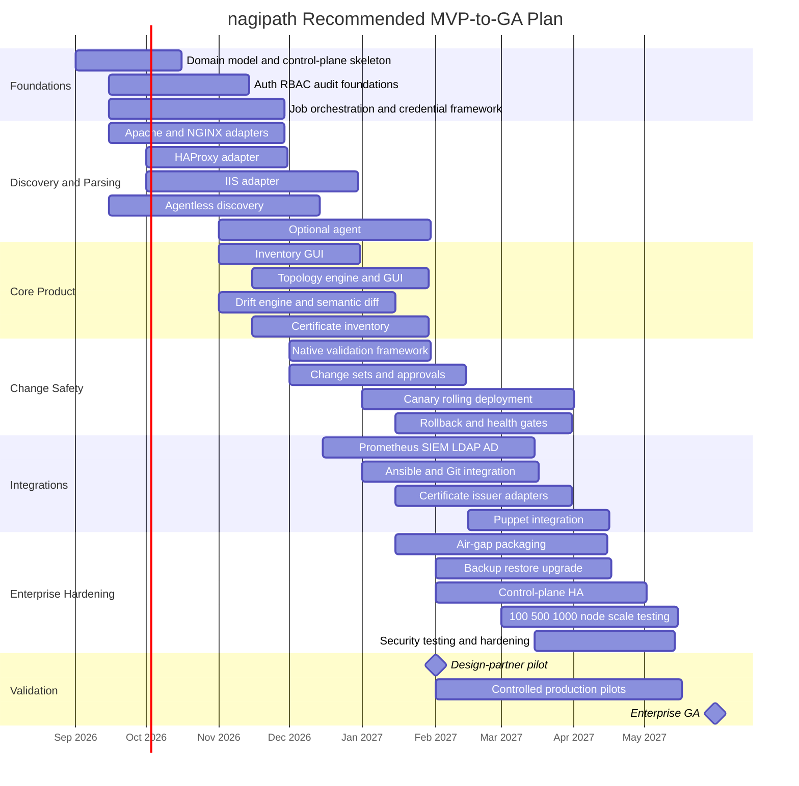
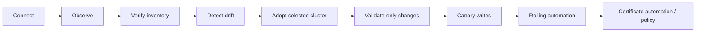

# Product Requirements Document — Web Server Fleet Control Plane

**Working product name:** nagipath
**Document type:** Analytical Product Requirements Document  
**Research date:** August 21, 2026  
**Target deployment:** Fully on-premises, including disconnected and air-gapped environments  
**Target fleet:** Apache HTTP Server, NGINX, HAProxy, and Microsoft IIS  
**Target organization:** Mid-to-large enterprises; design envelope analyzed through approximately 1,000 managed nodes  
**Primary users:** Sysadmins, SREs, infrastructure/platform engineering teams  
**Product posture:** Vendor-neutral control plane that integrates with Ansible, Puppet, Git, CI/CD, Prometheus, Grafana, and enterprise identity/security systems rather than replacing them

> **Status: market research, not the build plan.**
>
> This document predates the design decisions and sizes the opportunity for a funded team. Its market analysis, competitive matrix, parsing research and evidence base still stand. Its **scope, architecture, timeline, packaging and organisational assumptions do not** — they describe an 8–12 engineer, four-vendor, read-write product, and nagipath is being built by one part-time engineer as a read-only three-vendor tool on a single binary with an embedded datastore.
>
> For what is actually being built, read in this order: **[PRD-V1.md](PRD-V1.md)** (scope and plan), **[CONTEXT.md](CONTEXT.md)** (vocabulary), **[docs/adr/](docs/adr/)** (locked decisions and why), **[docs/OPEN-DECISIONS.md](docs/OPEN-DECISIONS.md)** (what is deliberately unresolved). Where this document and those disagree, those win.

## Executive summary

### Product thesis

There is a credible product gap between **vendor-specific web infrastructure control planes** and **generic configuration-management platforms**.

HAProxy Fusion provides a modern self-hosted GUI/API for managing HAProxy Enterprise fleets, including multi-cluster operation, configuration management, metrics and role-based control, but it is explicitly centered on HAProxy Enterprise. citeturn17view0turn17view3 NGINX One provides centralized configuration, metrics, vulnerability visibility, certificate status and fleet management for NGINX, but its console requires access to F5 Distributed Cloud and its agent sends management and telemetry information to that control plane. citeturn17view1turn17view2 F5 BIG-IQ provides centralized discovery, configuration, monitoring, backup and lifecycle management for BIG-IP appliances, again within F5's ecosystem. citeturn16search6turn16search0

Generic products solve a different layer. Red Hat Ansible Automation Platform provides inventories, automation execution, RBAC, APIs and disconnected deployment, while Puppet offers desired-state enforcement, drift correction, agent and agentless approaches, scripts/process integration and enterprise RBAC. citeturn16search1turn16search3turn16search9turn21view4 They are valuable integration partners, but neither presents Apache, NGINX, HAProxy and IIS as a single **application-delivery topology with first-class virtual hosts, listeners, routes, upstreams, TLS bindings, certificates, health gates and safe web-server rollout semantics**.

The proposed product should therefore not be positioned as “another Ansible” or “a better Webmin.” It should be positioned as:

> **The vendor-neutral control plane for long-lived web-server fleets: discover what is running, understand how traffic flows, detect drift, rotate certificates, and make validated changes safely—without replacing the automation already in place.**

This is supported by real-world migration evidence. Dartmouth's HAProxy migration retained its existing YAML manifests, Git repositories, Jenkins pipeline and Ansible playbooks while inserting HAProxy Fusion as the centralized deployment API; its published case study describes more than 1,100 existing structured load-balancer manifests and a workflow deliberately designed to preserve platform independence. citeturn17view4turn17view5 That pattern should be treated as a design requirement: **enterprises will frequently prefer adoption over replacement**.

### Recommended product strategy

The product should follow four principles.

**Read first, write safely.** Initial onboarding must be useful without assuming configuration ownership. Discovery, topology, certificate inventory and drift detection should work in read-only mode. Write automation is enabled only after an administrator explicitly adopts a server or application into a managed change policy.

**Normalize without destroying native configuration.** Apache, NGINX, HAProxy and IIS have materially different configuration models. The platform should build a normalized semantic model but preserve every original file, directive, XML element and unknown/custom extension. The native server binary or native management interface remains the final validation authority. Apache provides `configtest`, NGINX provides `nginx -t`, and HAProxy provides `haproxy -c`; IIS provides native configuration backup/restore and administration interfaces such as AppCmd and PowerShell. citeturn18search0turn18search1turn18search2turn19search0

**Treat existing automation as a peer.** Git, Ansible and Puppet must be modeled as potential systems of record instead of enemies. Changes originating outside nagipath should produce drift events, links to the responsible Git commit or automation job where available, and configurable reconciliation choices: observe, alert, export/PR, or enforce.

**Air-gap must be architectural, not an SKU checkbox.** The product must run with zero mandatory internet egress, use offline license activation, support importable signed update bundles, and integrate with local LDAP/Active Directory, SIEM, Prometheus, Git and certificate authorities. This is meaningfully differentiated from NGINX One's current F5 Distributed Cloud dependency. citeturn17view1 Red Hat's explicit support for disconnected Ansible Automation Platform deployments demonstrates that enterprise infrastructure software can—and often must—support this operating model. citeturn16search3turn16search17

### Recommended MVP

The recommended enterprise MVP should support all four target server families for **discovery, inventory, configuration snapshots, semantic parsing, topology, drift and certificate inventory**. Controlled change execution should support a defined compatibility matrix rather than claiming arbitrary configurations.

The MVP should include:

| Capability | MVP recommendation |
|---|---|
| Discovery | SSH, WinRM/PowerShell, imported inventory; optional lightweight agent |
| Vendors | Apache 2.4, supported NGINX OSS/Plus branches, supported HAProxy branches, supported IIS/Windows Server generations |
| Inventory | Server/version/modules, listeners, vhosts/sites, routes, upstreams/pools, certificates, service state |
| Configuration | Immutable raw snapshots plus normalized semantic representation |
| Topology | Listener → vhost/site → route → upstream/backend → member graph |
| Drift | Live-vs-baseline, node-vs-cluster, version/module and certificate drift |
| Change workflow | Diff → native validation → approval → canary → health gate → rolling rollout → rollback |
| Certificates | Inventory, binding mapping, expiration alerts; issuance adapters begin with internal ACME/AD CS/manual CSR |
| Observability | Basic health + product metrics; Prometheus integration rather than attempting to replace Prometheus |
| Security | LDAP/AD, local break-glass account, scoped RBAC, approval rules, append-only audit trail and SIEM export |
| Offline | No mandatory egress, offline licensing, signed update bundles, local repositories/private registry |
| Integrations | Git, Ansible Automation Platform/AWX, Puppet, Prometheus, Grafana, SIEM/webhooks |
| Control plane | REST/OpenAPI API, CLI, backup/restore and production HA |
| Scale qualification | Certification at 100, 500 and 1,000 managed nodes |

A credible schedule is approximately **nine months to enterprise GA**, assuming a cross-functional team of roughly 8–12 engineers plus product/design, with controlled customer pilots beginning around month five. This is a planning assumption, not an external benchmark.

### Why certificate lifecycle should be a first-class wedge

Certificate management is becoming more operationally important rather than less. Under the current CA/Browser Forum Baseline Requirements, publicly trusted TLS certificates issued on or after March 15, 2026 have a maximum validity of 200 days; the approved schedule moves to 100 days from March 2027 and 47 days from March 2029. citeturn15search2turn15search3

That makes “find every certificate and every binding” increasingly valuable. nagipath should therefore treat a certificate as a graph object connected to listeners/sites and nodes, rather than merely another file in `/etc/ssl`.

### Core business opportunity

The strongest initial customer profile is not an organization with a homogeneous, freshly designed NGINX fleet. Such an organization already has credible vendor-specific choices. The better ICP is:

> **An enterprise with 50–1,000 long-lived Linux and Windows web servers, multiple web-server vendors, some combination of Ansible/Puppet/scripts/manual configuration, private PKI, strict network segmentation, and no appetite for a wholesale platform migration.**

The moat is not the ability to edit `nginx.conf`. It is building a reliable **cross-vendor semantic inventory and change-safety layer** over infrastructure that enterprises cannot easily replace.

## Market, users, and competitive context

### Market problem and evidence

Web infrastructure management is fragmented along two axes.

On one side are specialized control planes. HAProxy Fusion describes itself as a self-hosted control plane for centralized HAProxy Enterprise lifecycle management, including on-premises and cloud instances, multi-cluster management and more than 150 metrics. citeturn17view0 Its configuration workflow includes validation, snapshots, diffs, rollback, RBAC, audit logging and API access—the exact pattern that validates demand for an infrastructure-specific management plane. citeturn17view3

NGINX One similarly centralizes NGINX fleet configuration, metrics, CVE identification, SSL certificate status and real-time alerts. citeturn17view1 Its lightweight agent supports remote configuration deployment, verification and observability, including an embedded OpenTelemetry Collector. citeturn17view2

On the other side are general automation products. Ansible Automation Platform supports enterprise inventories, controller APIs, webhooks, RBAC and disconnected deployment, while Puppet explicitly emphasizes consistent configuration, desired-state enforcement and configuration correction across large server environments. citeturn16search1turn16search9turn21view4

The whitespace is therefore not “centralized management” in the abstract. The whitespace is **centralized, web-server-specific management across vendors**.

A search of the major products reviewed for this PRD did not identify a comparably mature product whose primary abstraction simultaneously covers Apache HTTP Server, NGINX, HAProxy and IIS. That is a research inference rather than proof that no niche product exists.

Operator evidence is directionally consistent with this fragmentation. Public Server Fault discussions show administrators combining Apache/NGINX with Ansible and dealing separately with certificates and per-vhost configuration; another discusses automating multi-site NGINX, certificate renewal and related tasks through Ansible. These posts are anecdotal, not statistically representative, but they illustrate the operational stack the product needs to coexist with. citeturn20search3turn20search7turn20search11

NIST's configuration-management guidance provides a useful enterprise framing: a baseline configuration is a formally reviewed state used as the basis for future changes, while security-focused configuration management should be integrated with broader information-system configuration management. citeturn15search0turn15search6 That maps directly onto nagipath's baseline/drift/change-control model.

### Personas

| Persona | Primary responsibility | Current pain | Desired outcome | nagipath value |
|---|---|---|---|---|
| **Enterprise Sysadmin** | Operates Linux/Windows web servers | SSH/RDP across hosts, fragmented configuration locations, certificate expiry, unknown manual changes | Quickly understand and safely operate the whole fleet | Unified inventory, drift, certificate and change UX |
| **SRE / Reliability Engineer** | Availability and safe production change | Configuration deployment lacks health gates; difficult to understand blast radius | Canary changes and automatically stop bad rollouts | Topology-aware deployment orchestration and health gates |
| **Infrastructure / Platform Engineer** | Standardization and automation | Existing Ansible/Puppet/Git automation is powerful but application topology is implicit | Put a domain-specific control plane above existing automation | API-first integration without replacing existing IaC |
| **Security / PKI Engineer** | TLS lifecycle, controls, auditability | Certificates distributed across filesystems, Windows stores, HAProxy/NGINX configs; ownership unclear | Complete certificate-to-service inventory and renewal visibility | Certificate graph, expiry policy, issuer integration and audit trail |
| **Operations Manager** | Change governance, incidents, compliance evidence | Difficult to answer who changed what, where and why | Central audit history and measurable change safety | RBAC, approvals, immutable audit log and reports |
| **Application Owner** | Availability of a specific service | Infrastructure details span several teams and technologies | See the application's delivery path without becoming a web-server expert | Application-centric topology and delegated read/self-service access |

### Critical user journeys

#### Brownfield discovery

A sysadmin provides an existing Ansible inventory, CSV, CIDR ranges or individual hostnames. nagipath tests connectivity without modifying targets, identifies supported web-server processes/services, locates effective configuration, collects version/build/module information, builds a configuration snapshot and reports permissions or reachability failures separately.

The successful end state is not “100% of entered IP addresses were scanned.” It is:

> “I can see which applications, virtual hosts, listeners, certificates and backends exist across my reachable web infrastructure, and I know which systems nagipath could not understand.”

#### Incident investigation

An SRE opens an affected hostname and immediately sees:

```text
payments.example.internal
        |
        +-- HAProxy lb01 / lb02
        |       |
        |       +-- backend payments-web
        |
        +-- Apache web01 / web02 / web03
                |
                +-- proxy /api -> app01:8080 / app02:8080
```

The operator can then answer: what changed, which node differs, whether certificate health is involved, which deployment produced the difference, and whether the topology is inferred or explicitly verified.

#### Safe production change

The operator edits or imports a change. nagipath generates a semantic and raw diff, runs target-native validation, requires approval according to policy, deploys to one canary or batch, watches health, then continues or pauses.

This behavior follows established vendor capabilities rather than inventing a universal synthetic validator. Apache's `apachectl configtest` parses configuration before restart and its graceful restart preserves currently open connections; NGINX's `-t` tests syntax and referenced files while its reload starts new workers and gracefully shuts down old workers; HAProxy's `-c` validates configuration and its documented graceful reload model lets old processes finish existing connections. citeturn18search0turn18search1turn18search2

#### Certificate rotation

A PKI administrator filters certificates expiring in 30 days, sees the issuer, SANs, fingerprint, nodes and web bindings, chooses a supported issuer workflow, stages replacement, validates private-key/certificate consistency and target configuration, rotates a canary, and completes the rollout with audit evidence.

### Competitive matrix

Legend: **Strong** means the capability is a core product feature; **Partial** means it can be built/configured but is not the product's primary web-fleet abstraction.

| Product / approach | Primary scope | Config / drift | Cert lifecycle | Fleet GUI | On-prem / strict air-gap | Vendor lock-in risk | Pricing model | Fit for Apache + NGINX + HAProxy + IIS |
|---|---|---|---|---|---|---|---|---|
| **HAProxy Fusion** | HAProxy Enterprise | Strong: validation, snapshots, diffs, rollback | Strong for managed HAProxy assets | Strong | Self-hosted/private control plane | **High** | Fusion is bundled with HAProxy Enterprise; Enterprise commercial pricing | **Poor** outside HAProxy |
| **NGINX One** | NGINX | Strong centralized NGINX config management | Certificate status/management | Strong | Data plane on-prem, but Console requires F5 Distributed Cloud | **High** | Annual enterprise subscription; contact F5 | **Poor** outside NGINX |
| **F5 BIG-IQ** | BIG-IP fleet | Strong BIG-IP discovery/config/deployment | Strong F5 lifecycle capabilities | Strong | Strong on-prem; BIG-IQ supports HA and offline-oriented licensing workflows | **High** | Commercial F5 licensing; no simple public BIG-IQ list price located | **Poor** for direct web-server management |
| **Red Hat Ansible Automation Platform** | Generic enterprise automation | Strong, but playbook-centric | Automatable through modules/roles | Strong generic automation UI | Strong; disconnected installation supported | Low–medium | Custom subscription quote | **Good engine; weak web-specific UX** |
| **Puppet Enterprise/Core** | Desired-state/config management | Strong drift/enforcement | Automatable | Strong generic infrastructure GUI | On-prem enterprise product | Low–medium | Core free under current node threshold; commercial/Enterprise custom | **Good engine; weak web-specific topology** |
| **Progress Chef** | Generic infrastructure/config/compliance | Strong generic automation | Automatable | Generic fleet/orchestration tooling | Self-managed option available | Low–medium | Public self-managed Business $59/node/year, Enterprise $189/node/year; Enterprise Plus quote | **Good generic automation, not web-fleet specific** |
| **Webmin** | Per-system Unix administration | Local config editing | Limited/manual tooling | Strong per-server administration | Strong local/on-prem | Low | BSD-3-Clause/free | **Limited:** Unix-focused and not an application-fleet control plane |
| **Custom Git + CI + Ansible/Puppet** | Whatever customer builds | Potentially very strong | Potentially very strong | Usually fragmented/custom | Excellent when designed for it | Low | OSS/software cost can be low; engineering TCO is internal | **Technically high; UX/maintenance burden is customer-owned** |
| **Proposed nagipath** | Cross-vendor web-server fleet | First-class semantic drift + native validation | First-class graph/lifecycle | First-class | Designed for fully disconnected deployment | **Low** | Recommended node-band/site subscription | **Target: excellent** |

HAProxy supports the feature set summarized above through Fusion's self-hosted centralized control plane, snapshots, rollback, RBAC, audit logs and API. citeturn17view0turn17view3 HAProxy stated that Fusion ships with HAProxy Enterprise at no added cost. citeturn21view3

NGINX One requires F5 Distributed Cloud access and provides centralized NGINX configuration, monitoring, security and certificate visibility; F5 packages NGINX products as annual enterprise subscriptions. citeturn17view1turn21view2

BIG-IQ centrally manages BIG-IP configuration, monitoring, backup and application operations, with role-based access, while F5 documents active/standby BIG-IQ management configurations. citeturn16search6turn16search0

Ansible's commercial pricing is customized according to size and subscription, and Red Hat supports disconnected installations. citeturn21view1turn16search3 Puppet currently advertises free Core use below 25 nodes and custom pricing above that, with enterprise offerings adding GUI/RBAC and large-environment infrastructure automation. citeturn21view4 Chef currently publishes self-managed Business at $59 per node/year and Enterprise at $189 per node/year, with Enterprise Plus quoted separately. citeturn21view0 Webmin is BSD-3-Clause licensed and is fundamentally a web-based Unix-like system administration tool. citeturn21view5

### Strategic competitive conclusion

nagipath should **not** claim:

> “Central management is new.”

It clearly is not.

It should claim:

> **“You no longer need four vendor consoles, generic automation code, manual certificate spreadsheets, and tribal knowledge just to understand and safely operate one web application.”**

A useful positioning map is:



This positioning is analytical: exact coordinates are illustrative rather than measured market data.

## Product vision, requirements, and user experience

### Vision

**Make heterogeneous web infrastructure behave like one manageable system without forcing it to become homogeneous.**

nagipath should expose an **application model** above the server model.

A traditional server-management view starts with:

```text
web01
web02
lb01
iis03
```

nagipath should allow the operator to start with:

```text
customer-portal
 ├── public listener :443
 ├── TLS certificate
 ├── HAProxy tier
 ├── Apache tier
 ├── IIS legacy route
 ├── upstream applications
 └── nodes
```

The product's primary objects are applications, environments, clusters, listeners, sites/vhosts, routes, pools/upstreams, certificates, changes and deployments. Servers remain important implementation objects.

### Product goals

The first release should achieve five outcomes.

**Inventory certainty:** an operator can determine what web-server software and relevant configuration exists across the fleet.

**Topology comprehension:** an operator can determine how a hostname or listener maps through proxy/web tiers to backend destinations.

**Change safety:** configuration changes are validated by the actual server software, deployed incrementally and reversible.

**Security and certificate control:** access is controlled and audited; certificate bindings and expiration are visible across vendors.

**Brownfield adoption:** the product can be deployed against existing servers and automation without forcing a migration of configuration ownership.

### Explicit non-goals

MVP should not attempt to become a general operating-system configuration manager, patch-management platform, full SIEM, full APM platform, application deployment platform, DNS/IPAM replacement, public certificate authority, WAF, or general-purpose secret-management system.

It should integrate with those systems.

The product also should not promise to translate arbitrary Apache configuration into semantically equivalent NGINX configuration. Cross-vendor migration tooling could eventually be valuable, but it has fundamentally greater semantic risk than fleet management.

### Prioritized feature backlog and acceptance criteria

| Capability | Priority | Phase | Acceptance criteria |
|---|---|---|---|
| **Host onboarding and discovery** | P0 | MVP | Given hosts, inventory or discovery scopes, identifies supported Apache/NGINX/HAProxy/IIS instances without making configuration changes; unreachable/unauthorized targets are separately reported |
| **SSH and Windows remote execution** | P0 | MVP | Linux supports SSH with scoped privilege elevation; Windows supports supported remote PowerShell/WinRM path; credentials are encrypted and never returned through API/UI |
| **Optional node agent** | P0 | MVP | Agent can establish outbound mTLS to control plane, report inventory/drift and execute explicitly authorized jobs; agentless operation remains supported |
| **Raw config snapshots** | P0 | MVP | Every collection stores immutable source bundle, checksum, timestamp, node, path and collection method before semantic parsing |
| **Vendor-aware parsing** | P0 | MVP | Parses supported vhosts/sites, listeners, routes, upstreams/pools, modules/build properties and TLS references; unsupported directives remain preserved as opaque/raw configuration |
| **Effective-config collection** | P0 | MVP | Where vendor tooling supports it, records effective/expanded configuration in addition to source files; provenance remains traceable to original files |
| **Application inventory** | P0 | MVP | Operators can assign or infer instances, listeners, sites, backends and certificates to application/environment objects |
| **Topology visualization** | P0 | MVP | Graph shows listener → site/vhost → route → upstream/backend → member relationships and labels inferred versus manually verified edges |
| **Configuration drift** | P0 | MVP | Detects raw, semantic, cluster-baseline, version/module and certificate drift; approved changes can suppress expected drift |
| **Diff viewer** | P0 | MVP | Presents raw unified diff and semantic object diff side by side |
| **Native configuration validation** | P0 | MVP | Apache invokes appropriate `configtest`; NGINX uses `-t`; HAProxy uses `-c`; IIS uses a vendor-specific validation/backup staging strategy; any failed validation blocks rollout |
| **Change sets** | P0 | MVP | Change has immutable target scope, author, reason/ticket, before/after snapshot, validation results, approval state and deployment history |
| **Canary deployment** | P0 | MVP | Operator can select one or more initial nodes; rollout pauses until configurable health and soak conditions succeed |
| **Rolling deployment** | P0 | MVP | Supports configurable batch size, concurrency, pause, maintenance/drain hooks and stop-on-failure threshold |
| **Rollback** | P0 | MVP | Every managed configuration write captures a pre-change snapshot; rollback restores the prior state, revalidates it and records partial failures explicitly |
| **Certificate inventory** | P0 | MVP | Discovers certificate fingerprint, issuer, subject/SANs, validity, target nodes and config bindings; detects duplicate/expiring material |
| **Certificate alerts** | P0 | MVP | Configurable thresholds such as 60/30/14/7 days, with deduplication per certificate and binding |
| **Internal certificate automation** | P1 initially, GA target | MVP/GA | Supports pluggable issuer interface; initial adapters: ACME, Microsoft AD CS/manual CSR; no dependence on a public Internet CA |
| **Basic service health** | P0 | MVP | Records service running state and vendor-specific basic health; missing permissions produce unknown rather than false healthy state |
| **Prometheus metrics endpoint** | P0 | MVP | Control plane and agent expose operational metrics suitable for Prometheus scraping |
| **Prometheus integration** | P0 | MVP | Existing Prometheus can be queried or linked for rollout health gates without importing the full TSDB |
| **Alerts** | P0 | MVP | Drift, unreachable targets, failed deployment, cert expiry and product-health alerts support acknowledge/silence/routing |
| **LDAP / Active Directory** | P0 | MVP | Supports enterprise directory login and group-to-role mappings; local break-glass administration remains possible |
| **RBAC** | P0 | MVP | Permission scopes include platform, application/environment and cluster; separate view/change/approve/certificate/admin capabilities |
| **Audit trail** | P0 | MVP | Authentication, authorization, config, certificate, deployment and administrative events are tamper-evident and exportable |
| **SIEM integration** | P0 | MVP | Streams structured audit/security events through syslog and webhook-compatible outputs |
| **REST/OpenAPI API** | P0 | MVP | Every major GUI lifecycle operation has documented API support |
| **CLI** | P0 | MVP | Scriptable CLI supports inventory queries, diff, validation, deployment status and backup/restore |
| **Ansible integration** | P0 | MVP | Imports inventory and can invoke configured existing job templates/workflows instead of rewriting them |
| **Git integration** | P0 | MVP | Stores source-of-truth references and can operate in observe-only, export, webhook and PR-oriented workflows |
| **Puppet integration** | P1 | Next | Imports applicable inventory/state and associates Puppet-originated changes with nodes; avoids fighting Puppet enforcement |
| **Air-gapped installation** | P0 | MVP | Full installation, activation and operation succeeds with internet egress denied |
| **Offline update bundles** | P0 | MVP | Updates can be transported as signed bundles with checksum/signature verification and rollback documentation |
| **Backup/restore** | P0 | MVP | Database, encryption metadata and configuration artifacts can be backed up and restored into a clean environment |
| **Control-plane HA** | P0 for GA | MVP/GA | Supported production topology survives loss of a control-plane application node without data-plane interruption |
| **Advanced policy-as-code** | P1 | Next | Change and security policies can be represented as version-controlled rules |
| **Automated remediation** | P2 | Later | Selected drift policies can automatically reconcile after explicit administrator authorization |
| **Cross-site federation** | P2 | Later | Multiple disconnected nagipath control planes can exchange signed inventory/report bundles without creating runtime dependency |

The validation strategy deliberately uses native tools. Apache documents that `configtest` parses its configuration and returns syntax status; NGINX documents that `-t` checks syntax and attempts to open referenced files; HAProxy documents that `-c` parses configuration and exits based on validity. citeturn18search0turn18search1turn18search2

For IIS, Microsoft provides configuration backup/restore through AppCmd and configuration history that snapshots `ApplicationHost.config`; these should be incorporated into the IIS adapter's recovery design rather than forcing a Unix-style text-file model onto Windows. citeturn19search0turn19search6

### Change workflow



The product should not state that every configuration change is zero-downtime. Vendor reload behavior and application behavior differ. Apache documents graceful restart as preserving open connections, NGINX describes its reload as gracefully shutting down old workers after starting the new configuration, and HAProxy documents graceful/soft reload behavior. citeturn18search0turn18search1turn18search2 nagipath should expose these capabilities but report the actual semantics used per target.

### Drift model

Drift should be more sophisticated than “SHA-256 changed.”

Each instance should have five independently evaluated drift classes:

| Drift class | Example |
|---|---|
| **Raw configuration drift** | `httpd.conf` differs byte-for-byte from baseline |
| **Semantic drift** | `MaxRequestWorkers`, upstream members or a TLS binding changed even though formatting also changed |
| **Peer/cluster drift** | web03 differs from web01/web02 despite all three belonging to the same desired cluster |
| **Runtime/build drift** | one NGINX instance has different modules/build parameters or version |
| **Security/certificate drift** | one peer references a different certificate fingerprint or expiration state |

Baseline choices should include “approved nagipath snapshot,” “Git commit,” “Ansible-generated state,” “Puppet desired state,” and “designated golden peer.”

Automated remediation should **not** be the initial default. The initial default should be **observe and explain**.

### UX wireframe descriptions

#### Inventory screen

```text
┌──────────────────────────────────────────────────────────────────────────────┐
│ nagipath / Inventory                           Search: [ payments________ ] │
├──────────────────────────────────────────────────────────────────────────────┤
│ Filters: Environment Prod | Vendor All | Health All | Drift ⚠ | Cert <30d │
├──────────────────────────────────────────────────────────────────────────────┤
│ Node       App            Vendor    Version      Health Drift Cert   Source │
│ web01      payments       Apache    2.4.x        ✓      —     ✓      Ansible│
│ web02      payments       Apache    2.4.x        ✓      ⚠     ✓      Ansible│
│ edge01     payments       HAProxy   3.x          ✓      —     18d⚠  Git    │
│ legacy03   claims         IIS       Windows/IIS  ✓      —     46d   Manual │
├──────────────────────────────────────────────────────────────────────────────┤
│ Selected: web02                                                     [View] │
│ Drift: /etc/httpd/conf.d/payments.conf                             [Diff] │
└──────────────────────────────────────────────────────────────────────────────┘
```

The key distinction from a generic server inventory is that **application, drift, certificate and configuration-source state are visible without opening the node**.

#### Topology screen

The graph should support three modes: application topology, certificate topology and infrastructure topology.

```text
[Internet]
    |
payments.example.com:443
    |
[HAProxy: edge01 edge02] -- cert: payments-2026
    |
backend payments-web
    |
+----------+----------+
|                     |
Apache web01       Apache web02 ⚠ drift
|                     |
+----------+----------+
           |
      app-service:8080
```

Every inferred edge should display evidence such as:

`edge source: haproxy.cfg backend payments-web line/AST object`

or:

`edge source: Apache ProxyPass /api -> app01:8080`

The operator must be able to mark an inferred edge **verified**, **incorrect**, or **external/unmanaged**.

#### Change screen

The change UX should have a consistent left-to-right progression:

**Scope → Diff → Validation → Approval → Rollout → Result**

The validation view should show a matrix:

| Target | Vendor | Parser | Native validator | Precondition | Result |
|---|---|---|---|---|---|
| web01 | Apache | Pass | `configtest` | Pass | Ready |
| web02 | Apache | Pass | `configtest` | Pass | Ready |
| edge01 | HAProxy | Pass | `-c` | Pass | Ready |
| legacy03 | IIS | Pass | IIS adapter validation | Warning | Approval required |

HAProxy Fusion's use of configuration validation, snapshots, diff and rollback is a strong reference pattern for this UX. citeturn17view3 NGINX One similarly demonstrates that centralized configuration changes can be deployed and verified by an instance-side agent. citeturn17view2

#### Certificates screen

```text
┌─────────────────────────────────────────────────────────────────────────────┐
│ Certificates                                      [Renew] [Import] [CSR]  │
├─────────────────────────────────────────────────────────────────────────────┤
│ Name          Expires  Issuer        SANs  Bindings  Renewal   State       │
│ payments      18d ⚠    Internal-CA    4     6         Manual    Action req. │
│ portal        74d      ADCS-Issuing   2     12        AD CS     Healthy     │
│ public-api    91d      Public CA      3     4         ACME      Healthy     │
└─────────────────────────────────────────────────────────────────────────────┘
```

Opening a certificate should show every consuming object:

```text
Certificate fingerprint
  ├── HAProxy edge01 bind :443
  ├── HAProxy edge02 bind :443
  ├── NGINX proxy04 server api.example.com
  └── IIS legacy01 HTTPS binding
```

This is increasingly important as publicly trusted certificate validity periods shorten under the CA/Browser Forum schedule. citeturn15search2turn15search3

#### Alerts screen

Alerts should be object-centric rather than log-centric:

```text
CRITICAL  Change rollout paused
          payments / web02
          Native validation passed; HTTP health gate failed
          Deployment CHG-4821
          [Open deployment] [Rollback] [Acknowledge]

WARNING   Certificate expires in 18 days
          payments.example.com
          6 bindings across 4 nodes
          [Open certificate]
```

Prometheus Alertmanager already provides grouping, deduplication and routing of alerts, so nagipath should integrate with existing alerting rather than attempting to replace enterprise alert-routing systems. citeturn1search7

## Architecture, data model, API, and integrations

### Architectural model

The architecture should separate the **control plane**, **execution plane**, and existing **data plane**.

Most importantly, nagipath must never sit in the application request path.

A control-plane failure therefore cannot stop Apache, NGINX, HAProxy or IIS from serving existing traffic.



### Adapter architecture

Each web server should be represented by a plugin implementing a stable capability interface rather than by conditionals spread across the product.

Conceptually:

```text
WebServerAdapter
 ├─ detect()
 ├─ get_version()
 ├─ get_build_capabilities()
 ├─ collect_source_config()
 ├─ collect_effective_config()
 ├─ parse()
 ├─ discover_certificates()
 ├─ validate(candidate)
 ├─ snapshot()
 ├─ apply(candidate)
 ├─ reload()
 ├─ health()
 ├─ rollback(snapshot)
 └─ capabilities()
```

The `capabilities()` call is critical.

The UI should never assume that every combination of operating system, build, custom module and web-server version supports every operation.

Example:

```json
{
  "vendor": "apache",
  "instanceId": "ins_123",
  "capabilities": {
    "readConfig": true,
    "semanticParse": true,
    "nativeValidate": true,
    "gracefulReload": true,
    "managedWrite": true,
    "certificateReplace": true,
    "drain": false
  }
}
```

### Why raw-plus-semantic storage is required

A semantic-only database is unsafe because unsupported directives will inevitably exist.

A raw-files-only database is insufficient because the product cannot answer queries such as:

> “Show every application using this certificate.”

The correct design is:

```text
             Raw immutable snapshot
                    |
                    v
           Vendor parser / adapter
                    |
          +---------+---------+
          |                   |
          v                   v
   normalized AST       opaque nodes
          |
          v
 cross-vendor inventory
```

For NGINX, `-T` can both test and dump the loaded configuration, making it useful for effective-configuration collection. citeturn18search1 Apache configuration can involve non-standard binary locations and server-specific invocation details, which is one reason the adapter should collect actual runtime metadata rather than assuming canonical paths. citeturn18search0 HAProxy itself notes that supported options and keywords may vary and exposes version/build information through its executable, reinforcing the need for capability detection rather than hard-coded assumptions. citeturn18search2

IIS requires a different model. Microsoft exposes Sites, AppPools, configuration sections and custom configuration through its administration interfaces, and IIS also supports central/shared configuration via `ApplicationHost.config`. citeturn19search3turn19search2 The normalized model must therefore map IIS concepts rather than pretending IIS has an `nginx.conf` equivalent.

### Inventory data model

| Entity | Important fields | Purpose |
|---|---|---|
| **Node** | ID, hostname, addresses, OS, environment, zone, connection profile, last seen | Physical/VM management endpoint |
| **ServerInstance** | node ID, vendor, version, binary path, service name, build/modules, capabilities | Individual Apache/NGINX/HAProxy/IIS runtime |
| **Application** | name, owner, business metadata, environments | User-facing management abstraction |
| **Cluster** | application, environment, role, members, baseline policy | Groups equivalent instances |
| **ConfigSnapshot** | instance, timestamp, source, checksum, raw bundle, parser version | Immutable observed/configuration state |
| **ConfigObject** | type, normalized fields, source references, opaque metadata | Semantic configuration element |
| **Listener** | address, port, protocol, TLS flag | Entry point |
| **VirtualHost / Site** | names, listener associations, document root/service metadata | Host-level routing object |
| **Route** | host/path/condition, action, target | Request routing |
| **Upstream / Backend / Pool** | name, algorithm/options | Group of target servers |
| **BackendMember** | host/IP, port, health properties | Destination |
| **Certificate** | fingerprint, issuer, subject, SANs, not-before/not-after, key reference | Cryptographic identity object |
| **CertificateBinding** | cert, instance, listener/site, source | Connects certificate to serving configuration |
| **DriftEvent** | object, baseline, observed, category, severity, state | Tracks divergence |
| **ChangeSet** | author, reason, source, targets, diff, approval policy | Desired change |
| **Deployment** | change set, batches, timestamps, result | Execution |
| **DeploymentStep** | node, action, validation, health, rollback result | Per-target history |
| **Alert** | object, severity, condition, state, routing | Operational signal |
| **CredentialRef** | type, scope, encrypted reference, rotation metadata | Secrets without exposing raw value |
| **Integration** | type, endpoint/config, scopes | Ansible, Git, Prometheus, CA, SIEM, etc. |
| **AuditEvent** | actor, action, target, request/change ID, time, result | Governance evidence |

### Core entity relationship model



### Topology inference

Topology should have a **confidence/evidence model**.

For example:

| Evidence | Confidence |
|---|---:|
| Explicit HAProxy backend membership | High |
| Explicit NGINX `proxy_pass` / Apache proxy target | High |
| IIS configured reverse-proxy relationship detected through supported config | High |
| Same IP/port discovered as another managed listener | High after resolution |
| DNS name resolves to managed node | Medium |
| Port is reachable but no config correlation exists | Low |
| User manually creates relationship | Verified/manual |

This prevents the visualization from presenting guesses as facts.

### API surface

The API should be versioned and OpenAPI-described from the beginning. HAProxy Fusion's explicit API-first model and NGINX One's management API show that enterprise control planes are expected to support automation and GUI parity. citeturn17view3turn17view1

| Endpoint family | Representative operations |
|---|---|
| `/api/v1/nodes` | list/create/import nodes; connection test; scan |
| `/api/v1/instances` | inventory/filter instances; capabilities; rescan |
| `/api/v1/applications` | create applications; assign topology objects |
| `/api/v1/clusters` | create clusters; membership; baseline policy |
| `/api/v1/config-snapshots` | list/get/compare snapshots |
| `/api/v1/config-objects` | query listeners/vhosts/routes/upstreams |
| `/api/v1/topology` | retrieve graph by app/hostname/node |
| `/api/v1/drift` | query/acknowledge/suppress/rebaseline drift |
| `/api/v1/changes` | create/import/validate/approve changes |
| `/api/v1/deployments` | start/pause/resume/abort/rollback/status |
| `/api/v1/certificates` | list/import/inspect/rotate certificates |
| `/api/v1/issuers` | configure internal ACME/AD CS/manual issuers |
| `/api/v1/alerts` | query/acknowledge/silence |
| `/api/v1/integrations` | Git, Ansible, Puppet, Prometheus, SIEM, CA |
| `/api/v1/audit-events` | authorized search/export |
| `/api/v1/backups` | create/status/restore metadata |
| `/api/v1/system` | health, version, license, HA status |

Mutation APIs should accept an `Idempotency-Key` where retries are possible. Resources should expose version/ETag semantics so that competing administrative writes do not silently overwrite one another.

Long-running operations should be asynchronous:

```http
POST /api/v1/deployments
→ 202 Accepted
→ job/deployment resource
```

rather than leaving HTTP requests open through long production rollouts.

### CLI surface

The CLI should be intentionally symmetrical with the API.

```text
nagipath ctl inventory list --vendor apache --drifted
nagipath ctl topology show payments --environment prod
nagipath ctl config diff web02 --baseline cluster
nagipath ctl change validate CHG-4821
nagipath ctl deploy start CHG-4821 --canary 1 --batch-size 10%
nagipath ctl deploy pause DEP-882
nagipath ctl deploy rollback DEP-882
nagipath ctl cert list --expires-before 30d
nagipath ctl backup create
nagipath ctl system diagnostics bundle
```

The CLI should default to machine-readable JSON/YAML with optional human-readable tables.

### Ansible integration plan

Ansible should be treated as the highest-priority automation integration.

Red Hat Automation Platform provides inventory, REST APIs, webhooks and RBAC, and can be deployed in disconnected environments. citeturn16search1turn16search3turn16search9 Dartmouth's published production pattern—Git → Jenkins → Ansible → Fusion API—is particularly important evidence that domain-specific control planes and Ansible can coexist instead of competing for ownership. citeturn17view4

Recommended integration modes:

| Mode | Behavior |
|---|---|
| **Inventory import** | Pull hosts/groups/variables needed for nagipath onboarding |
| **Execution delegation** | Call approved AAP/AWX job templates for customer-owned actions |
| **nagipath execution** | nagipath performs a narrowly scoped web-server operation itself |
| **Deployment callback** | Ansible job reports change/source metadata back to nagipath |
| **Dynamic inventory export** | nagipath exposes application/cluster membership to Ansible |
| **Read-only correlation** | Detect that observed config corresponds to Ansible-managed source |
| **GitOps handoff** | nagipath generates desired change/patch rather than modifying node directly |

The product should never run an arbitrary customer playbook automatically merely because drift was observed.

### Puppet integration plan

Puppet explicitly provides desired-state enforcement and configuration correction, including agent-based and agentless architecture in its current product portfolio. citeturn21view4 That creates a risk of “control-plane wars” if nagipath writes a file and Puppet immediately changes it back.

The Puppet integration must therefore identify Puppet-owned files/resources where possible and default those to:

```text
Drift detected
       |
       v
Is resource Puppet-owned?
   /             \
 yes              no
 |                 |
Generate          nagipath managed
upstream change   change allowed
or alert
```

The product should be able to coexist in **observation mode indefinitely**.

### GitOps integration plan

Git repositories should be attachable to applications, clusters or configuration sources.

nagipath should store:

```text
repo
branch
commit
path/template
pipeline/job URL or ID
last successful deployment
```

A customer may then configure one of four policies:

**Observe:** Git is informational; no write occurs.

**Export:** generate a patch/bundle the user commits manually.

**Pull request:** create a proposed Git change through the customer's configured Git integration.

**Direct managed:** nagipath is the approved source for that scoped configuration.

The Dartmouth case demonstrates the migration advantage of maintaining stable declarative manifests and inserting a vendor control-plane API downstream of the existing automation flow. citeturn17view5 nagipath should generalize this principle.

### Prometheus, Grafana, and SIEM strategy

Prometheus already supplies a dimensional monitoring model, PromQL, exporters/service discovery and integration with Alertmanager. citeturn1search25turn1search28turn1search7 nagipath should therefore expose metrics and consume a selected set of external health signals rather than create another general-purpose metrics database.

Recommended health gate:

```text
nagipath internal probes
          +
Target service state
          +
Existing Prometheus query
          +
Optional synthetic HTTP check
          |
          v
Deployment health decision
```

Examples:

```text
http_5xx_rate < policy threshold
up == 1
synthetic /health returns expected response
server process healthy
```

The exact PromQL is customer-defined.

Grafana remains the long-range visualization layer. Its current documentation supports LDAP authentication and mapping of directory groups to roles, illustrating the kind of enterprise-directory interoperability customers expect from on-premises operations products. citeturn14search4

nagipath's own GUI should focus on inventory, change context, topology, drift and certificate state rather than trying to become Grafana.

## Nonfunctional requirements, security, and deployment

### Agent versus agentless strategy

A binary choice would unnecessarily restrict adoption. The recommended design is hybrid.

| Dimension | Agentless SSH / WinRM | Optional agent |
|---|---|---|
| Installation friction | **Low** | Medium |
| Brownfield onboarding | **Excellent** | Requires rollout |
| Firewall requirement | Control plane/executor must reach target | Agent can connect outbound to control plane |
| Credential exposure | Central privileged credentials required | Strong mTLS machine identity possible |
| Continuous drift | Periodic polling | Near-real-time file/event reporting |
| Metrics | Remote collection is limited/costly | Efficient continuous collection |
| Segmented networks | Requires jump/execution nodes | Agent may simplify outbound-only topology |
| Agent maintenance | None | Versioning/patching required |
| Air gap | Straightforward | Straightforward if packages are locally distributable |
| Customer acceptance | Often easier initially | Varies by security policy |
| Recommended role | **Default discovery/onboarding path** | High-frequency monitoring and restricted-zone path |

NGINX One provides useful precedent for the agent model: its agent is a lightweight companion daemon used for remote management, configuration deployment verification and metric collection. citeturn17view2 The proposed product differs by keeping the agent optional and the control plane fully on-premises.

### Execution gateways

For heavily segmented networks, nagipath should support execution gateways:



This avoids demanding broad control-plane connectivity across every firewall zone.

### Air-gapped deployment topology

A strict disconnected deployment must have **no runtime dependence on vendor cloud infrastructure**.



The installation acceptance test must include a deployment in which DNS and network policy prevent all public internet access. This is stronger than “we do not normally phone home.”

Red Hat provides disconnected installation mechanisms for Ansible Automation Platform, which establishes a useful enterprise infrastructure-product precedent. citeturn16search3turn16search17 By contrast, the current NGINX One getting-started process requires F5 Distributed Cloud tenant access, so NGINX One's control-plane operating model does not meet this proposed strict-air-gap requirement. citeturn17view1

### Certificate authorities and ACME in disconnected networks

nagipath should separate **certificate discovery**, **certificate installation** and **certificate issuance**.

Discovery must work independently of the CA.

Issuance should use pluggable adapters:

```text
Certificate Issuer Interface
 ├── Internal ACME server
 ├── Microsoft AD CS
 ├── Manual CSR/import
 ├── Optional Vault PKI
 ├── Optional step-ca
 └── Future enterprise PKI vendors
```

ACME is a protocol between an ACME client/server using HTTPS and includes authorization/challenge flows by which the CA validates identifier control. citeturn12search0 A fully disconnected network therefore cannot simply assume that a public ACME provider is reachable or capable of validating internal names. The product should support internal ACME endpoints as first-class targets.

Microsoft AD CS is also important in Windows-heavy enterprises; Microsoft's Certificate Enrollment Web Service supports certificate enrollment scenarios over HTTPS and AD CS remains Microsoft's Windows PKI role. citeturn12search1turn12search16

The system should avoid extracting private keys from target systems merely to centralize them. Preferred modes are:

1. Inventory fingerprint/public certificate centrally.
2. Generate key on target or approved key-management endpoint.
3. Store only encrypted key references in nagipath where possible.
4. Permit centralized encrypted key material only when the customer's selected workflow requires it.

### Security model

nagipath is a privileged control plane. Compromise could permit an attacker to alter thousands of web-server configurations. Its security design must therefore be closer to an automation controller than a monitoring dashboard.

NIST SP 800-53 includes access control, audit/accountability and configuration-management families, while SP 800-128 specifically frames security-focused configuration management as part of overall information-system management. citeturn15search0turn15search1 The product should produce control mappings for those domains without claiming compliance certification merely by possessing features.

#### Identity and RBAC

Required scopes:

```text
Platform
└── Organization / business unit
    └── Application
        └── Environment
            └── Cluster
                └── Instance
```

Recommended default roles:

| Role | Read | Change | Deploy | Approve | Cert actions | Security/admin |
|---|---:|---:|---:|---:|---:|---:|
| Viewer | ✓ | | | | | |
| Operator | ✓ | ✓ | ✓* | | limited | |
| Change Approver | ✓ | | | ✓ | | |
| Certificate Manager | ✓ | | cert-only | cert approvals | ✓ | |
| Application Admin | ✓ | ✓ | ✓ | policy-dependent | scoped | scoped |
| Platform Admin | ✓ | ✓ | ✓ | ✓ | ✓ | ✓ |
| Auditor | ✓ | | | | | audit export |

`*` subject to deployment policy.

HAProxy Fusion already supports fine-grained RBAC, audit logs and identity-provider integration, and Red Hat Automation Platform provides granular role-based access, establishing these features as reasonable expectations for this product class. citeturn17view3turn16search9

#### Approval policy

The system should support:

```text
Production + >10 nodes
→ 1 approval

Production + certificate private-key operation
→ certificate-manager approval

Production + security-policy-defined high risk
→ 2-person approval

Emergency
→ privileged bypass + mandatory reason + enhanced audit
```

The precise defaults remain customer-configurable.

#### Credentials and secrets

Credentials must be:

- encrypted at rest;
- never included in ordinary API responses;
- redacted from diagnostic bundles and logs;
- scope-restricted to execution zones/resources;
- rotatable without recreating managed objects;
- capable of referencing external enterprise vaults in later phases.

Agent identities should use unique client certificates, not one fleet-wide shared secret.

#### Transport security

All browser/API/agent/gateway communications must be encrypted in transit. Internal agent/gateway communication should use mutually authenticated TLS.

Customers must be able to supply their own control-plane TLS certificate and trusted CA bundle.

#### Audit

Audit events must record at minimum:

```text
timestamp
actor / service identity
authentication source
action
resource
application/environment scope
request ID
change/deployment ID
before/after snapshot IDs
source IP where available
approval
result
reason/ticket field
```

Events should be append-oriented and exportable to SIEM. The product should provide retention configuration but avoid becoming the customer's long-term SIEM archive.

### Nonfunctional requirements

These are proposed product targets, not measured current performance.

| Area | Requirement / target |
|---|---|
| **Fleet scale** | Support and formally test 100, 500 and 1,000 nodes; architecture must avoid an all-nodes synchronous request path |
| **Instances** | At least one or more server instances per node; scale tests must include multi-instance hosts |
| **Inventory UI** | Common filtered/list queries p95 <500 ms at the 1,000-node certification dataset |
| **API** | Common read API p95 <500 ms excluding external integrations/large config retrieval |
| **Discovery** | Parallel, rate-limited, resumable; one unreachable zone must not block the full scan |
| **Drift latency — agent** | Target <5 minutes from detectable configuration change to recorded event under normal operation |
| **Drift latency — agentless** | Configurable polling; recommended default 15 minutes for production fleet, subject to load |
| **Deployment concurrency** | Configurable global/per-zone/per-cluster limits with queue backpressure |
| **Availability** | Existing web servers continue operating normally during complete nagipath outage |
| **Control-plane HA** | Production reference architecture supports failure of one application node without loss of management service |
| **Data consistency** | Change/deployment state must be transactional enough to distinguish “not started,” “in progress,” “applied,” “failed,” and “unknown” for every target |
| **Recovery** | Initial target RPO ≤5 minutes for control-plane transactional data with supported HA configuration; documented offline backup option |
| **Recovery time** | Initial target RTO ≤30 minutes for supported HA/reference environment |
| **Upgrade** | Rolling or controlled upgrade with preflight validation and rollback path |
| **Air-gap** | Zero mandatory internet egress during installation, activation, normal operation and backup/restore |
| **Telemetry** | No mandatory SaaS telemetry; optional telemetry must be explicit and disabled in strict disconnected mode |
| **Data encryption** | Encryption in transit and protected/encrypted secret/config-sensitive storage at rest |
| **Auditability** | All privileged mutations and approval decisions auditable |
| **Localization/time** | Persist timestamps in UTC; present configured user/site timezone |
| **Diagnostics** | Generate redacted support bundle without secrets/private keys |
| **Accessibility** | Web UI target WCAG 2.1 AA-level implementation where feasible |
| **Browser support** | Define and test current enterprise browser matrix at release time |

### Control-plane HA design

The simplest supportable model is a stateless application layer plus durable shared services:

```text
Internal VIP
    |
+---+---+---+
|   |   |
CP1 CP2 CP3
 \   |   /
 PostgreSQL HA
      |
 Snapshot storage
```

Background jobs require leasing/heartbeats so that failure of an orchestrator does not lead to two nodes simultaneously continuing the same deployment.

A job must be resumable by inspection:

```text
desired action
last command issued
target-reported state
last known snapshot
health result
```

rather than merely by retrying blindly.

F5 BIG-IQ demonstrates the expected enterprise pattern of a centralized management product supporting an HA pair, and F5 recommends separate active/standby platforms to maintain management availability. citeturn16search0

### Upgrade and backup

Every upgrade should:

```text
Preflight
→ backup metadata/database
→ verify storage capacity
→ validate version path
→ upgrade control-plane schema/application
→ health test
→ upgrade optional agents/gateways gradually
```

Agent/server protocol compatibility should permit at least an N/N-1 agent version window so a control-plane upgrade does not force an immediate 1,000-node agent rollout.

F5 BIG-IQ's separate backup/restore and HA operational procedures illustrate why lifecycle management belongs in the product rather than external documentation alone. citeturn16search4turn16search0

### Packaging options

| Package | Audience / use | Air-gap | HA | Recommendation |
|---|---|---:|---:|---|
| **Docker Compose / OCI bundle** | Trial, lab, smaller environments | Excellent with offline image bundle | Limited | **MVP** |
| **RPM control-plane packages** | Traditional RHEL-like enterprise ops | Excellent | Possible with external DB/VIP | **MVP/GA** |
| **DEB control-plane packages** | Debian/Ubuntu environments | Excellent | Possible | P1 depending customer demand |
| **Helm chart / Kubernetes** | Enterprises already operating Kubernetes | Excellent with private registry | Excellent | **GA/P1** |
| **Linux agent RPM** | RHEL-family nodes | Excellent | N/A | **MVP** |
| **Linux agent DEB** | Debian-family nodes | Excellent | N/A | **MVP** |
| **Windows MSI** | IIS nodes | Excellent | N/A | **MVP** |
| **Offline appliance bundle** | Highly controlled enterprise installation | **Best** | Reference HA bundle possible | **Strategically important** |

The offline distribution bundle should contain version-locked server images/packages, agents, CLI binaries, migration tooling, signatures, checksums, SBOMs and installation documentation.

## Delivery plan, go-to-market, pricing, and success metrics

### Recommended delivery strategy

The largest technical risk is not writing the GUI. It is trustworthy configuration understanding and safe change execution across four products.

Development should therefore start adapter-first.

A greenfield UI built before the parsers and reconciliation model stabilize would create misleading abstractions.

### Recommended implementation timeline

Assumption: kickoff September 2026, approximately 8–12 engineering contributors across backend/control plane, adapters/agent, frontend and quality/security, plus product/design. The schedule is a planning recommendation rather than a vendor benchmark.



### Pilot gates

The first design-partner build should intentionally be read-heavy:

```text
Month 3–4:
Discover
Inventory
Topology
Config snapshots
Drift
Certificate inventory
```

The product can already create value at this stage without the customer trusting it with write credentials.

Managed write access should be introduced per cluster after observed inventory matches the customer's understanding.

That produces a safer adoption sequence:



### Go-to-market positioning

The primary category language should be:

**Web Server Fleet Control Plane**

Secondary language:

**Vendor-neutral application delivery operations for on-premises infrastructure**

Avoid positioning as:

- configuration management;
- load balancer;
- reverse proxy;
- monitoring;
- “Ansible replacement.”

The message should be:

> **Keep Apache. Keep NGINX. Keep HAProxy. Keep IIS. Keep Ansible. Finally manage the whole delivery path from one place.**

### Ideal customer profile

Highest-priority prospects:

| Attribute | Strong ICP signal |
|---|---|
| Fleet | 50–1,000+ long-lived web/proxy servers |
| Vendors | Two or more of Apache, NGINX, HAProxy, IIS |
| Environment | On-prem, private cloud, regulated or network-segmented |
| Automation | Existing Ansible/Puppet/Git/scripts |
| Configuration | Significant brownfield/custom config |
| PKI | Internal CA, AD CS, multiple cert issuance paths |
| Pain | Drift, cert expiry, unsafe/manual rollouts, poor ownership visibility |
| Organization | Central infrastructure/platform team serving many app teams |
| Cloud policy | Limited/no SaaS management-plane access is especially attractive |

### Initial sales wedge

The first demo should not begin with:

> “Look, you can edit Apache config in a browser.”

It should begin by connecting an environment and showing:

```text
327 web servers discovered
   142 Apache
    76 NGINX
    41 HAProxy
    68 IIS

1,894 vhosts/sites
276 certificates
18 certificates expire <30 days
23 cluster drift findings
7 unsupported/custom configuration findings
4 unreachable nodes
```

Then show a hostname topology and a safe change.

This makes the initial value proposition **visibility and risk reduction**, allowing the customer to defer the much harder question of delegated write access.

### Pricing options

Competitors demonstrate several viable patterns. Red Hat uses customized subscription pricing for Ansible Automation Platform; Puppet uses free small-node Core plus custom commercial pricing; Chef publicly prices self-managed offerings per node/year; NGINX uses annual enterprise subscriptions. citeturn21view1turn21view4turn21view0turn21view2

For nagipath, the recommended primary model is **annual managed-node bands** rather than per-request, per-vhost or per-certificate charging.

#### Recommended commercial packaging

| Edition | Intended use | Packaging hypothesis |
|---|---|---|
| **Developer / Lab** | Evaluation, home lab, non-production | Free or low-cost, ≤10 managed nodes |
| **Standard** | Production fleet management | Annual subscription by node band; inventory, topology, drift, controlled deployment |
| **Enterprise** | Mid-large enterprise | Adds control-plane HA, full air-gap support, enterprise directory integration, approvals, SIEM, advanced certificate integration and premium support |
| **Enterprise Site** | 1,000+ or broad internal deployment | Negotiated site/node-band license to avoid per-node procurement friction |

Recommended bands for experimentation:

```text
≤50
≤100
≤250
≤500
≤1,000
>1,000 / site
```

No specific dollar price should be locked in before design-partner willingness-to-pay interviews. There is insufficient public apples-to-apples pricing for HAProxy Fusion, NGINX One and BIG-IQ to derive a defensible market price mechanically. The pricing metric, however, should be predictable: **managed infrastructure**, not traffic volume.

The strongest commercial argument for site/node-band licensing is that a control-plane buyer should never hesitate to discover an unmanaged server because adding it increments a surprise bill. Complete inventory is itself a product goal.

### Land-and-expand

A low-risk sales motion is:

**Land:** read-only discovery + certificate inventory + drift.

**Expand:** topology and application ownership.

**Expand:** controlled change and rolling deployment.

**Expand:** certificate renewal and policy automation.

**Expand:** delegated application-team self-service.

This lowers the trust barrier associated with a product that will eventually hold privileged fleet credentials.

### Success metrics

The following are proposed targets to validate during pilots.

| Metric | Definition | MVP / early target | Why it matters |
|---|---|---:|---|
| **Time to first useful inventory** | Install → first usable fleet view | <30 minutes for a prepared pilot environment | Measures onboarding friction |
| **Discovery coverage** | Reachable supported instances correctly inventoried | ≥95% during qualified pilots | Product cannot create trust without inventory |
| **Semantic parsing coverage** | Relevant managed config understood without destructive loss | ≥95% of supported pilot config objects; unknown directives explicitly retained | Ensures normalization is useful but safe |
| **Topology usefulness** | Apps where operator confirms generated map materially useful | ≥80% pilot apps | Validates core differentiation |
| **Drift MTTD** | Config change → drift event | <5 min agent; ≤configured polling period agentless | Operational usefulness |
| **False-positive drift rate** | Drift alerts operator marks non-actionable | <5% after baseline tuning | Alert trust |
| **Native-validation enforcement** | Managed changes validated before rollout | 100% | Fundamental safety property |
| **Automatic blast-radius containment** | Failed rollout stops within configured canary/batch policy | 100% in supported failure tests | Core safety proposition |
| **Rollback success** | Tested supported rollback restores prior validated config | ≥99% in qualification test suite | Enterprise trust |
| **Certificate inventory coverage** | Config-referenced TLS certs mapped to bindings | ≥95% in qualified pilot configs | PKI wedge |
| **Certificate-expiry incidents** | Customer incidents due to unmanaged expiry | Target ≥80% reduction after adoption | Outcome KPI |
| **Manual SSH/RDP changes** | Managed web-config changes performed directly | Target ≥50% reduction in adopted clusters | Adoption |
| **Change lead time** | Approved web config request → successful rollout | Target ≥50% reduction | Productivity |
| **Control-plane availability** | Management plane available in supported HA deployment | ≥99.9% design target | Enterprise expectation |
| **Data-plane independence** | Traffic interruption caused solely by nagipath control-plane outage | **0** | Architectural requirement |
| **1,000-node qualification** | Defined benchmark passes without correctness degradation | Required before enterprise scale claim | Keeps scale marketing honest |
| **Upgrade success** | Supported control-plane upgrades without restore | ≥95% in pilot; target >99% before maturity | Operational overhead |
| **Net admin satisfaction** | Admin survey following pilot | Establish baseline; target strong positive trend | Qualitative product fit |
| **Read-only → managed adoption** | Discovered clusters later authorized for managed changes | Track conversion by cohort | Measures trust creation |

### Product-level north-star metric

The most meaningful single metric is not “nodes under management.”

A better north-star is:

> **Percentage of production web applications for which nagipath has verified inventory, certificate visibility, drift status, and a tested safe-change path.**

It represents actual operational control rather than software installation.

## Risks, key decisions, and prioritized evidence

### Technical risk register

| Risk | Severity | Why it is hard | Mitigation |
|---|---:|---|---|
| **Configuration grammar complexity** | Critical | Four products, includes, inheritance, conditional behavior and version differences | Adapter architecture; AST + immutable raw representation; native validation |
| **Custom modules/plugins** | Critical | Extensions add unknown directives/behavior | Opaque-node preservation; capability flags; never rewrite unknown config implicitly |
| **Semantic normalization errors** | Critical | Different directives may look equivalent but behave differently | Normalize only common concepts; retain vendor-specific extensions |
| **Effective vs source config** | High | Includes/templates/shared configs mean one file is not the active state | Collect expanded/effective config where possible; retain source provenance |
| **Unsafe rollback** | Critical | Restoring files may not reverse external side effects | Define rollback boundary clearly; hooks; snapshots; revalidation; mark unknown state explicitly |
| **Bad canary selection** | High | One canary may not represent all traffic/config variants | Topology-aware selection; user/policy override; multiple canaries where required |
| **Control-plane credential compromise** | Critical | Product has high privilege across fleet | Least privilege, segmented execution gateways, mTLS, credential encryption, external vault adapters |
| **Agent supply-chain risk** | High | Installed privileged daemon creates attack surface | Minimal agent, signed packages, SBOM, scoped privileges, controlled upgrade |
| **Agentless firewall constraints** | High | SSH/WinRM may be prohibited across zones | Execution gateways and outbound-agent option |
| **Windows/IIS semantic mismatch** | High | IIS config/store/binding model differs from Unix web servers | Dedicated IIS model/adapter; use native PowerShell/AppCmd APIs |
| **Certificate private-key handling** | Critical | Centralizing private keys expands security impact | Prefer target-side generation/key retention; integrate CA/HSM/vault |
| **Public ACME assumption in air-gap** | High | Public CA challenge/transport may be impossible | Internal ACME, AD CS and manual CSR adapters |
| **Automation ownership conflict** | Critical | Puppet/Ansible may overwrite nagipath changes | Ownership metadata, observe/export modes, upstream change integration |
| **Partial deployments** | Critical | Network failure creates mixed state | Per-target durable state machine; immutable target list; resumable reconciliation |
| **Config write corruption** | Critical | Direct write could break service | Atomic staging, filesystem permission preservation, native validation, pre-change snapshot |
| **Monitoring cardinality/cost** | Medium | Rebuilding full metrics stack increases scope | Keep internal metrics narrow; integrate Prometheus |
| **Topology false confidence** | High | Inferred graph may be incorrect | Evidence/confidence on every inferred edge; manual verification |
| **Air-gap upgrade complexity** | High | No online package resolution/support telemetry | Complete signed bundles; preflight; offline compatibility matrix |
| **Control-plane HA split brain** | Critical | Two orchestrators could execute same deployment | Transactional job leases, fencing/idempotency, single durable source of truth |
| **1,000-node thundering herd** | High | Polling all nodes simultaneously burdens fleet/network | Scheduler jitter, per-zone concurrency, incremental scans and backpressure |
| **Legacy versions** | High | Brownfield fleets contain unsupported/EOL software | Read-only “best effort” classification; explicit tested capability matrix |
| **Product becomes an Ansible clone** | Strategic | Scope explodes into OS automation | Hard product boundary: web-serving configuration and application-delivery objects only |
| **Vendor API/product changes** | Medium | NGINX/F5/HAProxy interfaces evolve | Versioned adapters and compatibility CI |
| **Compliance overclaiming** | High | Customers have unspecified regimes | Publish technical controls/mappings; do not claim certification without formal work |

### Parsing strategy by vendor

#### Apache

Apache's own documentation supports `apachectl configtest`, provides service/restart semantics and notes that installations can use non-standard executable paths. citeturn18search0 Therefore the adapter should determine actual invocation paths from the host rather than assume `/usr/sbin/apachectl`.

Minimum normalized objects:

```text
Listen
VirtualHost
ServerName / ServerAlias
DocumentRoot
ProxyPass / upstream relationships
LoadModule / module inventory
SSLCertificateFile / key references
Includes
selected operational limits
```

Unknown directives remain native.

#### NGINX

NGINX offers particularly good inspection primitives because `-T` tests and dumps configuration and `-V` exposes build/configure parameters. citeturn18search1

Minimum normalized objects:

```text
listen
server
server_name
location
proxy_pass / fastcgi_pass / grpc_pass
upstream / server
ssl_certificate
ssl_certificate_key reference
include
load_module/build information
```

#### HAProxy

HAProxy's `-c` mode validates configuration, and its management documentation describes frontends/backends/listens and graceful reload behavior. citeturn18search2

Minimum normalized objects:

```text
global/defaults metadata
frontend
listen
bind
ACL
use_backend
default_backend
backend
server/server-template
certificate bind references
maps reference inventory
```

nagipath should not attempt to replicate the HAProxy runtime API itself. Where appropriate, use supported HAProxy interfaces.

#### IIS

IIS should be normalized from the Microsoft administration model:

```text
Site
Binding
Application
Virtual Directory
Application Pool
Module/handler
system.webServer config sections
certificate/HTTP.SYS bindings
ApplicationHost.config relationships
```

Microsoft's tooling exposes Site/AppPool objects, configuration sections and SSL bindings, while AppCmd provides global configuration backup/restore. citeturn19search3turn19search13turn19search0 IIS Shared Configuration also allows multiple web servers to consume centralized `ApplicationHost.config`, so discovery must identify that configuration mode to avoid incorrectly treating identical files as independent node-owned configuration. citeturn19search2turn19search4

### Rollback definition

“Rollback” must be precisely scoped.

nagipath can reliably aim to restore:

```text
managed config files / IIS configuration
certificate bindings managed by that deployment
permissions/ownership metadata touched by the deployment
service configuration state touched by the adapter
```

It cannot generically promise to undo:

```text
requests already processed
external database mutations
third-party API effects
cached application state
certificate revocation at an external CA
unrelated scripts invoked by customer hooks
```

The UI should distinguish:

**Configuration rollback successful**

from

**Application recovery verified**

Those are not identical.

### Certificate lifecycle risk and opportunity

The certificate subsystem should be promoted from “nice-to-have” to core product pillar because the operational renewal cadence for public TLS is increasing. The CA/Browser Forum's current requirements reduced public certificate maximum validity to 200 days for certificates issued on or after March 15, 2026, with approved future reductions to 100 and then 47 days. citeturn15search2turn15search3

However, the product should not assume public PKI. The target ICP will often use internal certificates where CA/B Forum validity rules do not directly govern issuance. nagipath's value in those environments is still inventory, ownership, expiry detection and deployment automation.

### Migration from Ansible/Puppet

The worst migration flow would be:

```text
Install nagipath
→ import configs
→ rewrite them into nagipath format
→ disable Puppet
→ delete Ansible playbooks
```

The recommended flow is:

```text
Install nagipath
→ import existing inventory
→ read existing configs
→ associate source of truth
→ establish baseline
→ observe drift
→ adopt one non-critical cluster
→ validate execution mode
→ progressively delegate selected operations
```

Dartmouth's published migration deliberately preserved its existing manifests and automation workflow while replacing the downstream implementation platform, demonstrating the strategic value of minimizing workflow disruption. citeturn17view5

### Key product decisions to lock early

| Decision | Recommendation | Reason |
|---|---|---|
| Cloud dependency | **None** | Core differentiation and air-gap requirement |
| Agent requirement | **Optional** | Brownfield adoption plus segmented-network flexibility |
| Data-plane dependency | **Never** | Control plane must not become traffic availability dependency |
| Configuration storage | **Raw + normalized** | Correctness and cross-vendor queryability |
| Parser philosophy | **Lossless / opaque unknowns** | Custom config is unavoidable |
| Validation authority | **Target-native vendor tooling** | Parser cannot reproduce runtime semantics perfectly |
| Default drift action | **Observe/alert** | Avoid fighting existing automation |
| Configuration source | **Multiple supported sources** | Git, Ansible, Puppet, manual and nagipath will coexist |
| Initial metric system | **Integrate Prometheus** | Avoid building generic observability platform |
| Initial cert model | **Inventory first, issuance pluggable** | Works across public/private PKI |
| Production datastore | **Relational primary store + immutable snapshot/object storage** | Strong relational topology/change model and large raw artifacts |
| HA responsibility | **Application layer stateless where possible** | Easier failover and scaling |
| Pricing metric | **Managed-node band/site** | Predictable and compatible with complete discovery |
| Initial customer onboarding | **Read-only first** | Minimizes trust barrier |

### Open questions for design-partner validation

These are intentionally unresolved because the prompt leaves organization-specific requirements unspecified.

| Question | Why it matters |
|---|---|
| What percentage of the target fleet is Windows/IIS? | Determines IIS adapter staffing and priority |
| Which Linux distributions and versions dominate? | Determines package/privilege/service test matrix |
| How many instances per node are common? | Impacts inventory and process discovery |
| Are targets reachable centrally or only through bastions? | Determines execution-gateway urgency |
| What is the accepted agent posture? | Determines default onboarding architecture |
| Which system currently owns configuration: Git, Puppet, Ansible, SCCM/scripts, manual? | Determines reconciliation behavior |
| Is certificate issuance predominantly AD CS, public CA, Vault, step-ca or another enterprise CA? | Determines first automated issuer adapters |
| Are private keys permitted to leave target hosts? | Changes certificate architecture |
| Is Kubernetes available for management software? | Determines HA packaging priority |
| What compliance regimes matter? | Determines evidence/reporting/certification roadmap |
| What approval workflow is required? | Determines change-policy engine complexity |
| Must maintenance windows integrate with ServiceNow/change-management tooling? | Likely enterprise roadmap item |
| How much historical config must be retained? | Storage sizing |
| Is cross-datacenter central management permissible? | Determines federation architecture |
| Are server versions EOL but operationally untouchable? | Determines read-only compatibility policy |
| What qualifies as “rollback success” operationally? | Critical for product promise and test design |

### Prioritized evidence base

The most important sources for product decisions are primary vendor and standards documentation.

| Priority | Source | Why it matters |
|---|---|---|
| **Tier A** | HAProxy Fusion product documentation | Validates demand for self-hosted fleet control, centralized GUI/API, metrics and multi-cluster operations. citeturn17view0 |
| **Tier A** | HAProxy Fusion configuration/RBAC feature documentation | Strong reference for snapshots, diffs, native validation, rollback, audit and API-first UX. citeturn17view3 |
| **Tier A** | NGINX One documentation | Reference for fleet inventory, configuration, CVE/cert visibility and highlights SaaS control-plane dependency. citeturn17view1 |
| **Tier A** | NGINX Agent documentation | Reference for optional agent architecture, remote management, verification and OpenTelemetry collection. citeturn17view2 |
| **Tier A** | F5 BIG-IQ documentation | Reference for centralized discovery/configuration, RBAC, management HA and backup lifecycle. citeturn16search6turn16search0turn16search4 |
| **Tier A** | Red Hat Ansible Automation Platform docs | Confirms disconnected deployment, REST automation and enterprise RBAC; establishes Ansible as integration platform. citeturn16search3turn16search1turn16search9 |
| **Tier A** | Puppet product/pricing docs | Confirms desired-state, correction, mixed agent/agentless and enterprise automation model. citeturn21view4 |
| **Tier A** | Apache HTTP Server docs | Native validation and graceful-restart semantics for the Apache adapter. citeturn18search0 |
| **Tier A** | NGINX core docs | Native `-t`, `-T`, build/version and graceful reload semantics. citeturn18search1 |
| **Tier A** | HAProxy management docs | Native config validation, build/capability inspection and reload behavior. citeturn18search2 |
| **Tier A** | Microsoft IIS documentation | Native config, backup/restore, shared config, SSL binding and PowerShell management model. citeturn19search0turn19search2turn19search3turn19search13 |
| **Tier A** | CA/Browser Forum requirements | Makes certificate automation increasingly important; provides current and scheduled certificate-validity changes. citeturn15search2turn15search3 |
| **Tier A** | ACME RFC / Microsoft AD CS docs | Grounds internal/public certificate issuer architecture. citeturn12search0turn12search1 |
| **Tier A** | NIST SP 800-128 / SP 800-53 | Provides a defensible model for baselines, configuration management, access and audit controls. citeturn15search0turn15search1 |
| **Tier A** | Prometheus documentation | Supports the decision to integrate with rather than recreate monitoring/alerting infrastructure. citeturn1search25turn1search7turn1search28 |
| **Tier B** | Dartmouth HAProxy case study/conference material | Strong brownfield migration evidence for preserving Git/Jenkins/Ansible workflows and control-plane API integration. citeturn17view4turn17view5 |
| **Tier B** | Server Fault / operator discussions | Qualitative evidence that mixed web-server, certificate and Ansible workflows exist in real operations; useful for discovery, not market sizing. citeturn20search3turn20search7turn20search11 |
| **Tier C** | Commercial pricing pages | Useful for packaging/pricing-model comparisons, not for direct value equivalence. citeturn21view0turn21view1turn21view2turn21view4 |

### Final product recommendation

The PRD should be implemented around one invariant:

> **nagipath does not need to own the server to make the server manageable.**

The most defensible MVP is therefore not a browser-based configuration editor. It is a **lossless discovery and semantic control system** that can:

```text
Discover
   ↓
Understand
   ↓
Map
   ↓
Compare
   ↓
Validate
   ↓
Approve
   ↓
Canary
   ↓
Observe
   ↓
Roll out or roll back
```

across Apache, NGINX, HAProxy and IIS.

The competitive evidence strongly supports individual pieces of this model: HAProxy Fusion validates specialized self-hosted fleet control and safe configuration workflows; NGINX One validates centralized inventory/config/certificate/metrics UX; BIG-IQ validates centralized lifecycle management and management-plane HA; Ansible and Puppet validate large-scale automation and configuration enforcement. citeturn17view0turn17view1turn16search6turn21view4

The product opportunity is to combine those operating principles without inheriting their vendor boundaries, while making **brownfield compatibility, strict on-premises operation and application-aware topology** the defining features.

That yields a concise product promise:

> **One on-prem control plane for every web-server fleet you already have—not the fleet a vendor wants you to replace it with.**