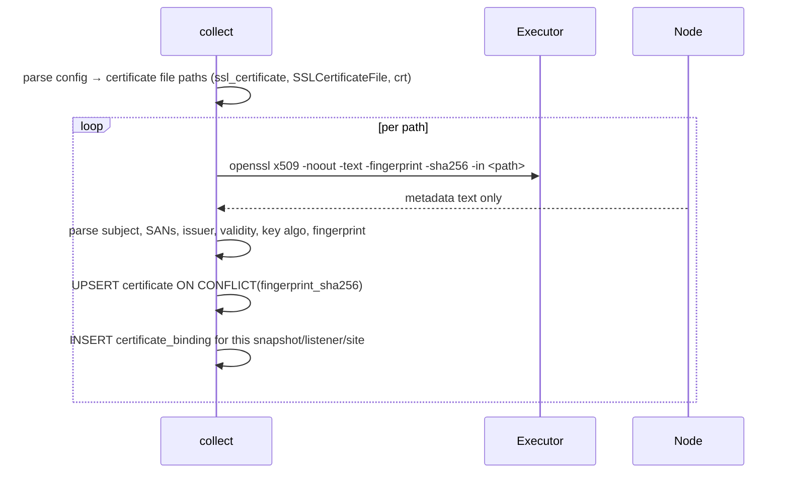

# Certificate and Certificate Binding

**Schema:** [schema.md §12](schema.md#12-certificates). **Conventions:** [api_conventions.md](api_conventions.md).
**Decisions:** ADR-0009 (never transfer private key material).
**Product spec:** [../product/certificate_exposure.md](../product/certificate_exposure.md).

---

## 1. Overview

- **Certificate** — a TLS certificate identified by its **fingerprint**, so the same material found on many Instances is one object.
- **Certificate Binding** — the link between a Certificate and the Listener or Site that serves it.
- **Combined PEM** — a file holding a Certificate and its private key together, as HAProxy conventionally uses. Recorded as a property of the Binding because it constrains how that Certificate may be read.

Two design decisions carry this entire entity, and both are non-obvious.

**Fingerprint as identity.** The operator's question is never "list my certificate files". It is *"what breaks when this expires"* — and answering it requires one Certificate row with thirty Bindings, not thirty near-duplicate rows that have to be mentally reconciled.

**Key material never moves.** There is no column for a private key anywhere in this schema, and there must never be one.

---

## 2. Never transferring key material

Metadata is extracted **on the target Node**:

```
openssl x509 -noout -text -fingerprint -sha256 -in /etc/ssl/certs/payments.pem
```

Only the parsed output crosses the SSH connection. Key bytes never do.

**HAProxy is why this is enforced at the transport layer rather than left to each adapter.** HAProxy's `crt` convention puts certificate, chain and private key in one file, so any collector that naively fetches "the certificate file" pulls a production load balancer's private key across the network and writes it to a database. That is not a hypothetical — it is the default configuration shape for one of the three v1 Vendors.

Two more guarantees:

- Where `openssl` is absent on a Node, `Executor.ReadFile` strips `-----BEGIN … PRIVATE KEY-----` blocks **in memory** before any buffer is handed onward. The strip happens in the one file-reading path, not in three adapters.
- **Snapshots contain configuration files only** — never certificate or key files. A Snapshot is configuration text; certificate data arrives as parsed metadata on a separate path.

---

## 3. Relationships

| | |
|---|---|
| `certificate` → `certificate_binding` | One-to-many. The Binding count *is* the blast radius. |
| `certificate_binding` → `instance`, `snapshot`, `listener`, `site` | Per-Snapshot, so history is preserved. |
| `certificate` ← Application footprint | Derived through Traces, no foreign key ([application.md](application.md)). |

`certificate` is **not** cascaded into by Snapshot deletion. Certificate identity outlives the configuration text it was found in: "this certificate was first seen fourteen months ago" is a real answer, and retention pruning must not erase it. Bindings do cascade, so history depth for bindings follows Snapshot retention while the Certificate itself persists.

---

## 4. Collection and identity



Certificate paths come from parsed directives, so a certificate not referenced by any configuration is not collected. That is deliberate: nagipath reports what is **served**, not what happens to sit in `/etc/ssl`. A stray unreferenced file is a housekeeping matter, and inventorying it would dilute the report that matters.

**Upsert on fingerprint.** First sighting inserts and sets `first_seen_at`; every subsequent sighting updates `last_seen_at`. Metadata is not re-written on conflict — a fingerprint determines its content, so a differing parse means our parse changed, not the certificate.

**Chain handling.** A file may contain leaf plus intermediates. Each becomes a Certificate; the leaf gets `chain_depth=0`, intermediates increment. `is_ca` distinguishes them so expiry reports can exclude intermediates by default — an intermediate expiring in eight years is not a finding, and mixing it into the list trains people to skim.

---

## 5. Business logic

### 5.1 Expiry windows

Computed, not stored — a stored `days_remaining` is wrong the next day. Buckets: `expired`, `<7d`, `<30d`, `<90d`, `ok`.

### 5.2 Hostname coverage

For each Binding, compare the Certificate's CN and SANs against the `site_name` rows of the Site serving it, honouring wildcard semantics.

Mismatches are a distinct and high-value finding class:

| Finding | Meaning |
|---|---|
| `name_not_covered` | The Site serves `api.corp.example`; the Certificate covers neither it nor a matching wildcard. Clients get a name mismatch error. |
| `wildcard_only` | Covered only by `*.corp.example`. Works, but worth knowing — a wildcard's blast radius is every Site using it. |
| `extra_sans` | The Certificate covers names this Site does not serve. Often the trace of a decommissioned service, and a reason the certificate is shared more widely than anyone remembers. |

This class of finding is cheap for us and genuinely hard for the customer to compute by hand across a fleet, which makes it disproportionately good demo material.

### 5.3 Weak-configuration findings

`key_bits < 2048` for RSA, `signature_algorithm` containing `sha1` or `md5`, `is_self_signed` on a Site with a public-looking name, validity period over 398 days. Reported as observations with the reason, never as a score. A letter grade invites arguing with the grade instead of fixing the certificate.

### 5.4 Shared-certificate impact

The reverse query, and the reason fingerprint identity exists: one Certificate, every Binding, every Instance, every Site, every Application whose Trace crosses those Listeners. This is what an operator opens twenty-four days before an expiry, and a per-file model cannot answer it.

---

## 6. API

### `GET /api/v1/certificates`

Filters: `expires_before`, `expires_within_days`, `instance_id`, `cluster_id`, `application_id`, `issuer`, `is_ca` (default `false`), `has_findings`, `q` (CN or SAN).

```json
{
  "items": [
    {
      "id": 88,
      "fingerprint_sha256": "AA:BB:CC:…",
      "subject_cn": "payments.corp.example",
      "sans": ["payments.corp.example", "payments-int.corp.example"],
      "issuer_dn": "CN=Corp Issuing CA 2, O=Corp",
      "not_before": "2025-09-14T00:00:00Z",
      "not_after": "2026-09-14T00:00:00Z",
      "days_remaining": 24,
      "expiry_bucket": "<30d",
      "key_algorithm": "RSA",
      "key_bits": 2048,
      "signature_algorithm": "sha256WithRSAEncryption",
      "is_self_signed": false,
      "is_ca": false,
      "binding_count": 12,
      "instance_count": 6,
      "node_count": 6,
      "application_count": 2,
      "combined_pem_anywhere": true,
      "findings": [
        { "kind": "name_not_covered", "severity": "high",
          "detail": "Site api.corp.example on instance 301 is served by this Certificate, which covers neither api.corp.example nor *.corp.example." }
      ],
      "first_seen_at": "2025-09-15T02:00:00Z",
      "last_seen_at": "2026-08-21T09:14:00Z"
    }
  ]
}
```

`binding_count` and `application_count` are the fields that answer the actual question. `combined_pem_anywhere` is surfaced at the Certificate level because it tells an operator that rotating this certificate means touching files that also contain keys — which changes who has to do it and under what change control.

### `GET /api/v1/certificates/{id}`

Adds every Binding and the full impact expansion:

```json
{
  "id": 88,
  "bindings": [
    { "id": 7701, "instance": { "id": 302, "vendor": "haproxy", "node": "lb01.corp.example" },
      "site": { "id": 8100, "primary_name": "fe_https" },
      "listener": { "address": "0.0.0.0", "port": 443 },
      "file_path": "/etc/haproxy/certs/payments.pem",
      "combined_pem": true,
      "chain_depth": 0,
      "provenance": { "path": "/etc/haproxy/haproxy.cfg", "line": 42 },
      "observed_at": "2026-08-21T09:14:00Z",
      "coverage": { "site_names": ["payments.corp.example"], "status": "covered" } }
  ],
  "impact": {
    "instances": 6,
    "nodes": 6,
    "sites": 9,
    "applications": [ { "id": 4, "name": "payments-prod", "owner": "payments-platform@corp.example" } ],
    "summary": "Replacing this Certificate requires updating 12 bindings across 6 Nodes. 4 of those files are Combined PEMs that also contain private keys."
  },
  "renewal_checklist": [
    { "node": "lb01.corp.example", "file_path": "/etc/haproxy/certs/payments.pem",
      "combined_pem": true, "instances_affected": 1,
      "reload_hint": "haproxy reload required after replacement" }
  ]
}
```

`renewal_checklist` is generated and deliberately **advisory**. It is a list of what to change, grouped by Node, with the reload each Vendor needs — not an action nagipath performs. v1 writes nothing, and this checklist is the honest maximum of useful help within that constraint. It also happens to be the exact artefact the future editing feature would automate, which is a useful thing to have already validated with customers before building writes.

### `GET /api/v1/certificates/expiring?within_days=30&include_ca=false`

The dashboard and report query. `include_ca` defaults false so eight-year intermediates do not dilute the list.

### `GET /api/v1/applications/{id}/certificates`

Per-Application expiry — "which of my Certificates expire soon", answered for an owner who does not know or care which Instances serve them.

### `GET /api/v1/certificates/findings`

Fleet-wide coverage and weak-configuration findings, grouped by kind, so the certificate pillar has a single actionable landing page.

### `GET /api/v1/upstream-members/{id}/tls`

Whether the hop to a backend verifies TLS — NGINX `proxy_ssl_verify`, Apache `SSLProxyVerify`, HAProxy `verify none`. Unverified internal TLS is extremely common, rarely known, and sits exactly at the intersection of the trace and certificate pillars, which is why it belongs in the API rather than only in a report.

---

## 7. Edge cases

| Case | Behaviour |
|---|---|
| HAProxy Combined PEM | Metadata extracted on the Node; the file is never transferred. Binding flagged `combined_pem=true`. |
| `openssl` absent on the Node | `ReadFile` strips `PRIVATE KEY` blocks in memory, then parses locally with `crypto/x509`. Recorded as a degraded extraction method. |
| Same certificate on 30 Instances | One `certificate` row, 30+ Bindings. The whole point. |
| Certificate file is a symlink (ACME `live/` layout) | Resolved on the Node; identity is the fingerprint, so symlink churn does not create duplicates. |
| `crt` pointing at a directory (HAProxy) | Every certificate in the directory is enumerated and bound. |
| Chained file: leaf + 2 intermediates | Three Certificates; leaf `chain_depth=0`; `is_ca=true` on intermediates; intermediates excluded from expiry lists by default. |
| Certificate present on disk but referenced by no directive | Not collected. nagipath reports what is served. |
| Referenced path does not exist | Binding recorded with a `missing_file` finding. A Site configured for TLS with no certificate is a serious finding, not an absence. |
| Expired certificate still bound | Reported, `expiry_bucket='expired'`. Frequently the reason someone opened the tool. |
| Self-signed on an internal Site | Reported as an observation, not a problem. Internal self-signed is a legitimate choice and calling it a violation is how a report loses credibility. |
| SNI: several certificates on one Listener | Multiple Bindings on that Listener, each tied to its Site. |
| Certificate rotated between Collections | New fingerprint → new `certificate` row; old row keeps its Bindings history. The rotation is visible as a timeline rather than an overwrite. |
| Retention prunes the Snapshot a Binding came from | Binding cascades; `certificate` survives with `first_seen_at` intact. |
| Certificate expires while the Instance is quarantined | Still reported from the last Snapshot, with a staleness warning naming the last Collection time. |
