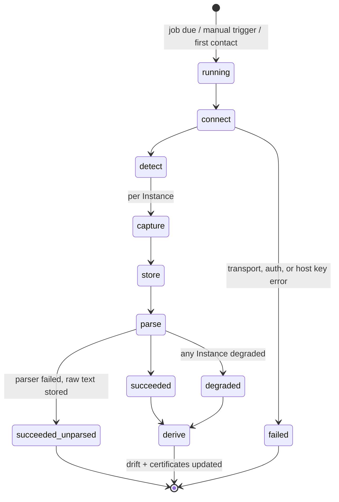

# Collection, Snapshot, Blob

**Schema:** [schema.md §6](schema.md#6-collection-and-snapshot), [§14](schema.md#14-retention-and-garbage-collection). **Conventions:** [api_conventions.md](api_conventions.md).
**Decisions:** ADR-0004 (vendor tooling is the config authority), ADR-0002 (read-only), ADR-0012 (parser version and re-parse policy), ADR-0003 (blobs in the database).

---

## 1. Overview

- **Collection** — one run of gathering configuration and certificate metadata from a Node. Always initiated by nagipath, always over a connection the operator configured.
- **Snapshot** — the immutable configuration text captured by one Collection for one Instance. Never edited, never regenerated.
- **Blob** — content-addressed compressed bytes, shared across every Snapshot containing the same file content.

One Collection targets one Node and produces one Snapshot per Instance on it.

Snapshot immutability is the foundation the rest of the system rests on: parsers change constantly in the first year, and the only reason a parser bug is recoverable rather than a data-loss event is that the raw text is always still there (ADR-0004).

---

## 2. Relationships

`node` → `collection` → `snapshot` → `snapshot_file` → `blob`, with `snapshot` also parent to every derived row (`listener`, `site`, `route`, `upstream`, `upstream_member`, `rule`, `certificate_binding`) via `ON DELETE CASCADE`.

`blob` is the one table **not** cascaded into, because it is shared. See §8.

---

## 3. The pipeline



### 3.1 Connect

Resolve the Credential, dial (through the bastion chain if configured), verify the host key against `host_key`. An unapproved key fails here — nothing else runs. See [credential.md](credential.md).

### 3.2 Detect

Process table plus systemd. See [instance.md §3](instance.md#3-detection).

### 3.3 Capture — vendor tooling first

For each Instance, the adapter runs the Vendor's own dump command and treats its output as authoritative:

| Vendor | Command | What it gives |
|---|---|---|
| NGINX | `nginx -T` | The fully resolved configuration with `# configuration file /path:` banners, includes expanded, conditionals settled |
| NGINX | `nginx -V` | Version, compiled paths, module list |
| Apache | `httpd -t -D DUMP_VHOSTS`, `-D DUMP_MODULES`, `-D DUMP_INCLUDES` | Resolved vhost table, loaded modules, the full include tree |
| Apache | `httpd -V` | `HTTPD_ROOT`, `SERVER_CONFIG_FILE`, MPM |
| HAProxy | `haproxy -c -f <each -f>` | Validation, and confirmation the file set is complete |
| HAProxy | `haproxy -vv` | Version, build options |

**Why not our own resolver.** Reimplementing NGINX's `include` globbing plus Apache's `IfModule`/`IfDefine`/`Include`/`IncludeOptional` semantics is an unwinnable fidelity race against two projects that change independently of us. Their binary already knows the answer, and it is the same answer the running server uses (ADR-0004).

**Then** the adapter reads the constituent files directly, so Provenance points at real paths on the Node rather than at offsets in a dump.

**Two details that decide whether any of this works at all.**

*Privilege.* Every command above is run first as the login user and retried through sudo only if that fails. The retry is not an optimisation: `nginx -T` as an unprivileged user aborts on the pid file before printing a single line, so without it the authoritative dump would be replaced by a walk on every correctly configured host. This is also why the commands carry no shell redirection — a redirection would need `sh -c`, which cannot be granted narrowly (see [credential.md](credential.md)).

*Streams.* stdout and stderr are both read, and never assumed: NGINX prints `-V` to stderr, Apache and HAProxy print their versions to stdout, and `-T` lands on either depending on the build. The two are not concatenated when splitting a dump — the file banners delimit content byte for byte, so appending the other stream would splice diagnostics into the last file and make its Provenance offsets lie.

Certificate metadata is extracted **on the Node** (`openssl x509 -noout -text`), never by transferring files. Upstream Member hostnames are resolved **on the Node** (`getent hosts`), because split-horizon DNS is normal (ADR-0010). See [certificate.md](certificate.md) and [trace.md](trace.md).

### 3.4 Degraded capture

When the dump command is unavailable — no sudo, binary not on `PATH`, `-T` unsupported on an ancient build — the adapter falls back to reading the main config file and following `include` directives itself.

The Snapshot is stamped `config_source='fallback_walk'`, `degraded=1`, and a specific `degraded_reason`. Every screen displaying derived data from a degraded Snapshot carries a visible badge, and the Node view shows exactly which command was refused plus the sudoers line that would fix it.

Degraded is a **first-class outcome, not an error**. What is never acceptable is silently guessing: conditionals we cannot evaluate are recorded as unresolved rather than assumed true, and a Trace built on a degraded Snapshot says so.

### 3.5 Store

```
for each Instance:
  split the vendor dump on its file banners
  for each resulting file:
      sha256 → blob exists?  yes: reference it
                             no:  zstd compress, insert blob
      insert snapshot_file (kind='config_file', path=<real path on Node>)
  insert snapshot_file (kind='vendor_dump', path='@dump/nginx -T')
  content_sha256 = sha256 over the ordered list of file hashes
  if content_sha256 == previous snapshot's:
      still insert the snapshot row (proof of collection at this time)
      skip re-parse and skip drift computation
  clear is_current on the previous snapshot; set it on this one
```

Keeping the whole dump *and* the split files is not redundancy — the split files give actionable Provenance, the dump gives the exact bytes the Vendor produced for when a parser is wrong and someone needs the truth.

The `content_sha256` short-circuit is what makes an hourly schedule over 1,000 Instances affordable: almost every run is a no-op past this point.

### 3.6 Parse

Parsing reads the **stored Snapshot**, not the wire. That ordering is deliberate: a parser panic loses no data, and a parser upgrade re-derives everything from what is already on disk (ADR-0012).

Each derived row is stamped with `parser_version`. A panic is recovered per Instance — one malformed configuration never aborts a fleet-wide Collection. On failure, `parse_state='failed'` with the error, the raw text stays searchable, and the Instance shows as unparsed with the dump linked.

### 3.7 Derive

Certificate identity and Bindings, then Drift against the Baseline, then invalidate cached Traces whose `snapshot_set` referenced the superseded Snapshot.

---

## 4. Retention

Driven by two settings, both configurable:

- `snapshot_retention_days` (default 90) — age ceiling.
- `snapshot_retention_min_per_instance` (default 10) — floor, so a rarely-collected Instance never loses all history.

A Snapshot is exempt from pruning if it is `is_current`, within the per-Instance floor, or referenced by a retained Trace (see [trace.md](trace.md) and the open question in [schema.md §15](schema.md#15-findings-for-the-decision-record)).

Because storage is content-addressed, retention is **not** what controls database size in practice — dedup is. Ninety days of hourly Collections over an unchanging fleet costs roughly one copy of that fleet's configuration. The settings page shows measured database size, blob count and dedup ratio, so the operator tunes against real numbers rather than a guess.

---

## 5. API

### `GET /api/v1/collections`

Filters: `node_id`, `status`, `trigger`, `since`, `until`.

```json
{
  "items": [
    {
      "id": 88431,
      "node": { "id": 12, "address": "web02.corp.example" },
      "trigger": "scheduled",
      "actor": null,
      "status": "degraded",
      "started_at": "2026-08-21T09:13:58Z",
      "finished_at": "2026-08-21T09:14:02Z",
      "duration_ms": 4180,
      "instances_seen": 2,
      "bytes_stored": 14209,
      "snapshots": [
        { "id": 99120, "instance_id": 301, "vendor": "nginx",
          "config_source": "vendor_dump", "degraded": false,
          "parse_state": "parsed", "changed_from_previous": true },
        { "id": 99121, "instance_id": 302, "vendor": "haproxy",
          "config_source": "fallback_walk", "degraded": true,
          "degraded_reason": "sudo denied: /usr/sbin/haproxy -c",
          "parse_state": "parsed", "changed_from_previous": false }
      ],
      "error": ""
    }
  ]
}
```

### `GET /api/v1/collections/{id}`

Adds a per-step timeline (connect, detect, capture per Instance, store, parse, derive) with durations and per-step errors. This is the screen an operator lands on when a Collection misbehaves, so partial failure has to be legible rather than one opaque error string.

### `POST /api/v1/nodes/{id}/collect`

`202 { "collection_id": 88512 }`. `409 collection_in_progress` — per-Node concurrency is 1.

### `POST /api/v1/collections/bulk`

`{ "node_ids": [...] }` or `{ "cluster_id": 2 }` or `{ "all": true }`. Enqueues with jitter; returns accepted and skipped counts. Skipped entries name the reason (already running, disabled, no credential, host key pending).

### `GET /api/v1/snapshots/{id}`

```json
{
  "id": 99120,
  "instance": { "id": 301, "vendor": "nginx", "display_name": "nginx (edge)" },
  "captured_at": "2026-08-21T09:14:00Z",
  "config_source": "vendor_dump",
  "degraded": false,
  "content_sha256": "9f2c…",
  "file_count": 14,
  "bytes_raw": 68210,
  "parse_state": "parsed",
  "parser_version": 7,
  "is_current": true,
  "files": [
    { "id": 41001, "kind": "config_file", "path": "/etc/nginx/nginx.conf", "bytes_raw": 2104, "truncated": false },
    { "id": 41002, "kind": "config_file", "path": "/etc/nginx/conf.d/api.conf", "bytes_raw": 3891, "truncated": false },
    { "id": 41015, "kind": "vendor_dump", "path": "@dump/nginx -T", "bytes_raw": 62215, "truncated": false }
  ]
}
```

### `GET /api/v1/snapshots/{id}/files/{file_id}`

Raw text, decompressed. `Range`-style `byte_start`/`byte_end` supported so a Provenance link resolves to exactly the bytes a Rule came from. `text/plain` or JSON-wrapped with line numbers for the UI.

### `GET /api/v1/snapshots/{id}/diff?against={other_id}`

Structural diff. **Both sides are re-parsed at the current parser version before comparison** (ADR-0012) — see [drift.md](drift.md).

### `GET /api/v1/search?q=…`

Full-text search over Rule text and over **current** Snapshot text.

```json
{
  "rule_hits": [ { "rule_id": 55021, "instance_id": 301, "directive": "add_header",
                   "action_class": "header", "snippet": "add_header Strict-Transport-…",
                   "site": "payments.corp.example", "route": "/api" } ],
  "text_hits": [ { "snapshot_file_id": 41002, "instance_id": 301,
                   "path": "/etc/nginx/conf.d/api.conf", "line": 41,
                   "snippet": "…proxy_pass http://payments_api;…" } ],
  "scope_note": "Text search covers current configuration only. Historical Snapshots are stored but not indexed."
}
```

`scope_note` is returned unconditionally, because PRD-V1 §3.2 promises search "across raw Snapshots" and the index deliberately covers only current ones. Saying so in the payload is cheaper than a support conversation about why a deleted directive is unfindable.

### `POST /api/v1/snapshots/prune` · `POST /api/v1/maintenance/gc-blobs`

Admin. Both return counts. `gc-blobs` is a separate job so a long GC never blocks a Collection, and it **must** run after pruning, never instead of it (§8).

---

## 6. Scheduler interaction

One `collect_node` job per enabled Node. `next_run_at = now + interval + rand(0, jitter)`, jitter re-rolled every run so 400 Nodes never converge on `:00`. Bounded worker pool (default 8); per-Node concurrency 1; jobs are idempotent — a duplicate Collection produces an extra Snapshot, never corruption.

After ten consecutive failures the Node is quarantined: scheduled Collections stop, manual ones still work, history is untouched. Retrying a decommissioned host hourly forever burns a worker and fills the log with noise that trains operators to ignore it.

---

## 7. Edge cases

| Case | Behaviour |
|---|---|
| Config unchanged since last Collection | Snapshot row still inserted (proof of collection); parse and Drift skipped via `content_sha256`. |
| `nginx -T` succeeds, one included file unreadable | Dump is authoritative and complete, so the Snapshot is **not** degraded; the unreadable file is recorded as `truncated`. |
| Runaway `include` glob → 40,000 files | Capped at `snapshot_max_files` (2,000). Snapshot marked degraded with the cap as the reason. Not failed — partial truth beats nothing. |
| A single 2 GB "config file" | `readfile_max_bytes` (8 MiB) cap; file stored truncated and flagged. |
| Configuration changed mid-Collection | The dump is a single point-in-time read; individual file reads may disagree with it. `content_sha256` mismatch between dump and files sets `degraded_reason='config changed during collection'` and the next run resolves it. |
| Node rebooted mid-Collection | Transport error → `failed`. Previous Snapshot untouched. Inventory is never deleted because one Collection failed. |
| Parser upgraded | Only the current Snapshot per Instance is re-parsed. History keeps whatever parse produced it, for provenance. Any diff re-parses **both** sides, so phantom Drift cannot occur (ADR-0012). |
| Disk full mid-store | Transaction rolls back; Collection `failed`; previous Snapshot and `is_current` untouched. |
| Two Instances on a Node share an included file | One blob, two `snapshot_file` rows. Dedup is per content, not per Instance. |
| Retention would delete the only Snapshot of a retired Instance | Blocked by the per-Instance floor. The evidence of what a decommissioned server used to serve is often the reason someone opened the tool. |
| Blob deleted before its `snapshot_file` rows | **Corrupts every Snapshot sharing that content**, which under dedup is most of them. Prevented by ordering, one function, one test ([schema.md §14](schema.md#14-retention-and-garbage-collection)). |
| Demo mode | Collection is refused with `403 demo_mode`. The hosted demo can never reach a real host. |
