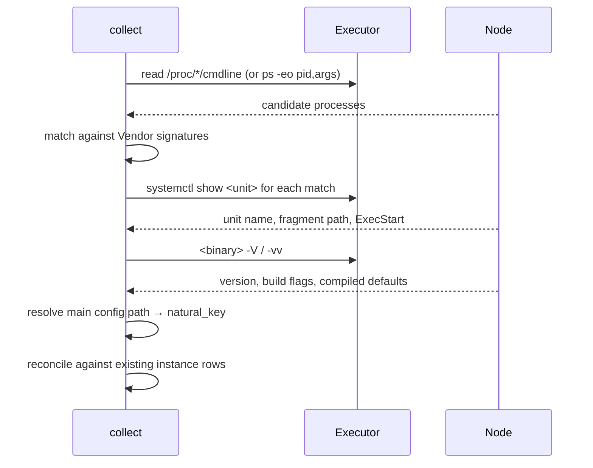

# Instance

**Schema:** [schema.md §5.5](schema.md#55-instance). **Conventions:** [api_conventions.md](api_conventions.md).
**Definition:** one running web server on a Node. A single Node may carry several Instances of the same or different Vendors.

---

## 1. Overview

Instance is the hinge of the whole data model: Snapshots belong to Instances, every derived Config Object and Rule belongs to a Snapshot, Drift is evaluated per Instance, and a Hop in a Trace is a position on an Instance.

It is also the first place a naive design goes wrong. **"One web server per host" is false in every enterprise fleet we care about** — a single host routinely runs an NGINX edge and an Apache application server, or three NGINX Instances with different `-c` arguments for three tenants. Multi-instance-per-node is supported from v1, not deferred, because retrofitting it means changing the identity of every derived row.

Instances are **detected, never declared**. An operator adds a Node; nagipath finds what is running on it.

---

## 2. Relationships

| | |
|---|---|
| `instance` → `node` | Many-to-one. Cascades on Node purge. |
| `instance` → `cluster` | Many-to-one, nullable, **derived**. Cluster membership lives here, not on Node — a Cluster *is* identical configuration, which is a property of the running server, not the host. |
| `instance` → `snapshot` | One-to-many. At most one with `is_current=1`. |
| `instance` → all derived rows | One-to-many, via Snapshot. |
| `instance` → `drift_run` | One-to-many. |
| `instance` → `certificate_binding` | One-to-many. |
| `instance` ← `hop` | A Hop references the Instance it passes through. |

---

## 3. Detection

Detection runs at the start of every Collection, before any configuration is captured.



### 3.1 Vendor signatures and config resolution

| Vendor | Process match | Main config resolution |
|---|---|---|
| NGINX | master process `nginx: master process <path> [-c conf]` | explicit `-c`, else `--conf-path` from `nginx -V` build flags |
| Apache | `httpd`, `apache2`, `/usr/sbin/httpd -k start` | `httpd -V` gives `HTTPD_ROOT` and `SERVER_CONFIG_FILE`; join them. `-d`/`-f` on the command line override |
| HAProxy | `haproxy -f …` | **every** `-f` argument, in order. HAProxy has no `include`, so the `-f` set *is* the complete file set — sorted and joined for the natural key |

Reading compiled defaults from `-V` rather than guessing `/etc/nginx/nginx.conf` matters: source-built and vendor-repackaged binaries frequently differ, and guessing wrong means collecting a file that is not the one running.

The HAProxy case is the cleanest in the product and worth stating explicitly, because it is the only Vendor where completeness is *provable* rather than delegated to vendor tooling.

### 3.2 Reconciliation

For each detected Instance, match on `(node_id, vendor, natural_key)`:

| Situation | Action |
|---|---|
| Match found | Update `version`, `build_flags`, `detected_pid`, `last_seen_at`. Preserve `id`, `cluster_id`, `display_name`, `first_seen_at`. |
| No match | Insert. `display_name` defaults to a human label (`nginx (/etc/nginx/nginx.conf)`), operator-editable. |
| Existing row not detected this run | **Do not retire immediately.** Increment an absence counter; retire after 3 consecutive absent Collections. |

The three-run delay exists because a rolling restart, a maintenance window or a slow `systemctl` call routinely makes a healthy Instance invisible for one Collection. Retiring on first absence produces a fleet inventory that flaps, and a flapping inventory is one nobody trusts.

Retirement sets `retired_at` and never deletes. History, Drift and past Traces stay intact.

### 3.3 Process-less Instances

A configured-but-stopped web server has no process. Detection therefore also inspects systemd units matching known Vendor names (`nginx.service`, `httpd.service`, `haproxy.service`) even when nothing is running, and records the Instance with `detected_pid = NULL`.

This is deliberate: "this host has an Apache configuration serving `payments.corp.example` and it is not running" is one of the more useful findings the tool can produce, and a process-only detector would miss it entirely.

---

## 4. Business logic

### 4.1 What is authoritative

`version`, `build_flags`, `config_root` and `main_config_path` come from the Vendor's own binary, not from parsing configuration. `access_log_paths` is the exception — derived at parse time from the log directives and cached on the row, because the Probe correlation path needs it without re-parsing (see [probe.md](probe.md)).

### 4.2 Cluster membership

Discovered, not declared. Instances whose parsed configuration is **identical** — every Config Object and Rule, keyed the way the Drift comparison keys them — are one Cluster. The SHA-256 of that configuration is the Cluster's identity (`cluster.config_hash`), so an operator's rename survives every recollection and a Cluster that dissolves during a rollout comes back under its own name when the fleet converges. Membership is recomputed, never edited; the name is the only thing an operator sets.

This reverses the earlier *declared, never inferred* rule, and the reason that rule existed still holds — an inferred Cluster becomes a Drift Baseline, and a wrong Baseline produces a wrong report that gets closed and never reopened. Requiring **identical**, rather than similar, is what makes it safe: on the day a Cluster forms every member matches by construction, so the Baseline cannot be wrong, and the first divergence afterwards is exactly the finding Drift exists to report. A similarity threshold would not have this property, which is why there is none.

Consequences: mixed Vendors in one Cluster are impossible rather than rejected, and a group of one is not a Cluster at all — such an Instance is unassigned and compared against its own previous Snapshot.

`golden_peer_instance_id` on the Cluster must reference a member. Assigning a non-member returns `422`.

### 4.3 Version and build flag change detection

A change in `version` or `build_flags` between Collections is recorded as a distinct event, separate from configuration Drift. "Someone patched NGINX on 40 of 41 Instances" is a different question from "someone changed a `location` block", and conflating them buries both.

### 4.4 Multi-instance disambiguation

Where two Instances share a Vendor on one Node, every UI surface shows the natural key alongside the display name. The failure mode being avoided is an operator reading Drift for the wrong Instance because both rows said "nginx".

---

## 5. API

### `GET /api/v1/instances`

Filters: `node_id`, `vendor`, `cluster_id`, `version`, `q`, `state` (`running`|`stopped`|`retired`), `unparsed`, `degraded`, `drifted`, `include_retired`.

```json
{
  "items": [
    {
      "id": 301,
      "node": { "id": 12, "address": "web02.corp.example" },
      "vendor": "nginx",
      "display_name": "nginx (edge)",
      "natural_key": "nginx:/etc/nginx/nginx.conf",
      "version": "1.24.0",
      "binary_path": "/usr/sbin/nginx",
      "config_root": "/etc/nginx",
      "main_config_path": "/etc/nginx/nginx.conf",
      "service_manager": "systemd",
      "unit_name": "nginx.service",
      "running": true,
      "cluster": { "id": 2, "name": "web-prod", "is_golden_peer": false },
      "current_snapshot": {
        "id": 99120,
        "captured_at": "2026-08-21T09:14:00Z",
        "config_source": "vendor_dump",
        "degraded": false,
        "parse_state": "parsed",
        "parser_version": 7
      },
      "counts": { "listeners": 4, "sites": 18, "routes": 96, "upstreams": 11, "rules": 1204,
                  "certificate_bindings": 12, "open_drift_findings": 0 },
      "access_log_paths": ["/var/log/nginx/access.log"],
      "verification_capability": {
        "can_verify_from_logs": false,
        "reason": "log_format 'main' contains neither $server_name nor $upstream_addr",
        "suggested_directive": "log_format nagipath '$remote_addr … $server_name $upstream_addr $request_uri';"
      },
      "first_seen_at": "2026-06-02T11:22:00Z",
      "last_seen_at": "2026-08-21T09:14:00Z"
    }
  ]
}
```

`verification_capability` is computed from the parsed log format and is the honest answer to "can you prove this Trace" *before* anyone runs a Probe. It belongs on the Instance because it is a property of that Instance's configuration.

### `GET /api/v1/instances/{id}`

The above plus the full Listener/Site/Upstream tree and the `build_flags` text.

### `PATCH /api/v1/instances/{id}`

Mutable: `display_name`, `cluster_id`. Everything else is detected — a writable `version` field would let the database disagree with the binary.

### `GET /api/v1/instances/{id}/snapshots`

Paginated history: `id`, `captured_at`, `config_source`, `degraded`, `parse_state`, `bytes_raw`, `content_sha256`, `changed_from_previous`.

### `GET /api/v1/instances/{id}/config?path=…`

Returns configuration text from the current Snapshot, or a specific `snapshot_id`. Supports `byte_start`/`byte_end` so a Provenance link resolves to exactly the bytes a Rule came from. Reads through the blob store, decompressing on the fly.

### `POST /api/v1/instances/{id}/reparse`

Admin. Re-derives all Config Objects and Rules from the current Snapshot at the current parser version. `202`. Used after a parser upgrade, and by us constantly during development.

### `GET /api/v1/clusters` · `PATCH`

```json
{ "id": 2, "name": "web-prod", "description": "prod edge tier",
  "golden_peer": { "instance_id": 301, "label": "web02 / nginx (edge)" },
  "credential": { "id": 3, "name": "fleet-ro" },
  "member_count": 41, "vendors": ["nginx"],
  "baseline_kind_in_use": "golden_peer",
  "drift_ignore_rule_count": 3 }
```

`PATCH` accepts `name` only. There is no `POST`, no `DELETE` and no members endpoint: a Cluster is whatever the configuration says it is, and an empty one is a name kept for a group that has diverged.

---

## 6. Edge cases

| Case | Behaviour |
|---|---|
| Two NGINX Instances, different `-c` | Two rows. Distinct natural keys. Both shown with their config path everywhere. |
| NGINX master and 8 workers | One Instance. Workers are matched and ignored by their `nginx: worker process` signature. |
| Apache with `-d`/`-f` overriding compiled defaults | Command line wins over `httpd -V`. |
| HAProxy with three `-f` files | One Instance; natural key is the sorted joined set. Adding a fourth `-f` changes the natural key, so it reads as a new Instance — correct, because it is a materially different server. |
| Instance in a container on a managed Node | Detected via `/proc`; `service_manager='container'`. Config paths are namespace-local, so file reads may fail — Snapshot is `degraded` with that reason rather than silently empty. |
| Web server installed, never started, no unit | Not detected. Documented limitation: nagipath finds running services and known units, not every file on disk. |
| Rolling restart during a Collection | Absence counter increments; three consecutive absences before retirement. |
| Binary upgraded in place, config unchanged | `version` change event; no configuration Drift. Reported separately. |
| Config path is a symlink | Resolved on the Node; the natural key uses the resolved path, so a symlink flip does not create a phantom Instance. |
| Same `server_name` on two Instances of one Node | Legal and common (edge + app tier). The Trace shows both as candidate Hops and disambiguates by Listener port. |
| Operator sets a retired Instance as Golden Peer | `422`. |
| Cluster of one | Allowed. Baseline falls back to `previous_snapshot`; the UI says so rather than reporting "no drift" from a majority of one. |
