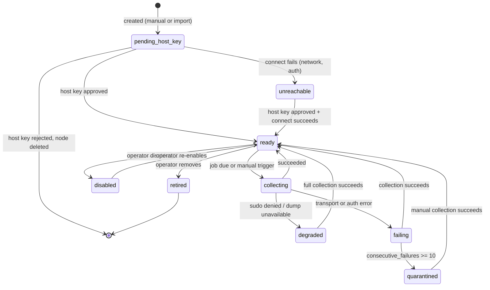

# Node

**Schema:** [schema.md §5.2](schema.md#52-node). **Conventions:** [api_conventions.md](api_conventions.md).
**Definition:** a host nagipath connects to and collects from — identified by how it is reached, not by what runs on it.

---

## 1. Overview

Node is the only entity an operator creates by hand that represents something in their infrastructure. Everything else — Instances, Sites, Upstreams, Certificates — is derived. That makes Node the trust boundary: it is where reachability, credentials and host-key approval are decided, and where the read-only guarantee is enforced.

**Nodes never appear by themselves.** They come from an operator-supplied entry or an imported Ansible inventory. nagipath does not scan networks, sweep CIDR ranges or probe ports to find hosts (ADR-0002) — a tool that scans an enterprise network produces a security incident, not a customer.

Also worth stating because it is counter-intuitive: a Node is not "a web server". One Node routinely carries several Instances, and `Cluster` membership belongs to the Instance, not the Node, because a Cluster is an assertion about configuration.

---

## 2. Relationships

| | |
|---|---|
| `node` → `credential` | Many-to-one, nullable. Null means fall through the resolution order ([credential.md](credential.md)). |
| `node` → `node` | Self-referential via `bastion_node_id`. Multi-hop by repetition, limit 4. |
| `node` → `host_key` | One-to-many. At most one `approved` per algorithm at a time. |
| `node` → `instance` | One-to-many, derived by detection. Cascades on delete. |
| `node` → `collection` | One-to-many. `last_collection_id` denormalises the newest. |
| `node` → `dns_resolution` | One-to-many. Names resolved *on* this Node (ADR-0010). |
| `node` → `job` | One `collect_node` job per enabled Node. |

---

## 3. Lifecycle



State is **computed**, not stored — derived from `enabled`, `retired_at`, `consecutive_failures`, the approved `host_key` row, and the newest `collection.status`. A stored status column would need updating from four places and would be wrong in one of them.

**Quarantine** stops scheduled Collections after ten consecutive failures but leaves the Node and all its history intact and manually collectable. The alternative — retrying a decommissioned host hourly forever — burns a worker slot and fills the log with noise that trains operators to ignore it.

---

## 4. Business logic

### 4.1 Creation and first contact

1. Validate `address` (hostname or IP, no scheme, no path) and `ssh_port` (1–65535).
2. Reject a duplicate `(address, ssh_port)` with `409`.
3. Validate the bastion chain: walk `bastion_node_id`, reject a cycle or depth > 4 with `422`.
4. Insert with `source='manual'` or `'ansible_inventory'`, `enabled=1`, `first_seen_at=now`.
5. **Do not connect.** Creation is a database write; connection is an explicit next step, so a mistyped address does not produce a mysterious hang on a form submit.
6. `POST /nodes/{id}/check` performs first contact: dial, present the resolved Credential, capture the host key.
   - Unknown host key → insert `host_key` state `pending`, **fail the connection**, return `409 host_key_not_approved`. There is no trust-on-first-use path, not even behind a flag.
   - Approved key present → authenticate, run `id`, `uname -s`, and a `sudo -n -l` probe, set `os_family` and `sudo_available`.
   - The probe is `-l`, not `sudo -n true`: `true` is not in the grant nagipath documents, so probing with it would report every correctly configured host as having no sudo and then silently degrade all of its Collections. `-l` asks sudo what the user may run, which needs no grant of its own.
7. On the first successful check, enqueue a `first_contact` Collection immediately rather than waiting for the schedule — the operator is standing there watching.

### 4.2 Ansible inventory import

Accepts INI and YAML inventories. Host input only; nagipath does not read or execute playbooks, roles or vars beyond connection metadata.

| Inventory concept | Mapped to |
|---|---|
| host entry | `node.address` |
| `ansible_host` | `node.address` (overrides the entry name) |
| `ansible_port` | `node.ssh_port` |
| `ansible_user` | `node.ssh_username` |
| group path | `node.source_detail`, e.g. `webservers/prod` |
| everything else | ignored, deliberately |

Reconciliation rules, in order:

1. Match on `(address, ssh_port)`.
2. **Existing Node with `source='manual'`:** never modified, never deleted. Reported as "already present, left alone". An import must not silently repoint a hand-configured Node's credential.
3. **Existing Node with `source='ansible_inventory'`:** update `ssh_username` and `source_detail`. Never clears `credential_id`.
4. **Absent from the inventory but present in nagipath with `source='ansible_inventory'`:** listed as "no longer in inventory" and **not deleted**. Deletion is an explicit operator action; an inventory refactor must not silently destroy fleet history.
5. Import is a preview-then-apply flow: the diff is shown, the operator confirms. See [../frontend/onboarding.md](../frontend/onboarding.md).

Groups do **not** become Clusters. A Cluster is an assertion that Instances should be configured identically, and Ansible groups routinely mean something else. Offering it as a suggested mapping is fine; inferring it is not.

### 4.3 Bastion connection

Dial the bastion with *its* resolved Credential, then open a tunnelled `ssh.Client` to the target through that connection, then repeat if the bastion itself has a bastion. Each hop performs its own host-key verification against its own `host_key` rows — a bastion does not vouch for what is behind it.

### 4.4 Deletion versus retirement

`DELETE /nodes/{id}` sets `retired_at`, disables the job, and keeps Collections, Snapshots and Certificate Bindings. Retired Nodes are excluded from inventory, Drift and Trace by default, and Traces that previously crossed them stay reproducible.

Hard deletion (`?purge=true`, admin only, typed confirmation) cascades everything and is offered because "we onboarded the wrong subnet" is a real first-day mistake. It is irreversible and says so.

---

## 5. API

### `GET /api/v1/nodes`

Filters: `q` (address or display name), `state`, `vendor` (has an Instance of that Vendor), `cluster_id`, `drifted`, `source`, `sudo_available`, `include_retired`.

```json
{
  "items": [
    {
      "id": 12,
      "address": "web02.corp.example",
      "ssh_port": 22,
      "display_name": "web02",
      "state": "degraded",
      "os_family": "linux",
      "sudo_available": false,
      "source": "ansible_inventory",
      "source_detail": "webservers/prod",
      "credential": { "id": 3, "name": "fleet-ro" },
      "bastion": null,
      "instance_count": 2,
      "vendors": ["nginx", "haproxy"],
      "drift_finding_count": 4,
      "last_collection": {
        "id": 88431,
        "status": "degraded",
        "degraded_reason": "sudo denied for nginx -T; fell back to file walk",
        "finished_at": "2026-08-21T09:14:02Z"
      },
      "consecutive_failures": 0,
      "first_seen_at": "2026-06-02T11:20:00Z"
    }
  ],
  "next_cursor": null,
  "total_estimate": 412
}
```

### `POST /api/v1/nodes`

```json
{ "address": "web03.corp.example", "ssh_port": 22, "display_name": "web03",
  "credential_id": 3, "bastion_node_id": null, "notes": "" }
```

`201` with the node object. `409 node_exists`, `422 bastion_cycle`.

### `PATCH /api/v1/nodes/{id}`

Mutable: `display_name`, `ssh_username`, `credential_id`, `bastion_node_id`, `enabled`, `notes`. Immutable: `address`, `ssh_port`, `source` — changing where a Node lives makes it a different Node, and silently repointing years of history is worse than making the operator create a new one.

### `POST /api/v1/nodes/{id}/check`

Connectivity check. `200`:

```json
{
  "reachable": true,
  "authenticated": true,
  "host_key": { "state": "approved", "algorithm": "ssh-ed25519", "fingerprint": "SHA256:qX8…" },
  "sudo": { "available": false, "missing_commands": ["/usr/sbin/nginx -T"] },
  "os_family": "linux",
  "latency_ms": 41
}
```

`409 host_key_not_approved` with the pending fingerprint in `detail`. `sudo.missing_commands` drives the copy-pasteable sudoers snippet in the UI.

### `POST /api/v1/nodes/{id}/collect`

`202` with `{ "collection_id": 88512 }`. `409 collection_in_progress` — per-Node concurrency is 1, so a backlog cannot hammer one host.

### `POST /api/v1/nodes/import/ansible`

`multipart/form-data`: `file`, `format` (`ini`|`yaml`|`auto`), `dry_run` (default `true`).

```json
{
  "dry_run": true,
  "parsed_hosts": 214,
  "to_create": [ { "address": "web07.corp.example", "ssh_port": 22, "group_path": "webservers/prod" } ],
  "to_update": [ { "id": 12, "changes": { "ssh_username": "svc-nagipath" } } ],
  "left_alone": [ { "id": 5, "address": "lb01.corp.example", "reason": "source=manual" } ],
  "no_longer_in_inventory": [ { "id": 91, "address": "web99.corp.example" } ],
  "warnings": ["3 hosts had no resolvable ansible_host and were skipped"]
}
```

### `DELETE /api/v1/nodes/{id}`

Retires. `?purge=true` hard-deletes, admin only, requires `X-Confirm: <address>`.

### `GET /api/v1/nodes/{id}/host-keys`

All keys with state. Never returns private material — host keys are public by nature.

---

## 6. Edge cases

| Case | Behaviour |
|---|---|
| Same host in the inventory twice under different names | Deduplicated on `(address, ssh_port)`. Both group paths recorded in `source_detail`. |
| Host key changes on an approved Node | Connection refused. New `pending` row. UI distinguishes **changed** from **unknown** — a changed key is a possible interception, not a first-run inconvenience. |
| DNS name resolves to a different host after a rebuild | Not detectable from the address alone; surfaces as Instance natural keys disappearing and new ones appearing. The Node row is correct, so this is honest rather than wrong. |
| Bastion retired while Nodes still reference it | `ON DELETE SET NULL`, and those Nodes go `unreachable` on the next attempt with a specific error naming the removed bastion. |
| Node reachable but no web server running | Collection succeeds with `instances_seen=0`. Not an error — a decommissioned web host is a legitimate finding. |
| `sudo` available at check time, denied later | Next Collection is `degraded` with the exact refused command. Never falls back silently. |
| 1,000 Nodes added at once via import | Jobs get `next_run_at` spread across `collection_jitter_seconds`, so they do not all fire together. |
| Operator sets a Node as its own bastion | `422 bastion_cycle` at validation. |
| IPv6 literal address | Stored bracketless in `address`, bracketed when dialled. |
| Unix socket / localhost-only Instance on a Node | Fine — the Node is reached over SSH; the Instance's Listener being a socket is an Instance property. |
