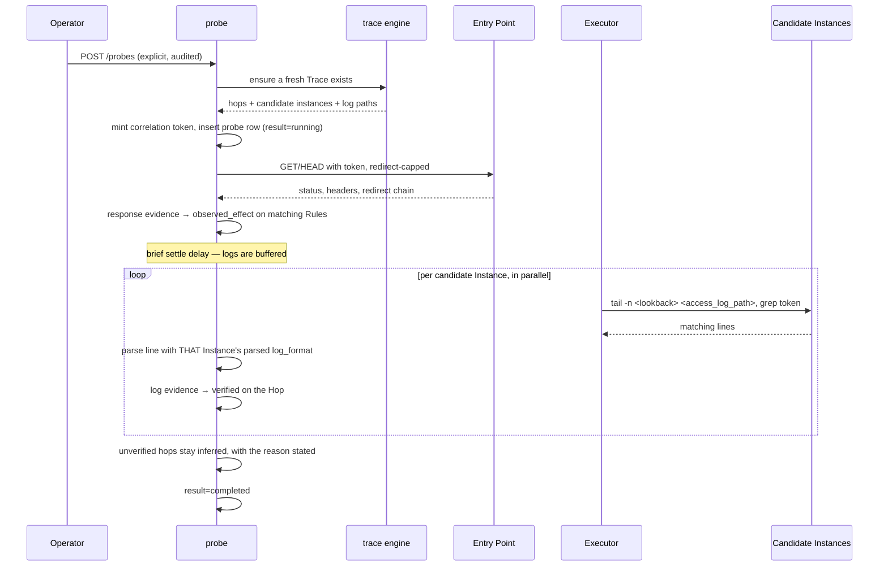

# Probe and Verification

**Schema:** [schema.md §10](schema.md#10-probe-and-verification). **Conventions:** [api_conventions.md](api_conventions.md).
**Decisions:** ADR-0002 (read-only; Probe is the single documented exception), ADR-0004.
**Product spec:** [../product/trace_verification.md](../product/trace_verification.md).

---

## 1. Overview

A **Probe** is a single operator-initiated GET or HEAD request against an Entry Point, sent to verify a Trace. Never scheduled, never automatic, always audited.

Probes exist because of a specific, concrete product failure. An earlier design answered "which Rules apply to this path" with a list of eleven candidates. That is honest, and it is also **not useful to an admin** — it is roughly what `grep` already gives them. The list is the starting point; proving which Hops actually served the request is what turns it into an answer.

Verification works in two stages, and the second is the one that matters:

1. **Response evidence** — headers, status, redirect chain → **Observed Effect** on the Rules whose result is visible.
2. **Access-log correlation** — read the log on each candidate Instance, find *this* Probe's request → **Verified** on those Hops.

The enabling insight for stage 2: **we know how to read their access logs because we already parsed their configuration.** The `log_format` / `LogFormat` / `option httplog` directive is a Rule in our database, so we can parse a log line into named fields for that specific Instance rather than guessing at a format.

---

## 2. Probe is the one exception to read-only

v1 writes nothing to any managed host (ADR-0002). A Probe sends network traffic to a production application, which is a different thing from writing to a host, but it is still the one action nagipath takes that has any effect outside its own process. The guardrails are therefore structural, not procedural:

| Guardrail | Enforcement |
|---|---|
| GET or HEAD only | `CHECK (method IN ('GET','HEAD'))` **at the database level**. A future request for `POST` must change a constraint and pass review — exactly the friction that should exist. |
| Operator-initiated per Probe | `actor_user_id NOT NULL`. There is no unattributed Probe. |
| Never scheduled | No `job.kind` value can create one, and none may be added. |
| Redirect-capped | `probe_max_redirects`, default 5. |
| Audited | An `audit_event` per Probe with actor, URL and target. |
| Origin disclosed | `probe.origin_host` records where the request came from, so a security team reviewing their own logs can identify it. |
| Identified | A `User-Agent` of `nagipath-probe/<version> (+correlation:<token>)`. The request announces itself rather than looking like an attack. |
| Rate-limited | Per user and per Entry Point. |
| Admin-only | `viewer` cannot Probe. |
| Disabled in demo | `NAGIPATH_DEMO_MODE` refuses Probes outright. |

---

## 3. Correlation token

A 128-bit random token, unique per Probe, sent three ways:

- Header: `X-Nagipath-Probe: <token>`
- Query parameter: `?__nagipath=<token>` (appended only when the operator opts in — it changes the request, and some applications route on query strings)
- Embedded in the `User-Agent`

Matching in the access log is **by token, not by timestamp**. Clock skew between the control plane and the Nodes is routine, and a timestamp-window match would produce both false positives under load and false negatives under skew. Token matching has neither failure mode.

Which of the three carriers survives to the log depends on the Vendor's log format — `%r`/`$request` captures the query string, `%{User-Agent}i`/`$http_user_agent` captures the agent, and a custom format may capture the header. The Probe records which carrier matched, in `probe_evidence.parsed_fields`.

---

## 4. Per-Vendor verification capability

This table is the honest limit of the feature and must be visible in the UI, not buried in documentation.

| Vendor | Default capability | What the log gives | Gap |
|---|---|---|---|
| **HAProxy** | **Strong out of the box** | `option httplog` logs `frontend_name/bind_name` and `backend_name/server_name` on every request | None. The log names both the Site and the Upstream Member directly. This is the best case in the product. |
| **Apache** | **Good with common formats** | `%v` (the serving vhost) and `%f`; `%f` shows `proxy:http://backend/...` for proxied requests | Stock `combined` lacks `%v`. Detectable, and the fix is one `LogFormat` directive. |
| **NGINX** | **Requires a customer change** | Stock `combined` has **neither** `$server_name` nor `$upstream_addr` | Without them, a log line proves a request arrived at that Instance but not which Site served it or where it went. nagipath detects this and shows the exact directive to add. It does not make the change. |

The NGINX gap is stated plainly everywhere it matters — on the Instance (`verification_capability`), in the Trace (`verification.blockers`), and on the Probe result. **nagipath never works around it by inference.** An honest Inferred beats a confident wrong Verified, and this is the case where the temptation to guess is strongest.

Even at stock `combined`, an NGINX log line still yields partial evidence: it proves the request reached that Instance at that moment. That grants `verified` to the Hop's *arrival*, and the response says exactly which parts remain `inferred`.

---

## 5. Execution



### 5.1 Response evidence → Observed Effect

| Evidence | Promotes |
|---|---|
| Response header matching an `add_header` / `Header set` / `http-request set-header` Rule | That Rule → `observed_effect` |
| 3xx with a `Location` matching a `return`/`Redirect`/`redirect` Rule | That Rule → `observed_effect` |
| `401` with `WWW-Authenticate`, or a redirect to an identity provider | The `auth`-class Rule → `observed_effect` |
| A header a Rule should have set but that is **absent** | Recorded as **negative evidence** — the strongest signal the shadowing analysis produces |

Negative evidence is the sharpest thing in this document. If the configuration says `add_header Strict-Transport-Security` at the Site scope, the shadowing analysis predicted it would be discarded by an inner `add_header`, and the Probe confirms the header is absent — that is a **proven** security finding, delivered with the file and line that caused it. That is the single most compelling output the product can produce, and it falls out of design rather than being built for.

### 5.2 Log evidence → Verified

Reading the log uses `Executor.ReadFile` / a `tail` command restricted to the Instance's `access_log_paths`, which were derived at parse time. Path validators reject anything outside those declared paths, so log correlation cannot become an arbitrary file read.

`probe_log_lookback_seconds` (default 120) bounds how much log is read. A short settle delay before reading accounts for buffered writes (`access_log ... buffer=`, `BufferedLogs On`).

Each matching line is parsed with that Instance's own log format into `parsed_fields`, and the verbatim line is stored in `raw_evidence`. Every promotion above `inferred` requires such a row — a "verified" claim the operator cannot audit is worthless, so the UI links straight to the log line.

---

## 6. API

### `POST /api/v1/probes`

Admin only. Rate-limited.

```json
{ "entry_point_id": 11, "trace_id": 7712, "method": "GET",
  "include_query_token": false, "follow_redirects": true }
```

Or ad hoc: `{ "url": "https://payments.corp.example/api/v2/charge", "method": "HEAD" }`

`202 { "probe_id": 4410 }`. Errors: `403 demo_mode`, `429 probe_rate_limited`, `422 non_probeable_scheme`.

### `GET /api/v1/probes/{id}`

```json
{
  "id": 4410,
  "trace_id": 7712,
  "entry_point": { "id": 11, "hostname": "payments.corp.example", "path_prefix": "/" },
  "actor": { "id": 1, "username": "aallen" },
  "method": "GET",
  "url": "https://payments.corp.example/api/v2/charge",
  "origin_host": "nagipath01.corp.example",
  "requested_at": "2026-08-21T09:31:02Z",
  "completed_at": "2026-08-21T09:31:09Z",
  "duration_ms": 214,
  "result": "completed",
  "status_code": 200,
  "redirect_chain": [],
  "response_headers": { "server": "nginx", "strict-transport-security": null,
                        "x-request-id": "abc123" },

  "hop_verification": [
    { "hop_ordinal": 0, "instance_id": 302, "vendor": "haproxy",
      "before": "inferred", "after": "verified",
      "evidence": [
        { "kind": "access_log_line", "log_path": "/var/log/haproxy.log",
          "raw_evidence": "Aug 21 09:31:02 lb01 haproxy[9912]: 10.1.2.3:52134 [21/Aug/2026:09:31:02.114] fe_https~ be_payments/web02 0/0/1/12/13 200 512 - - ---- 4/4/0/0/0 0/0 \"GET /api/v2/charge HTTP/1.1\"",
          "parsed_fields": { "frontend": "fe_https", "backend": "be_payments",
                             "server": "web02", "status": 200,
                             "matched_by": "user_agent_token" },
          "grants": "verified" }
      ] },
    { "hop_ordinal": 1, "instance_id": 301, "vendor": "nginx",
      "before": "inferred", "after": "verified",
      "partial": true,
      "partial_reason": "log_format 'main' lacks $server_name and $upstream_addr; arrival at this Instance is proven, Site selection and Upstream choice remain inferred",
      "evidence": [
        { "kind": "access_log_line", "log_path": "/var/log/nginx/access.log",
          "raw_evidence": "10.20.1.12 - - [21/Aug/2026:09:31:02 +0000] \"GET /api/v2/charge HTTP/1.1\" 200 512 \"-\" \"nagipath-probe/1.0 (+correlation:9f2c…)\"",
          "parsed_fields": { "request_uri": "/api/v2/charge", "status": 200,
                             "matched_by": "user_agent_token" },
          "grants": "verified" }
      ] },
    { "hop_ordinal": 2, "instance_id": 402, "vendor": "apache",
      "before": "inferred", "after": "inferred",
      "blocked_reason": "access log format lacks %v; a request cannot be attributed to a specific vhost",
      "suggested_directive": "LogFormat \"%v %h %l %u %t \\\"%r\\\" %>s %b %f\" nagipath" }
  ],

  "rule_verification": [
    { "rule_id": 55900, "directive": "http-request set-header",
      "args": "X-Forwarded-Proto https", "action_class": "header",
      "before": "candidate", "after": "observed_effect",
      "evidence": [ { "kind": "response_header", "raw_evidence": "x-forwarded-proto: https",
                      "grants": "observed_effect" } ] },
    { "rule_id": 55004, "directive": "add_header",
      "args": "Strict-Transport-Security max-age=31536000", "action_class": "header",
      "before": "candidate", "after": "disproved",
      "finding": {
        "severity": "high",
        "summary": "Strict-Transport-Security is configured but not served.",
        "cause": "location /api declares its own add_header, which discards all add_header directives inherited from the server block.",
        "provenance": { "path": "/etc/nginx/conf.d/api.conf", "line": 21 }
      },
      "evidence": [ { "kind": "response_header",
                      "raw_evidence": "(header absent from response)",
                      "grants": "observed_effect" } ] }
  ],

  "summary": { "hops_total": 4, "hops_verified": 2, "hops_blocked": 1, "hops_external": 1,
               "rules_observed": 1, "rules_disproved": 1,
               "trace_confidence_after": "partial" }
}
```

`disproved` is a `rule_verification` outcome, not a stored `hop_rule.confidence` value — the Rule exists and is configured; what is disproved is its *effect*. That distinction keeps the confidence enum honest: it describes evidence about behaviour, not the presence of configuration.

### `GET /api/v1/probes?trace_id=…&entry_point_id=…`

History. Repeated Probes over time are the cheapest possible change detector for an Entry Point: "this path was verified through three Hops last week and now stops at two."

### `GET /api/v1/entry-points/{id}/verification-readiness`

Answers "can this be verified" **before** anyone runs a Probe, so the operator is not surprised.

```json
{ "entry_point_id": 11, "traceable": true, "hop_count": 4,
  "verifiable_hops": 3, "blocked_hops": 1,
  "blockers": [ { "instance_id": 402, "vendor": "apache", "node": "app01.corp.example",
                  "reason": "LogFormat lacks %v",
                  "suggested_directive": "LogFormat \"%v %h %l %u %t \\\"%r\\\" %>s %b %f\" nagipath",
                  "note": "nagipath will not make this change. Apply it yourself and re-run the Probe." } ] }
```

That `note` is deliberate. The moment the product offers to fix a log format for you, it is no longer read-only, and read-only is what gets it installed.

---

## 7. Edge cases

| Case | Behaviour |
|---|---|
| Entry Point not reachable from the nagipath host | `result='failed'` with the transport error. Reported as *our* connectivity problem, not as a fleet finding — the operator's fleet may be fine. |
| Probe returns 500 | Verification still works. A failing application is still an excellent verification signal, and the Trace is what was asked about. |
| Token absent from every log | Every Hop stays `inferred`, each with a specific reason: format lacks the carrier, log path unreadable, buffered write not yet flushed, or request genuinely did not reach that Instance. Never a bare "not verified". |
| Log rotated between request and read | Reads the current file and the most recent rotated one. If still absent, reason names rotation. |
| Log is piped to a program (`CustomLog "\|/usr/bin/cronolog …"`) | Not readable. Detected at parse time and reported as a blocker, with the pipe target named. |
| Log shipped off-host with nothing local | Same blocker path. Reading from a SIEM is not in v1 scope and is not pretended. |
| High-traffic Instance, thousands of lines in the lookback | Token grep is done on the Node (`grep` before transfer), so only matching lines cross the network. |
| Two Probes concurrently on one Entry Point | Distinct tokens, no interference. |
| Application routes on query strings | `include_query_token` defaults to **false** for exactly this reason; the operator opts in knowing it changes the request. |
| Redirect loop | Capped at 5, `result='completed'` with the chain recorded. The loop is the finding. |
| mTLS-required Entry Point | Probe fails at TLS handshake with a specific reason. Client certificates are not in v1 scope. |
| Probed path has side effects despite GET | Cannot be prevented technically. Mitigated by GET/HEAD-only, per-Probe operator initiation, and documentation. Stated in the UI next to the button rather than only in the manual. |
| Viewer attempts a Probe | `403` plus an `audit_event` with `outcome='denied'`. |
