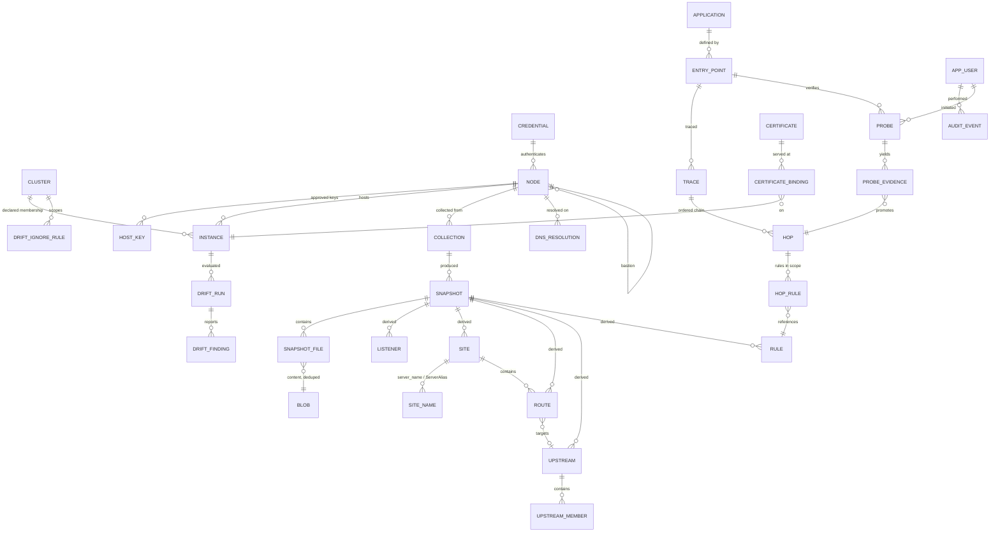

# Database Schema

**Scope:** every table in nagipath v1, the conventions they all follow, and the reasoning behind the non-obvious ones. Per-entity documents in this directory expand on business logic and APIs; this file is the authoritative shape of the data.
**Vocabulary:** [CONTEXT.md](../../CONTEXT.md). **Runtime:** [../infra/architecture.md](../infra/architecture.md).

---

## 1. Conventions

Every table follows these without exception. They are stated once here rather than repeated in twenty entity documents.

| Convention | Rule |
|---|---|
| **STRICT** | Every table is declared `STRICT`. SQLite's default type affinity will happily store `'later'` in an `INTEGER` column; that is not a debugging session anyone should have. |
| **Primary keys** | `id INTEGER PRIMARY KEY` (rowid alias) except `blob`, keyed by content hash. Surrogate keys internally; **natural keys** carry identity across Snapshots (§4). |
| **Timestamps** | `TEXT` in ISO-8601 UTC with a `Z` suffix (`2026-08-21T10:04:33Z`). Lexical sort equals chronological sort, values are legible in a `sqlite3` shell, and `strftime` works. Column names always end `_at`. |
| **Booleans** | `INTEGER NOT NULL CHECK (x IN (0,1))`. |
| **Enums** | `TEXT NOT NULL CHECK (x IN (...))`. Enforced in the database, not only in Go, because migrations and manual fixes bypass Go. |
| **JSON** | `TEXT NOT NULL CHECK (json_valid(col))`. Used only for genuinely open-ended maps (response headers, resolved address lists) — never as a substitute for a column we should have declared. |
| **Foreign keys** | Always declared, `PRAGMA foreign_keys=ON`. `ON DELETE CASCADE` from Snapshot down through all derived rows, so dropping a Snapshot cannot leave orphans. Never cascade *into* audit or Certificate identity. |
| **Soft delete** | Fleet objects that disappear get `retired_at`, never a `DELETE`. History is the product. |
| **Naming** | Singular table names (`node`, not `nodes`). `snake_case`. Foreign keys are `<table>_id`. |
| **Access** | `sqlc`-generated typed queries only. No ORM, no string-built SQL. |
| **Migrations** | Numbered, forward-only, embedded, one transaction at startup. No down-migrations; rollback is restoring the file you copied. |

### 1.1 The derived-row contract

Six kinds of row are **derived** — produced by parsing a Snapshot, never authored by an operator: `listener`, `site`, `route`, `upstream`, `upstream_member`, `rule`. Every one of them carries the same six columns, and every one of them can be deleted and rebuilt from the Snapshot without data loss.

```sql
snapshot_id      INTEGER NOT NULL REFERENCES snapshot(id) ON DELETE CASCADE,
instance_id      INTEGER NOT NULL REFERENCES instance(id),
parser_version   INTEGER NOT NULL,   -- ADR-0012
natural_key      TEXT    NOT NULL,   -- identity across Snapshots, §4
ordinal          INTEGER NOT NULL,   -- source order within its scope; tie-breaks natural_key
-- Provenance (ADR-0005): every derived row points at the exact bytes it came from
prov_file_id     INTEGER NOT NULL REFERENCES snapshot_file(id) ON DELETE CASCADE,
prov_byte_start  INTEGER NOT NULL,
prov_byte_end    INTEGER NOT NULL
```

The repetition is deliberate. A shared `provenance` table joined six ways would add a join to every hot query — and these *are* the hot queries — to save six column declarations.

`(instance_id, snapshot_id, natural_key, ordinal)` is unique on each derived table. That is what makes drift diffing a set comparison rather than a text diff.

---

## 2. Entity relationships



---

## 3. Meta and settings

```sql
CREATE TABLE schema_migration (
  version     INTEGER PRIMARY KEY,
  name        TEXT NOT NULL,
  applied_at  TEXT NOT NULL
) STRICT;

CREATE TABLE setting (
  key         TEXT PRIMARY KEY,
  value       TEXT NOT NULL,
  updated_at  TEXT NOT NULL,
  updated_by  INTEGER REFERENCES app_user(id)
) STRICT;
```

`setting` keys in v1, all with code defaults so an empty table is a working system:

| Key | Default | Meaning |
|---|---|---|
| `collection_interval_seconds` | `3600` | Default Collection cadence for new Nodes. |
| `collection_jitter_seconds` | `300` | Spread, so 400 Nodes do not fire at `:00`. |
| `snapshot_retention_days` | `90` | Age-based pruning. |
| `snapshot_retention_min_per_instance` | `10` | Floor, so a rarely-collected Instance never loses all history. |
| `default_credential_id` | *(unset)* | Last tier of Credential resolution (§5.3). |
| `probe_max_redirects` | `5` | |
| `probe_log_lookback_seconds` | `120` | How far back to read access logs for correlation. |
| `ssh_command_timeout_seconds` | `30` | |
| `readfile_max_bytes` | `8388608` | 8 MiB cap. |
| `snapshot_max_files` | `2000` | Runaway `include` glob guard. |

Settings are a key-value table rather than typed columns because they are read once per operation, written rarely, and the alternative is a migration per knob.

---

## 4. Object identity

Derived objects have no stable vendor-assigned ID, so identity is a **natural key** per type, with `ordinal` as tie-breaker (ADR-0007). Content hashing was rejected — any edit would read as delete-plus-create. Path-plus-line-number was rejected — inserting a blank line would recreate the whole file.

| Type | Natural key |
|---|---|
| `instance` | `vendor` + resolved main config path (NGINX: `-c`/compiled default; Apache: `HTTPD_ROOT` + `SERVER_CONFIG_FILE`; HAProxy: sorted `-f` arguments joined) |
| `listener` | `address:port` + TLS flag + protocol |
| `site` | primary server name, or first `bind` for an HAProxy frontend, or the frontend/`<VirtualHost>` label when unnamed |
| `site_name` | the name itself, within its Site |
| `route` | match type + normalised pattern |
| `upstream` | upstream/backend name; for an inline `proxy_pass` target, the normalised URL |
| `upstream_member` | `host:port` as written |
| `rule` | scope reference + directive name + `ordinal` |
| `certificate` | **SHA-256 fingerprint** — the one genuinely global identity in the system |

**Accepted consequence:** renaming an Upstream reads as one removed and one added. Fuzzy rename detection was declined; it produces confident wrong answers, and "removed `api_v1`, added `api_v2`" is a true statement an operator can interpret.

---

## 5. Fleet

### 5.1 Cluster

```sql
CREATE TABLE cluster (
  id                    INTEGER PRIMARY KEY,
  name                  TEXT NOT NULL UNIQUE,
  description           TEXT NOT NULL DEFAULT '',
  golden_peer_instance_id INTEGER REFERENCES instance(id) ON DELETE SET NULL,
  credential_id         INTEGER REFERENCES credential(id) ON DELETE SET NULL,
  created_at            TEXT NOT NULL
) STRICT;
```

Membership lives on `instance`, not `node`, because a Cluster is an assertion about configuration and a Node may carry Instances belonging to different Clusters. `golden_peer_instance_id` is nullable: with no designation, the Baseline is the Cluster majority (§10).

### 5.2 Node

```sql
CREATE TABLE node (
  id                  INTEGER PRIMARY KEY,
  address             TEXT NOT NULL,
  ssh_port            INTEGER NOT NULL DEFAULT 22,
  display_name        TEXT NOT NULL,
  ssh_username        TEXT,                    -- overrides credential.username when set
  credential_id       INTEGER REFERENCES credential(id) ON DELETE SET NULL,
  bastion_node_id     INTEGER REFERENCES node(id) ON DELETE SET NULL,
  os_family           TEXT NOT NULL DEFAULT 'unknown'
                        CHECK (os_family IN ('linux','unknown')),
  sudo_available      INTEGER NOT NULL DEFAULT 0 CHECK (sudo_available IN (0,1)),
  enabled             INTEGER NOT NULL DEFAULT 1 CHECK (enabled IN (0,1)),
  source              TEXT NOT NULL CHECK (source IN ('manual','ansible_inventory')),
  source_detail       TEXT NOT NULL DEFAULT '',  -- inventory group path, for traceability
  notes               TEXT NOT NULL DEFAULT '',
  consecutive_failures INTEGER NOT NULL DEFAULT 0,
  last_collection_id  INTEGER REFERENCES collection(id) ON DELETE SET NULL,
  first_seen_at       TEXT NOT NULL,
  retired_at          TEXT,
  UNIQUE (address, ssh_port)
) STRICT;
```

`os_family` allows only `linux` and `unknown` in v1. Adding `windows` is a one-line migration when IIS arrives; pretending the column supports it today would be a lie in the schema.

`source` exists so that re-importing an Ansible inventory can reconcile — update what it owns, never silently delete a manually added Node.

**`bastion_node_id` is self-referential** and multi-hop by repetition. A `CHECK` cannot prevent a cycle in SQLite; the dial loop enforces a hop limit of 4 and detects repeats.

### 5.3 Credential

```sql
CREATE TABLE credential (
  id                 INTEGER PRIMARY KEY,
  name               TEXT NOT NULL UNIQUE,
  username           TEXT NOT NULL,
  auth_kind          TEXT NOT NULL CHECK (auth_kind IN ('private_key','ssh_certificate')),
  -- AES-256-GCM under the Master Key. Never returned by any API. See ADR-0011.
  private_key_ct     BLOB NOT NULL,
  private_key_nonce  BLOB NOT NULL,
  passphrase_ct      BLOB,
  passphrase_nonce   BLOB,
  certificate_ct     BLOB,                    -- signed SSH certificate, when auth_kind=ssh_certificate
  certificate_nonce  BLOB,
  public_key         TEXT NOT NULL DEFAULT '', -- safe to display; helps operators confirm which key this is
  key_fingerprint    TEXT NOT NULL DEFAULT '', -- SHA256:… for display and rotation tracking
  created_at         TEXT NOT NULL,
  created_by         INTEGER REFERENCES app_user(id),
  rotated_at         TEXT
) STRICT;
```

No password column, in any form. Key and SSH-certificate authentication only.

**Resolution order** (ADR-0011): `node.credential_id` → the `credential_id` of the Clusters of that Node's Instances, when exactly one distinct non-null value exists → `setting['default_credential_id']`.

> **Finding, surfaced while writing this schema.** The Cluster tier cannot apply on first contact with a Node, because Cluster membership lives on `instance` and no Instances are known until the first Collection succeeds. A brand-new Node therefore resolves `node.credential_id` → default, skipping the Cluster tier. Two Clusters disagreeing also falls through to the default and must raise a visible warning rather than picking one. Both behaviours are correct but neither is stated in ADR-0011; see [§15](#15-findings-for-the-decision-record).

`key_fingerprint` and a "Nodes currently resolving to this Credential" query give key rotation a visible blast radius before the operator rotates anything.

### 5.4 Host key approval

```sql
CREATE TABLE host_key (
  id             INTEGER PRIMARY KEY,
  node_id        INTEGER NOT NULL REFERENCES node(id) ON DELETE CASCADE,
  algorithm      TEXT NOT NULL,               -- ssh-ed25519, rsa-sha2-512, …
  public_key     TEXT NOT NULL,               -- base64 wire format
  fingerprint    TEXT NOT NULL,               -- SHA256:…
  state          TEXT NOT NULL CHECK (state IN ('pending','approved','rejected','superseded')),
  first_seen_at  TEXT NOT NULL,
  decided_at     TEXT,
  decided_by     INTEGER REFERENCES app_user(id),
  superseded_at  TEXT,
  UNIQUE (node_id, algorithm, fingerprint)
) STRICT;
```

No command runs on a Node without a row here in state `approved`. An unknown key inserts `pending` and fails the connection. A *different* key arriving where an approved one exists is the security-relevant case and is distinguished in the UI from a merely unknown key — it is a possible interception, not a first-run inconvenience.

### 5.5 Instance

```sql
CREATE TABLE instance (
  id                 INTEGER PRIMARY KEY,
  node_id            INTEGER NOT NULL REFERENCES node(id) ON DELETE CASCADE,
  cluster_id         INTEGER REFERENCES cluster(id) ON DELETE SET NULL,
  vendor             TEXT NOT NULL CHECK (vendor IN ('nginx','apache','haproxy')),
  natural_key        TEXT NOT NULL,            -- §4
  display_name       TEXT NOT NULL,
  version            TEXT NOT NULL DEFAULT '',
  binary_path        TEXT NOT NULL DEFAULT '',
  config_root        TEXT NOT NULL DEFAULT '',
  main_config_path   TEXT NOT NULL DEFAULT '',
  build_flags        TEXT NOT NULL DEFAULT '', -- raw nginx -V / httpd -V / haproxy -vv output
  service_manager    TEXT NOT NULL DEFAULT 'unknown'
                       CHECK (service_manager IN ('systemd','sysvinit','container','unknown')),
  unit_name          TEXT NOT NULL DEFAULT '',
  detected_pid       INTEGER,
  access_log_paths   TEXT NOT NULL DEFAULT '[]' CHECK (json_valid(access_log_paths)),
  first_seen_at      TEXT NOT NULL,
  last_seen_at       TEXT NOT NULL,
  retired_at         TEXT,
  UNIQUE (node_id, vendor, natural_key)
) STRICT;
```

`vendor` excludes `iis` for the same reason `os_family` excludes `windows`.

`detected_pid` is informational only — it changes on every restart and is never part of identity. Detection is from the process table (`/proc/*/cmdline`) cross-referenced with systemd, so two NGINX Instances with different `-c` arguments on one Node are two rows from v1.

`access_log_paths` is derived at parse time from the Vendor's own log directives and cached here, because the Probe correlation path needs it without re-parsing.

---

## 6. Collection and Snapshot

```sql
CREATE TABLE collection (
  id             INTEGER PRIMARY KEY,
  node_id        INTEGER NOT NULL REFERENCES node(id) ON DELETE CASCADE,
  trigger        TEXT NOT NULL CHECK (trigger IN ('scheduled','manual','first_contact')),
  actor_user_id  INTEGER REFERENCES app_user(id),   -- NULL when scheduled
  started_at     TEXT NOT NULL,
  finished_at    TEXT,
  status         TEXT NOT NULL CHECK (status IN ('running','succeeded','degraded','failed')),
  error          TEXT NOT NULL DEFAULT '',
  instances_seen INTEGER NOT NULL DEFAULT 0,
  bytes_stored   INTEGER NOT NULL DEFAULT 0,
  duration_ms    INTEGER
) STRICT;

CREATE INDEX collection_node_started ON collection(node_id, started_at DESC);
```

```sql
CREATE TABLE snapshot (
  id               INTEGER PRIMARY KEY,
  collection_id    INTEGER NOT NULL REFERENCES collection(id) ON DELETE CASCADE,
  instance_id      INTEGER NOT NULL REFERENCES instance(id) ON DELETE CASCADE,
  captured_at      TEXT NOT NULL,
  -- how Effective Configuration was obtained; ADR-0004
  config_source    TEXT NOT NULL CHECK (config_source IN ('vendor_dump','fallback_walk')),
  degraded         INTEGER NOT NULL CHECK (degraded IN (0,1)),
  degraded_reason  TEXT NOT NULL DEFAULT '',
  content_sha256   TEXT NOT NULL,     -- hash over all file hashes; cheap "did anything change"
  file_count       INTEGER NOT NULL,
  bytes_raw        INTEGER NOT NULL,
  parse_state      TEXT NOT NULL CHECK (parse_state IN ('pending','parsed','failed')),
  parse_error      TEXT NOT NULL DEFAULT '',
  parser_version   INTEGER,           -- NULL until parsed
  is_current       INTEGER NOT NULL DEFAULT 0 CHECK (is_current IN (0,1)),
  UNIQUE (instance_id, captured_at)
) STRICT;

CREATE INDEX snapshot_instance_captured ON snapshot(instance_id, captured_at DESC);
CREATE UNIQUE INDEX snapshot_one_current ON snapshot(instance_id) WHERE is_current = 1;
```

`is_current` with a partial unique index is worth the denormalisation: "the latest parsed Snapshot per Instance" is the single most frequent query in the product (every Trace, every inventory page, every Rule lookup), and a correlated `MAX(captured_at)` subquery against 1,000 Instances is exactly the query that gets slow first.

`content_sha256` lets a Collection short-circuit: if nothing changed, there is no Drift to compute and no re-parse to do.

```sql
CREATE TABLE snapshot_file (
  id             INTEGER PRIMARY KEY,
  snapshot_id    INTEGER NOT NULL REFERENCES snapshot(id) ON DELETE CASCADE,
  kind           TEXT NOT NULL CHECK (kind IN ('config_file','vendor_dump','log_format_sample')),
  path           TEXT NOT NULL,     -- real path on the Node, or '@dump/nginx -T' for a vendor_dump
  blob_sha256    TEXT NOT NULL REFERENCES blob(sha256),
  bytes_raw      INTEGER NOT NULL,
  truncated      INTEGER NOT NULL DEFAULT 0 CHECK (truncated IN (0,1)),
  UNIQUE (snapshot_id, kind, path)
) STRICT;

CREATE TABLE blob (
  sha256     TEXT PRIMARY KEY,
  bytes_raw  INTEGER NOT NULL,
  bytes_zstd INTEGER NOT NULL,
  content    BLOB NOT NULL,          -- zstd-compressed
  created_at TEXT NOT NULL
) STRICT;
```

**Why the dump is split into files.** `nginx -T` emits the resolved configuration with `# configuration file /etc/nginx/nginx.conf:` banners. The collector splits on those banners and writes one `config_file` row per original path, *and* keeps the whole dump as a `vendor_dump` row. That gives Provenance real file paths an operator can act on — "line 41 of `/etc/nginx/conf.d/api.conf`" — while preserving the exact vendor output for when a parser is wrong and someone needs the truth.

**Content-addressed dedup is not an optimisation, it is what makes retention viable.** Configuration barely changes between Collections; hourly collection of a 1,000-Instance fleet for a year costs roughly one copy of the fleet's configuration rather than 8,760. Its cost is that deletion is indirect (§12).

---

## 7. Derived topology

All six tables carry the derived-row contract from §1.1; only their distinguishing columns are shown.

```sql
CREATE TABLE listener (
  ...contract...,
  address    TEXT NOT NULL,          -- '0.0.0.0', '[::]', a specific IP, or a unix socket path
  port       INTEGER NOT NULL,
  tls        INTEGER NOT NULL CHECK (tls IN (0,1)),
  protocol   TEXT NOT NULL CHECK (protocol IN ('http','https','http2','http3','tcp','unknown')),
  is_default INTEGER NOT NULL CHECK (is_default IN (0,1)),  -- default_server / _default_:
  raw_text   TEXT NOT NULL
) STRICT;

CREATE TABLE site (
  ...contract...,
  listener_ids TEXT NOT NULL CHECK (json_valid(listener_ids)),  -- a Site may bind several Listeners
  primary_name TEXT NOT NULL DEFAULT '',
  kind         TEXT NOT NULL CHECK (kind IN ('nginx_server','apache_vhost','haproxy_frontend')),
  document_root TEXT NOT NULL DEFAULT '',
  raw_text      TEXT NOT NULL
) STRICT;

CREATE TABLE site_name (
  id         INTEGER PRIMARY KEY,
  site_id    INTEGER NOT NULL REFERENCES site(id) ON DELETE CASCADE,
  name       TEXT NOT NULL,
  match_kind TEXT NOT NULL CHECK (match_kind IN ('exact','wildcard_prefix','wildcard_suffix','regex','catch_all')),
  ordinal    INTEGER NOT NULL,
  UNIQUE (site_id, name)
) STRICT;

CREATE INDEX site_name_lookup ON site_name(name);
```

```sql
CREATE TABLE route (
  ...contract...,
  site_id          INTEGER NOT NULL REFERENCES site(id) ON DELETE CASCADE,
  parent_route_id  INTEGER REFERENCES route(id) ON DELETE CASCADE,   -- nested location / Directory
  match_type       TEXT NOT NULL CHECK (match_type IN (
                     'exact','prefix','prefix_no_regex','regex','regex_ci','named',
                     'directory','directory_match','location','location_match',
                     'files','files_match','haproxy_acl_use_backend','haproxy_default_backend')),
  pattern          TEXT NOT NULL,
  precedence_rank  INTEGER NOT NULL,   -- §7.1
  specificity      INTEGER NOT NULL,   -- pattern length, the within-rank tiebreak
  upstream_id      INTEGER REFERENCES upstream(id) ON DELETE SET NULL,
  target_raw       TEXT NOT NULL DEFAULT '',  -- proxy_pass / ProxyPass / use_backend as written
  is_terminal      INTEGER NOT NULL CHECK (is_terminal IN (0,1)),
  raw_text         TEXT NOT NULL
) STRICT;

CREATE INDEX route_site_precedence ON route(site_id, precedence_rank, specificity DESC, ordinal);
```

```sql
CREATE TABLE upstream (
  ...contract...,
  name          TEXT NOT NULL,
  kind          TEXT NOT NULL CHECK (kind IN ('nginx_upstream','nginx_inline','apache_balancer',
                                              'apache_inline','haproxy_backend')),
  balance_method TEXT NOT NULL DEFAULT '',
  raw_text      TEXT NOT NULL
) STRICT;

CREATE TABLE upstream_member (
  ...contract...,
  upstream_id   INTEGER NOT NULL REFERENCES upstream(id) ON DELETE CASCADE,
  host          TEXT NOT NULL,          -- as written: hostname, IP, or unix socket
  port          INTEGER,
  scheme        TEXT NOT NULL DEFAULT '' CHECK (scheme IN ('','http','https','fcgi','uwsgi','ajp','tcp')),
  weight        INTEGER,
  flags         TEXT NOT NULL DEFAULT '', -- backup, down, check, ssl verify none, …
  raw_text      TEXT NOT NULL
) STRICT;

CREATE INDEX upstream_member_host ON upstream_member(host);
```

### 7.1 `precedence_rank`: real Vendor semantics, computed once

Rule evaluation order is **not file order**, and getting it wrong is the fastest way to lose a customer's trust. The precedence is resolved at parse time into a sortable integer, so the Trace engine is `ORDER BY precedence_rank, specificity DESC, ordinal` rather than a pile of vendor conditionals in the hot path.

| Rank | NGINX | Apache | HAProxy |
|---|---|---|---|
| 10 | `location = /path` (exact) | — | — |
| 20 | `location ^~ /path` (prefix, suppresses regex) | — | — |
| 30 | `location ~ / ~*` (regex, **first match in file order wins**) | — | — |
| 40 | `location /path` (longest prefix wins) | — | — |
| 50 | — | `<Directory>`, shortest path to longest | — |
| 60 | — | `<DirectoryMatch>` | — |
| 70 | — | `<Files>`, `<FilesMatch>` | — |
| 80 | — | `<Location>`, `<LocationMatch>` | — |
| 90 | — | — | `use_backend` with ACL, file order |
| 99 | — | — | `default_backend` |

Two consequences encoded in the schema. For NGINX rank 30, `specificity` is *ignored* and `ordinal` decides, because regex locations match in file order — the opposite of the longest-prefix rule one rank below. And Apache's `RewriteRule` inheritance means a Route's effective Rules include its ancestors', which is why `parent_route_id` exists and why `hop_rule` (§9) is a separate table rather than a join on `route_id`.

---

## 8. Rules and search

```sql
CREATE TABLE rule (
  ...contract...,
  scope_kind    TEXT NOT NULL CHECK (scope_kind IN ('global','http','site','route','upstream','listener')),
  scope_id      INTEGER,                   -- route.id / site.id / …; NULL for global
  directive     TEXT NOT NULL,             -- 'add_header', 'RewriteRule', 'http-request', …
  action_class  TEXT NOT NULL CHECK (action_class IN (
                  'match','rewrite','redirect','header','auth','cache',
                  'rate_limit','proxy','access_control','other')),
  args          TEXT NOT NULL DEFAULT '',  -- normalised argument string
  raw_text      TEXT NOT NULL,             -- verbatim, including original whitespace
  is_modelled   INTEGER NOT NULL CHECK (is_modelled IN (0,1)),
  -- A Rule that is present in the configuration and has no effect, because a
  -- nearer scope discards the whole inherited set (NGINX add_header).
  shadowed      INTEGER NOT NULL DEFAULT 0 CHECK (shadowed IN (0,1)),
  shadowed_by   TEXT NOT NULL DEFAULT ''   -- which directive discarded it
) STRICT;

CREATE INDEX rule_scope ON rule(scope_kind, scope_id, ordinal);
CREATE INDEX rule_class ON rule(instance_id, action_class);
CREATE INDEX rule_directive ON rule(directive);
```

One uniform shape with a closed ten-value `action_class`, rather than a typed table per directive (ADR-0006). An unrecognised directive still becomes a Rule — correct scope, correct order, `action_class='other'`, `is_modelled=0` — so coverage of a new module is automatic and there is no schema treadmill. `is_modelled` is what lets the UI say "we understand this one" versus "here it is verbatim, in the right place".

An **Opaque Directive** needs no table: it is a Rule with `is_modelled=0`, plus the raw bytes already in `snapshot_file`.

`shadowed` is stored rather than recomputed on read because a header that is silently discarded is exactly what an operator came here to find. It is the answer to "why is `X-Frame-Options` missing when the file plainly sets it", and a Rule that exists but has no effect is invisible unless the schema has somewhere to say so. `hop_rule.shadowed` records the same fact per Trace; this column records it for the Instance.

```sql
-- Rule text search, all Snapshots
CREATE VIRTUAL TABLE rule_fts USING fts5(
  raw_text, directive,
  content='rule', content_rowid='id',
  tokenize="unicode61 separators '/.:-_'"
);

-- Raw configuration text search, CURRENT Snapshots only
CREATE VIRTUAL TABLE snapshot_text_fts USING fts5(
  path, body,
  tokenize="unicode61 separators '/.:-_'"
);

CREATE TABLE snapshot_text_fts_map (
  rowid            INTEGER PRIMARY KEY,
  snapshot_file_id INTEGER NOT NULL REFERENCES snapshot_file(id) ON DELETE CASCADE
) STRICT;
```

Two deliberate decisions here.

The custom tokenizer splits on `/.:-_` because every real query in this product is a path, a hostname or a directive: searching `api/v2` or `payments.corp.example` must work, and the default tokenizer treats those as single opaque tokens.

`snapshot_text_fts` indexes **only current Snapshots**. FTS5 needs plaintext, so indexing all history would store an uncompressed copy of every historical configuration file alongside the compressed one — multiplying the database by retention depth to serve a query nobody has asked for. Rows are removed from the index when a Snapshot loses `is_current`. If searching history is ever needed, it is a decompress-and-grep job over blobs, not an index.

---

## 9. Application, Trace, Hop

```sql
CREATE TABLE application (
  id          INTEGER PRIMARY KEY,
  name        TEXT NOT NULL UNIQUE,
  owner       TEXT NOT NULL DEFAULT '',   -- free text in v1; a user/group FK when LDAP lands
  description TEXT NOT NULL DEFAULT '',
  created_at  TEXT NOT NULL,
  created_by  INTEGER REFERENCES app_user(id)
) STRICT;

CREATE TABLE entry_point (
  id             INTEGER PRIMARY KEY,
  application_id INTEGER NOT NULL REFERENCES application(id) ON DELETE CASCADE,
  scheme         TEXT NOT NULL CHECK (scheme IN ('http','https')),
  hostname       TEXT NOT NULL,
  path_prefix    TEXT NOT NULL DEFAULT '/',
  port           INTEGER,                 -- NULL means scheme default
  notes          TEXT NOT NULL DEFAULT '',
  created_at     TEXT NOT NULL,
  UNIQUE (application_id, scheme, hostname, path_prefix)
) STRICT;
```

**There is no `application_instance` membership table, and adding one would defeat the design** (ADR-0008). An Application *is* its Entry Points; its Instances, Sites, Upstreams and Certificates are whatever tracing currently finds. That is the property that makes the inventory self-maintaining instead of a spreadsheet that rots.

```sql
CREATE TABLE trace (
  id              INTEGER PRIMARY KEY,
  entry_point_id  INTEGER REFERENCES entry_point(id) ON DELETE CASCADE,
  ad_hoc_scheme   TEXT,   -- an operator can trace a URL with no Application; then entry_point_id IS NULL
  ad_hoc_hostname TEXT,
  ad_hoc_path     TEXT,
  computed_at     TEXT NOT NULL,
  parser_version  INTEGER NOT NULL,
  snapshot_set    TEXT NOT NULL CHECK (json_valid(snapshot_set)),  -- snapshot ids the walk used
  hop_count       INTEGER NOT NULL,
  confidence      TEXT NOT NULL CHECK (confidence IN ('inferred','observed_effect','verified','partial')),
  terminal_reason TEXT NOT NULL CHECK (terminal_reason IN (
                    'external_hop','no_matching_listener','no_matching_site','no_matching_route',
                    'unresolvable_upstream','static_content','hop_limit','loop_detected')),
  CHECK ((entry_point_id IS NOT NULL) <> (ad_hoc_hostname IS NOT NULL))
) STRICT;
```

`snapshot_set` records exactly which Snapshots produced this Trace. Without it, a Trace shown to a customer three weeks ago is unreproducible, and "the tool said something different last time" is unanswerable.

`terminal_reason` is `NOT NULL` with no "unknown" value. Every Trace must state why it stopped — an External Hop that names the address, or a specific structural reason. A Trace that ends silently is the failure mode this table exists to prevent.

```sql
CREATE TABLE hop (
  id              INTEGER PRIMARY KEY,
  trace_id        INTEGER NOT NULL REFERENCES trace(id) ON DELETE CASCADE,
  ordinal         INTEGER NOT NULL,
  is_external     INTEGER NOT NULL CHECK (is_external IN (0,1)),
  instance_id     INTEGER REFERENCES instance(id) ON DELETE SET NULL,   -- NULL when external
  snapshot_id     INTEGER REFERENCES snapshot(id) ON DELETE SET NULL,
  listener_id     INTEGER REFERENCES listener(id) ON DELETE SET NULL,
  site_id         INTEGER REFERENCES site(id) ON DELETE SET NULL,
  route_id        INTEGER REFERENCES route(id) ON DELETE SET NULL,
  upstream_id     INTEGER REFERENCES upstream(id) ON DELETE SET NULL,
  external_target TEXT NOT NULL DEFAULT '',   -- host:port when external
  external_reason TEXT NOT NULL DEFAULT '',   -- 'not a managed Node', 'DNS unresolved', …
  effective_path  TEXT NOT NULL,              -- the path AFTER this Hop's rewrites
  confidence      TEXT NOT NULL CHECK (confidence IN ('inferred','observed_effect','verified')),
  UNIQUE (trace_id, ordinal)
) STRICT;

CREATE TABLE hop_rule (
  id            INTEGER PRIMARY KEY,
  hop_id        INTEGER NOT NULL REFERENCES hop(id) ON DELETE CASCADE,
  rule_id       INTEGER NOT NULL REFERENCES rule(id) ON DELETE CASCADE,
  ordinal       INTEGER NOT NULL,
  inherited_from_route_id INTEGER REFERENCES route(id) ON DELETE SET NULL,
  confidence    TEXT NOT NULL CHECK (confidence IN ('candidate','observed_effect','verified')),
  UNIQUE (hop_id, rule_id)
) STRICT;
```

`effective_path` per Hop is what makes a rewrite visible: the operator sees `/api/v2/pay` arrive and `/pay` leave, and the Rule that did it is right there in `hop_rule`.

`hop_rule.confidence` starts at `candidate` for every Rule — configuration says it *could* apply. Nothing in the trace path can write `verified`; only Probe evidence can (§10).

```sql
CREATE TABLE dns_resolution (
  id           INTEGER PRIMARY KEY,
  node_id      INTEGER NOT NULL REFERENCES node(id) ON DELETE CASCADE,
  name         TEXT NOT NULL,
  addresses    TEXT NOT NULL CHECK (json_valid(addresses)),
  method       TEXT NOT NULL CHECK (method IN ('getent_hosts','host','unresolved')),
  resolved_at  TEXT NOT NULL,
  UNIQUE (node_id, name, resolved_at)
) STRICT;

CREATE INDEX dns_resolution_name ON dns_resolution(name, resolved_at DESC);
```

Keyed by `node_id` because that is the whole point: names are resolved **on the target Node** via `getent hosts`, since split-horizon DNS is normal in segmented enterprises and the control plane's own view is frequently wrong (ADR-0010). Two Nodes returning different addresses for one name is a **finding to surface**, not an error to reconcile — the index on `(name, resolved_at DESC)` is what makes detecting that a cheap query. A future contributor will be tempted to replace this table with `net.LookupHost`; ADR-0010 exists to stop them.

---

## 10. Probe and verification

```sql
CREATE TABLE probe (
  id                INTEGER PRIMARY KEY,
  trace_id          INTEGER REFERENCES trace(id) ON DELETE SET NULL,
  entry_point_id    INTEGER REFERENCES entry_point(id) ON DELETE SET NULL,
  actor_user_id     INTEGER NOT NULL REFERENCES app_user(id),
  method            TEXT NOT NULL CHECK (method IN ('GET','HEAD')),
  url               TEXT NOT NULL,
  correlation_token TEXT NOT NULL UNIQUE,
  origin_host       TEXT NOT NULL,           -- where the request came from, stated in the record
  requested_at      TEXT NOT NULL,
  completed_at      TEXT,
  status_code       INTEGER,
  redirect_chain    TEXT NOT NULL DEFAULT '[]' CHECK (json_valid(redirect_chain)),
  response_headers  TEXT NOT NULL DEFAULT '{}' CHECK (json_valid(response_headers)),
  duration_ms       INTEGER,
  result            TEXT NOT NULL CHECK (result IN ('running','completed','failed','blocked')),
  error             TEXT NOT NULL DEFAULT ''
) STRICT;
```

`method` admits only `GET` and `HEAD` **at the database level**. A future feature request for `POST` must change a `CHECK` constraint and pass review, which is exactly the friction that should exist before a fleet tool sends a mutating request to a production application.

`actor_user_id` is `NOT NULL`: there is no such thing as an unattributed Probe. No schedule references this table, and none may.

`correlation_token` is the mechanism that makes verification robust: it goes out in a header and a query parameter, and matching in the access log is by token, not by timestamp — so clock skew between the control plane and the Nodes cannot break correlation.

```sql
CREATE TABLE probe_evidence (
  id             INTEGER PRIMARY KEY,
  probe_id       INTEGER NOT NULL REFERENCES probe(id) ON DELETE CASCADE,
  hop_id         INTEGER REFERENCES hop(id) ON DELETE SET NULL,
  rule_id        INTEGER REFERENCES rule(id) ON DELETE SET NULL,
  instance_id    INTEGER REFERENCES instance(id) ON DELETE SET NULL,
  kind           TEXT NOT NULL CHECK (kind IN ('response_header','response_status','redirect',
                                               'access_log_line','auth_challenge','header_absent',
                                               'access_log_absent','access_log_error')),
  log_path       TEXT NOT NULL DEFAULT '',
  raw_evidence   TEXT NOT NULL,           -- the header value or the log line, verbatim
  parsed_fields  TEXT NOT NULL DEFAULT '{}' CHECK (json_valid(parsed_fields)),
  grants         TEXT NOT NULL CHECK (grants IN ('observed_effect','verified','disproved','inferred')),
  observed_at    TEXT NOT NULL
) STRICT;
```

Every promotion above `inferred` requires a row here, and `raw_evidence` holds the verbatim bytes. "Verified" is a claim the operator must be able to audit, so the UI links straight to the log line. `access_log_absent` and `access_log_error` (`grants = 'inferred'`) are the exception: they record that log correlation was attempted and found nothing — a read that came back empty of the token, or one that could not be done at all (no file, no permission) — so a Hop that stayed `inferred` for a log reason reads differently on screen than one nagipath never got to try.

`parsed_fields` is populated using **that Instance's own parsed `log_format`**, which is the loop that makes this work at all: we can read their logs because we already parsed their config. Per-Vendor capability (HAProxy's `option httplog` names the backend; Apache's `%v`/`%f` do; NGINX's stock `combined` carries neither `$server_name` nor `$upstream_addr`) is detected from the parsed format and reported as an instruction, never inferred around.

---

## 11. Drift

```sql
CREATE TABLE drift_run (
  id                  INTEGER PRIMARY KEY,
  instance_id         INTEGER NOT NULL REFERENCES instance(id) ON DELETE CASCADE,
  subject_snapshot_id INTEGER NOT NULL REFERENCES snapshot(id) ON DELETE CASCADE,
  baseline_kind       TEXT NOT NULL CHECK (baseline_kind IN
                        ('previous_snapshot','golden_peer','cluster_majority')),
  baseline_snapshot_id INTEGER REFERENCES snapshot(id) ON DELETE CASCADE,
  computed_at         TEXT NOT NULL,
  parser_version      INTEGER NOT NULL,
  finding_count       INTEGER NOT NULL DEFAULT 0,
  ignored_count       INTEGER NOT NULL DEFAULT 0,
  UNIQUE (instance_id, subject_snapshot_id, baseline_kind)
) STRICT;
```

`parser_version` here is load-bearing. Both Snapshots are **re-parsed at the current parser version before comparison**, so a parser upgrade can never manufacture phantom Drift — a difference caused by our parser changing rather than the customer's configuration changing (ADR-0012). A `drift_run` row whose `parser_version` is behind current is stale and recomputed, not displayed.

```sql
CREATE TABLE drift_finding (
  id             INTEGER PRIMARY KEY,
  drift_run_id   INTEGER NOT NULL REFERENCES drift_run(id) ON DELETE CASCADE,
  object_kind    TEXT NOT NULL CHECK (object_kind IN
                   ('listener','site','site_name','route','upstream','upstream_member','rule','certificate_binding')),
  natural_key    TEXT NOT NULL,
  change         TEXT NOT NULL CHECK (change IN ('added','removed','changed','reordered')),
  field          TEXT NOT NULL DEFAULT '',
  baseline_text  TEXT NOT NULL DEFAULT '',
  subject_text   TEXT NOT NULL DEFAULT '',
  action_class   TEXT NOT NULL DEFAULT '',   -- carried through for rules, so findings are filterable
  prov_file_id   INTEGER REFERENCES snapshot_file(id) ON DELETE SET NULL,
  prov_byte_start INTEGER,
  prov_byte_end   INTEGER,
  ignored_by_rule_id INTEGER REFERENCES drift_ignore_rule(id) ON DELETE SET NULL
) STRICT;

CREATE INDEX drift_finding_run ON drift_finding(drift_run_id, ignored_by_rule_id);
```

`change` includes `reordered` as a distinct value because in this domain **order is semantics**: two Snapshots with identical Rule sets in different order behave differently, and a diff that reports "no change" would be wrong.

```sql
CREATE TABLE drift_ignore_rule (
  id          INTEGER PRIMARY KEY,
  cluster_id  INTEGER NOT NULL REFERENCES cluster(id) ON DELETE CASCADE,
  object_kind TEXT NOT NULL,
  field       TEXT NOT NULL DEFAULT '',
  pattern     TEXT NOT NULL,            -- glob against natural_key or field value
  reason      TEXT NOT NULL,            -- required; an ignore with no reason is technical debt
  created_at  TEXT NOT NULL,
  created_by  INTEGER REFERENCES app_user(id)
) STRICT;
```

Scoped to a Cluster, because the expected host-specific differences — bind addresses, hostnames, instance identifiers — are a property of how that Cluster is built. Without this table the first Drift report on a real fleet is pure noise and gets closed forever, which is the actual failure mode of every drift tool.

Findings are marked ignored, **never deleted**. The counts stay visible so an ignore list cannot quietly grow until it hides everything, and `reason` is `NOT NULL` so each entry has to justify itself.

---

## 12. Certificates

```sql
CREATE TABLE certificate (
  id                    INTEGER PRIMARY KEY,
  fingerprint_sha256    TEXT NOT NULL UNIQUE,
  subject_cn            TEXT NOT NULL DEFAULT '',
  subject_dn            TEXT NOT NULL DEFAULT '',
  sans                  TEXT NOT NULL DEFAULT '[]' CHECK (json_valid(sans)),
  issuer_dn             TEXT NOT NULL DEFAULT '',
  serial                TEXT NOT NULL DEFAULT '',
  not_before            TEXT NOT NULL,
  not_after             TEXT NOT NULL,
  key_algorithm         TEXT NOT NULL DEFAULT '',
  key_bits              INTEGER,
  signature_algorithm   TEXT NOT NULL DEFAULT '',
  is_self_signed        INTEGER NOT NULL DEFAULT 0 CHECK (is_self_signed IN (0,1)),
  is_ca                 INTEGER NOT NULL DEFAULT 0 CHECK (is_ca IN (0,1)),
  first_seen_at         TEXT NOT NULL,
  last_seen_at          TEXT NOT NULL
) STRICT;

CREATE INDEX certificate_expiry ON certificate(not_after);

CREATE TABLE certificate_binding (
  id             INTEGER PRIMARY KEY,
  certificate_id INTEGER NOT NULL REFERENCES certificate(id) ON DELETE CASCADE,
  instance_id    INTEGER NOT NULL REFERENCES instance(id) ON DELETE CASCADE,
  snapshot_id    INTEGER NOT NULL REFERENCES snapshot(id) ON DELETE CASCADE,
  listener_id    INTEGER REFERENCES listener(id) ON DELETE SET NULL,
  site_id        INTEGER REFERENCES site(id) ON DELETE SET NULL,
  file_path      TEXT NOT NULL,
  combined_pem   INTEGER NOT NULL DEFAULT 0 CHECK (combined_pem IN (0,1)),
  chain_depth    INTEGER NOT NULL DEFAULT 0,
  prov_file_id   INTEGER REFERENCES snapshot_file(id) ON DELETE SET NULL,
  prov_byte_start INTEGER,
  prov_byte_end   INTEGER,
  observed_at    TEXT NOT NULL,
  UNIQUE (snapshot_id, certificate_id, file_path)
) STRICT;
```

**Fingerprint as the primary identity** is the design decision here. The operator's real question is not "list my certificate files" but "what breaks when this certificate expires" — and answering it requires one Certificate row with thirty Bindings, not thirty near-duplicate rows.

**There is no column for private key material anywhere in this schema, and there must never be one.** Metadata is extracted on the target Node with `openssl x509`; key bytes never cross the SSH connection. Where `openssl` is absent, `PRIVATE KEY` blocks are stripped in memory inside `Executor.ReadFile` before any buffer is handed onward. Snapshots hold configuration files only (ADR-0009).

`combined_pem` exists because HAProxy's `crt` convention puts certificate, chain and key in one file — the exact case where a naive collector would pull private keys off a production load balancer. Recording it as a property of the Binding means the constraint travels with the data instead of living in one adapter's comments.

---

## 13. Access, audit, licence, scheduler

```sql
CREATE TABLE app_user (
  id            INTEGER PRIMARY KEY,
  username      TEXT NOT NULL UNIQUE,
  password_hash TEXT NOT NULL,          -- argon2id
  role          TEXT NOT NULL CHECK (role IN ('admin','viewer')),
  display_name  TEXT NOT NULL DEFAULT '',
  created_at    TEXT NOT NULL,
  last_login_at TEXT,
  disabled_at   TEXT
) STRICT;

CREATE TABLE user_session (
  token_hash  TEXT PRIMARY KEY,          -- the token itself is never stored
  user_id     INTEGER NOT NULL REFERENCES app_user(id) ON DELETE CASCADE,
  created_at  TEXT NOT NULL,
  expires_at  TEXT NOT NULL,
  user_agent  TEXT NOT NULL DEFAULT '',
  remote_addr TEXT NOT NULL DEFAULT ''
) STRICT;

CREATE TABLE api_token (
  id          INTEGER PRIMARY KEY,
  name        TEXT NOT NULL,
  token_hash  TEXT NOT NULL UNIQUE,
  user_id     INTEGER NOT NULL REFERENCES app_user(id) ON DELETE CASCADE,
  created_at  TEXT NOT NULL,
  last_used_at TEXT,
  expires_at  TEXT,
  revoked_at  TEXT
) STRICT;
```

Two roles, global scope, local accounts — that is all of v1. The schema is deliberately shaped so v1.1 adds an `application_id` scope column and an LDAP group mapping table without touching anything else, because every permission decision goes through one `authz.Can()` chokepoint.

```sql
CREATE TABLE audit_event (
  id            INTEGER PRIMARY KEY,
  at            TEXT NOT NULL,
  actor_user_id INTEGER REFERENCES app_user(id) ON DELETE SET NULL,
  actor_label   TEXT NOT NULL,           -- denormalised; survives user deletion
  action        TEXT NOT NULL,           -- 'credential.create', 'host_key.approve', 'probe.run', …
  target_kind   TEXT NOT NULL DEFAULT '',
  target_id     INTEGER,
  target_label  TEXT NOT NULL DEFAULT '',
  outcome       TEXT NOT NULL CHECK (outcome IN ('success','failure','denied')),
  detail        TEXT NOT NULL DEFAULT '{}' CHECK (json_valid(detail)),
  remote_addr   TEXT NOT NULL DEFAULT ''
) STRICT;

CREATE INDEX audit_event_at ON audit_event(at DESC);
CREATE INDEX audit_event_target ON audit_event(target_kind, target_id, at DESC);
```

`actor_label` is denormalised on purpose: an audit trail that says `NULL` because a user was deleted is not an audit trail. Nothing cascades a delete into this table, and audit rows are exempt from retention pruning.

Audit events are written in the **same transaction** as the effect they describe. Actions that must always produce one: Credential create/update/delete, Host Key approve/reject, Node add/remove/disable, Probe run, manual Collection, setting change, drift-ignore create, user and token lifecycle, login success and failure, and every `denied` authorisation outcome.

```sql
CREATE TABLE license_state (
  id                INTEGER PRIMARY KEY CHECK (id = 1),   -- single row
  license_blob      TEXT NOT NULL,
  customer          TEXT NOT NULL,
  edition           TEXT NOT NULL,
  node_ceiling      INTEGER NOT NULL,
  expires_at        TEXT NOT NULL,
  signature_valid   INTEGER NOT NULL CHECK (signature_valid IN (0,1)),
  last_evaluated_at TEXT NOT NULL,
  installed_by      INTEGER REFERENCES app_user(id)
) STRICT;
```

A cache of the verified ed25519 file, not an authority — verification is re-run against the embedded public key at startup. **No column here can stop a Collection.** Exceeding `node_ceiling` or passing `expires_at` produces a banner, an API header and a report entry, and nothing else; the tool going dark during a customer's incident is the one unrecoverable outcome (ADR-0014).

```sql
CREATE TABLE job (
  id                   INTEGER PRIMARY KEY,
  kind                 TEXT NOT NULL CHECK (kind IN
                         ('collect_node','prune_snapshots','recompute_drift','reparse_current',
                          'gc_blobs','refresh_certificates')),
  target_kind          TEXT NOT NULL DEFAULT '',
  target_id            INTEGER,
  interval_seconds     INTEGER NOT NULL,
  jitter_seconds       INTEGER NOT NULL DEFAULT 0,
  next_run_at          TEXT NOT NULL,
  leased_until         TEXT,              -- written, never contended; see below
  last_run_at          TEXT,
  last_status          TEXT NOT NULL DEFAULT 'never'
                         CHECK (last_status IN ('never','succeeded','degraded','failed','skipped')),
  last_error           TEXT NOT NULL DEFAULT '',
  consecutive_failures INTEGER NOT NULL DEFAULT 0,
  enabled              INTEGER NOT NULL DEFAULT 1 CHECK (enabled IN (0,1)),
  UNIQUE (kind, target_kind, target_id)
) STRICT;

CREATE INDEX job_due ON job(next_run_at) WHERE enabled = 1;
```

`leased_until` is written on every claim and never contended, because there is exactly one process. It is the door to a multi-instance control plane (ADR-0001, ADR-0003): the alternative is discovering later that every job row needs a lease column and migrating a live table under a customer. A future reader will find dead lease logic and assume it is vestigial — it is a deliberately cheap option.

---

## 14. Retention and garbage collection

Retention is the one place where content-addressed storage bites back, so the order of operations is fixed:

1. **Select** Snapshots older than `snapshot_retention_days`, **excluding** the newest `snapshot_retention_min_per_instance` per Instance and excluding anything with `is_current = 1`.
2. **Delete** those `snapshot` rows. Cascades remove `snapshot_file`, all derived rows, `hop_rule` links, `drift_run` and `drift_finding`.
3. **Remove** the corresponding `snapshot_text_fts` entries.
3b. **Rebuild** `rule_fts`: `INSERT INTO rule_fts(rule_fts) VALUES('rebuild')`. It is an FTS5 *external-content* index over `rule`, so the cascade in step 2 removes the `rule` rows without touching the index, leaving entries that match a query and then resolve to nothing. Rebuilding is O(surviving rules) and retention already runs off the request path.
4. **Garbage-collect** `blob` rows with no surviving `snapshot_file` reference — `gc_blobs`, a separate job so a long GC never blocks a Collection.
5. **Never** touch `audit_event`, `certificate` or `probe`. Certificate identity and audit history outlive the configuration text they were found in.

**Retention is deliberately not Trace-aware** (ADR-0015). Nothing is pinned on behalf of a `trace.snapshot_set`; Traces that referenced a pruned Snapshot degrade to `unreproducible` instead. Keeping the conditional out of this procedure is the point — this is the one function where an untestable predicate is least affordable.

Deleting `blob` rows directly, or before step 2, would corrupt every Snapshot sharing that content — which, given dedup, is most of them. This is the single most dangerous operation in the schema and belongs in one function with one test.

---

## 15. Findings for the decision record

Three gaps this schema exposed. They are recorded here rather than silently resolved in code, because each contradicted or extended something already written down. **All three are now resolved**; the entries stay because the reasoning is the useful part.

1. **Credential resolution has an ordering hole.** ✅ Resolved — ADR-0011's Consequences now documents both cases. Cluster membership lives on `instance`, which does not exist until the first Collection succeeds, so first contact always skips the Cluster tier; a Node whose Instances span two disagreeing Clusters falls through to the default rather than a guessed plurality winner. Both behaviours are now stated, surfaced in the UI, and attributed to Cluster membership being derived rather than declared.

2. **`snapshot_text_fts` covers current Snapshots only.** ✅ Resolved — PRD-V1 §3.2's acceptance criterion now says "current configuration" and states why: indexing all history would store an uncompressed copy of every configuration file ever collected, defeating content-addressed storage. Historical Snapshots remain retained and browsable, just not indexed, and every search result states the scope.

3. **`trace.snapshot_set` versus retention.** ✅ Resolved by ADR-0015 — **retention wins, nothing is pinned.** Pinning would make storage a function of who clicked what, and the earlier hedge ("Snapshots referenced by a Trace still on screen") was not a predicate a retention query can evaluate. Affected Traces are `unreproducible` instead, a state **derived** from `hop.is_external = 0 AND hop.snapshot_id IS NULL` or a stale `trace.parser_version` — never a stored flag that could disagree with the rows it describes. The existing `ON DELETE SET NULL` / `ON DELETE CASCADE` choices on `hop` and `hop_rule` already implement the degradation: shape survives, per-Hop detail does not.
