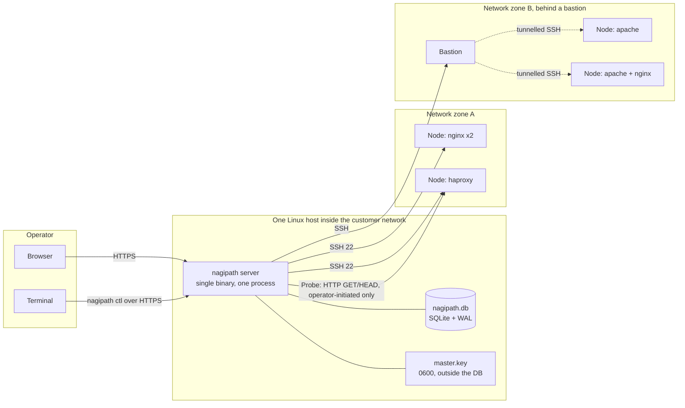
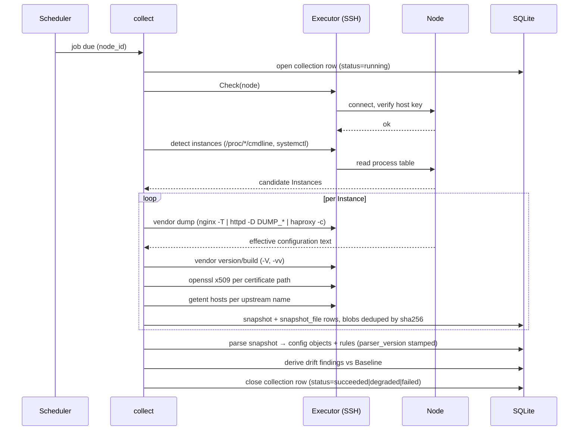
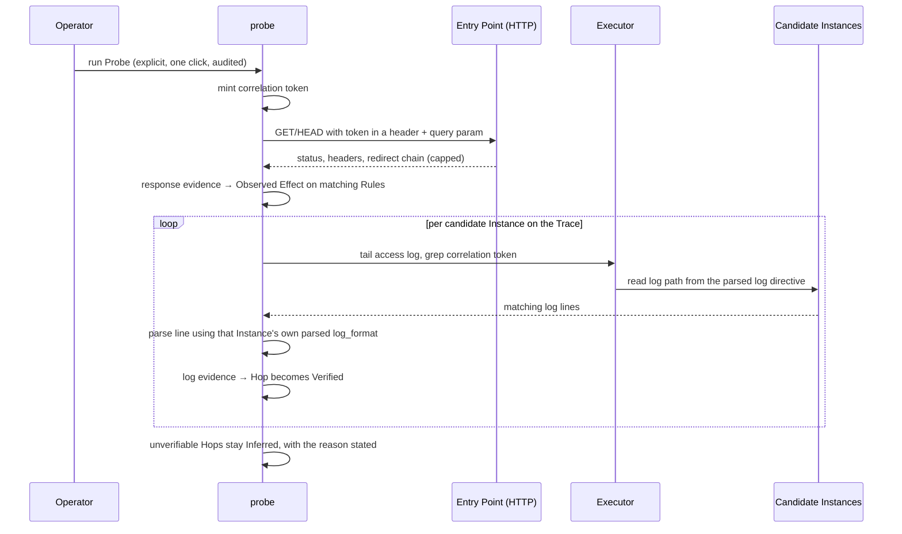

# System Architecture

**Scope:** the runtime shape of nagipath v1 — process model, package layout, data flow, concurrency, and where every byte lives.
**Vocabulary:** [CONTEXT.md](../../CONTEXT.md). **Decisions and reasoning:** [docs/adr/](../adr/).
**Companion documents:** [customer_deployment.md](customer_deployment.md) (how it gets installed), [release_and_demo.md](release_and_demo.md) (our own GCP infrastructure), [test_lab.md](test_lab.md) (the lab that keeps the parsers honest), [../backend/schema.md](../backend/schema.md) (the tables).

---

## 1. A note on the shape of this document

Most architecture documents for a new product answer "which cloud, which managed database, how does it autoscale". nagipath answers none of those, deliberately.

nagipath is a **single Go binary with an embedded datastore that runs inside the customer's own network**, because a control plane in our cloud cannot open an SSH connection to a host in a segmented enterprise network — a connector gets installed either way, so the cloud tier buys nothing and costs the entire deployment story (ADR-0001). There is no load balancer, no auto-scaling group, no read replica, no Redis, no CDN and no object store, because there is one process and one file.

GCP is real, but it hosts **our** infrastructure, not the product: build and release, artifact signing, the hosted demo, the docs site. That lives in [release_and_demo.md](release_and_demo.md).

Scalability is therefore a **vertical, single-process** question — how many Nodes can one process collect from on a schedule — and it is answered in §9 with bounded worker pools and measured benchmarks, not with horizontal scaling.

---

## 2. Deployment topology



Everything in the middle box is what the customer installs: one executable, one database file, one key file. Backup is copying two files while the process is stopped, or `VACUUM INTO` while it runs.

**The one-host reachability assumption.** v1 requires a single host that can reach every Node over SSH. When a design partner's segmentation makes that impossible, the answer is an outbound-connecting execution gateway per zone — deliberately not built, with the trigger recorded in [OPEN-DECISIONS](../OPEN-DECISIONS.md). The `Executor` interface (§5) exists so that gateway is a second implementation rather than a rewrite.

---

## 3. Process model

One binary, subcommands:

| Command | Purpose |
|---|---|
| `nagipath server` | The control plane: HTTP listener, scheduler, executor pool. The only long-running mode. |
| `nagipath ctl <...>` | CLI client. Talks to `server` over the same HTTP API the UI uses, with an API token. It is a client, never a second path into the database. |
| `nagipath migrate` | Apply schema migrations and exit. Runs automatically on `server` start; exposed separately for operators who want it as a distinct step. |
| `nagipath keygen` | Generate a Master Key file with `0600` permissions. Does nothing else, so it can be run before anything is configured. |
| `nagipath license show` | Print the parsed license and entitlement state. Works offline, works without the database. |
| `nagipath version` | Version, commit, build date, parser version. |

`nagipath ctl` being an HTTP client rather than a direct SQLite reader matters: two processes writing one SQLite file is the classic way to get `SQLITE_BUSY` under load, and every permission check and audit event lives in the server. The CLI gets no privileged shortcut.

Configuration is **flags and environment variables only** — no config file. Every value has a defensible default; the only two required inputs are the Master Key path and the listen address. This keeps the process stateless apart from its two files and is one of the five doors ADR-0001 left open.

```
NAGIPATH_LISTEN            default 127.0.0.1:8443
NAGIPATH_MASTER_KEY_FILE   required unless NAGIPATH_MASTER_KEY is set
NAGIPATH_MASTER_KEY        raw key, for container/secret-manager injection
NAGIPATH_DB                default ./nagipath.db
NAGIPATH_TLS_CERT/_KEY     optional; if unset, serves HTTP and logs a loud warning
NAGIPATH_LICENSE_FILE      default ./nagipath.license
NAGIPATH_DEMO_MODE         disables Collection and Probe entirely; used only by the hosted demo
NAGIPATH_SSH_WORKERS       default 8
NAGIPATH_LOG_LEVEL         default info
```

---

## 4. Package layout

```
cmd/nagipath/            main; subcommand dispatch only, no logic
internal/
  server/                HTTP server, routing, middleware, handlers
  web/                   templates/ static/ embed.FS — the entire UI
  api/                   request/response types shared by handlers and ctl
  cli/                   nagipath ctl commands, HTTP client
  store/                 migrations/, queries/ (sqlc input), generated code, blob store
  crypto/                Master Key loading, AEAD seal/open for Credentials
  license/               ed25519 verification, entitlement evaluation
  exec/                  Executor interface; ssh/ implementation; bastion dialling
  collect/               Collection orchestration: detect → dump → capture → store
  adapter/               per-Vendor behaviour behind one interface
    nginx/ apache/ haproxy/
  parse/                 position-preserving CST parsers, one per Vendor
    nginx/ apache/ haproxy/
  model/                 domain types: Trace, Hop, Rule, ActionClass, Provenance…
  topology/              Config Objects → Listener/Site/Route/Upstream graph
  trace/                 Trace engine, per-Vendor route precedence
  probe/                 Probe execution, access-log correlation
  drift/                 diff engine, Baseline selection, ignore rules
  certs/                 certificate metadata parsing, fingerprint identity
  sched/                 in-process scheduler, worker pool
  audit/                 audit event writing
```

The dependency rule is one-directional: `server` → domain packages → `store`. `store` imports nothing from the domain; the domain never imports `server`. `model` imports nothing internal at all, so parsers and the trace engine can be tested with no database.

**`adapter` versus `parse`.** `parse` turns bytes into a CST and knows nothing about SSH. `adapter` knows which commands to run on a Node, how to interpret their output, and where the access log lives. Splitting them is what makes the parsers unit-testable against fixture files checked into the repo — the single most valuable testing property in the whole system, given that parser fidelity is the top risk.

**The Collector/Parser interface split that was declined.** A first-class abstraction over "where configuration comes from" would make an API-based collector (PingAccess admin REST) a peer of SSH. It was considered for v1 and declined as speculative; it is recorded as a known refactor in [OPEN-DECISIONS](../OPEN-DECISIONS.md), not forgotten.

---

## 5. The Executor interface

The single deliberate abstraction with one implementation. Justified because it is the seam for both deferred transports (execution gateway, WinRM for IIS) and because it is what makes the collection pipeline testable without a network.

```go
// internal/exec
type Executor interface {
    // Run executes a single command on a Node and returns its output.
    // The command is a fixed, parameterised template from a closed allowlist —
    // never a string assembled from user input.
    Run(ctx context.Context, node NodeRef, cmd Command) (Result, error)

    // ReadFile fetches a single file's bytes. Separate from Run because size
    // limits, binary detection and PRIVATE KEY stripping apply here and only here.
    ReadFile(ctx context.Context, node NodeRef, path string, limit int64) ([]byte, error)

    // Probe returns the transport's view of the Node, for the connectivity check
    // on the Add Node screen: reachable, authenticated, host key state, sudo state.
    Check(ctx context.Context, node NodeRef) (Reachability, error)
}

type Command struct {
    ID      CommandID // enum: CmdNginxDumpConfig, CmdHttpdDumpVhosts, CmdGetentHosts, …
    Args    []string  // validated per CommandID
    Sudo    bool
    Timeout time.Duration
}
```

`CommandID` being an enum rather than a free string is the injection boundary: there is no code path from an HTTP request to an arbitrary remote shell command. Adding a command means adding a constant and its argument validator, which is a reviewable diff.

The SSH implementation uses `golang.org/x/crypto/ssh` in-process, because Credentials are entered in the UI and stored encrypted — shelling out to the system `ssh` client would mean materialising private keys to disk on every connection, defeating the encryption entirely (ADR-0011). Bastions work by dialling the bastion, then tunnelling a second `ssh.Client` through the resulting connection, which supports multiple hops by repetition.

Host key verification uses a `HostKeyCallback` backed by the `host_key` table. An unknown key **fails the connection** and records a pending approval row. There is no trust-on-first-use path, not even a flag.

---

## 6. Data flow

### 6.1 Collection



Parsing happens **in the same transaction-adjacent step as capture, but from the stored Snapshot, not from the wire** — the Snapshot is written first and parsing reads it back. That ordering means a parser panic loses no data, and a parser upgrade can re-derive everything from what is already on disk (ADR-0012).

Degraded collection is a first-class outcome, not an error: when the vendor dump command is unavailable or `sudo` is not granted, the adapter falls back to reading the main config file and following `include` directives itself. The Snapshot is stamped `degraded` with a reason, and every screen that displays derived data from it carries a visible badge. Silently guessing is the one behaviour that is never acceptable, because a confidently wrong Trace is worse than no Trace.

### 6.2 Trace

The Trace engine reads only from the database — the latest non-degraded Snapshot per Instance — and never touches the network. That is what makes it fast, reproducible, and testable from fixtures.

```
Entry Point (hostname + path)
   └─ candidate Listeners matching port/TLS across all Instances
        └─ Site selection by server_name / ServerName+ServerAlias / HAProxy acl
             └─ Route selection by Vendor precedence (see product/request_path_trace.md)
                  └─ Rules in scope, ordered, with Action Class
                       └─ Upstream → Upstream Members
                            ├─ member resolves (via dns_resolution) to a managed Instance → next Hop
                            └─ otherwise → External Hop, terminal, with a stated reason
```

Every Hop is written with confidence `inferred`. Nothing in the collection or trace path can produce `verified`; only the Probe correlation path (§6.3) can promote a Hop, and only with a stored evidence row to point at.

### 6.3 Probe and verification



The loop closes on itself: we can read the customer's access logs because we already parsed their `log_format`. Per-Vendor limits (NGINX's stock `combined` format carries neither `$server_name` nor `$upstream_addr`) are detected and reported as an instruction, never worked around by inference.

---

## 7. Storage

### 7.1 SQLite, concretely

| Concern | Choice |
|---|---|
| Driver | `modernc.org/sqlite` — pure Go, no cgo, so the binary cross-compiles and is genuinely static. Slower than the cgo driver; irrelevant against SSH round-trip latency. Includes FTS5. |
| Journal | `PRAGMA journal_mode=WAL` — concurrent readers during a write-heavy Collection. |
| Sync | `PRAGMA synchronous=NORMAL`, safe under WAL and materially faster on the write-amplifying Collection path. |
| Locking | `PRAGMA busy_timeout=10000`. |
| Integrity | `PRAGMA foreign_keys=ON`. All tables `STRICT` — SQLite's type affinity silently storing `'abc'` in an `INTEGER` column is not a debugging session anyone should have. |
| Connections | **Two pools.** Writer: `MaxOpenConns(1)`, so writes serialise in Go rather than colliding as `SQLITE_BUSY`. Reader: `MaxOpenConns(runtime.NumCPU())`. |
| Queries | `sqlc` — SQL in `.sql` files, generated typed Go. No ORM, no query builder, no reflection. |
| Migrations | Numbered, forward-only, embedded, applied in one transaction at startup. No down-migrations: the rollback story is restoring the file you copied. |
| Search | FTS5 over Rule text and over the **current** Snapshot per Instance only. Indexing all history would multiply the index by retention depth for no v1 use case; rows are dropped from the index when a Snapshot is superseded. |

### 7.2 Blobs

Snapshot file contents are zstd-compressed (`klauspost/compress`, pure Go) and stored in a `blob` table keyed by `sha256`, with `snapshot_file` rows referencing that key. Configuration files barely change between Collections, so content-addressed dedup means an hourly schedule over a year costs roughly one copy of the fleet's configuration rather than 8,760.

Consequence, recorded here because it is easy to get wrong: **retention deletion must delete `snapshot_file` rows and then garbage-collect unreferenced blobs**, not delete blobs directly. See [schema.md §12](../backend/schema.md).

### 7.3 What is never stored

- **Private key material.** Certificate metadata is extracted on the target Node with `openssl x509`; key bytes never cross the SSH connection. Where `openssl` is absent, `PRIVATE KEY` blocks are stripped in memory in `Executor.ReadFile` before any buffer is handed onward. Snapshots contain configuration files only — never certificate or key files (ADR-0009). HAProxy's Combined PEM convention is precisely why this is enforced at the transport layer rather than left to each adapter.
- **Node passwords.** Key and SSH-certificate authentication only.
- **Customer configuration in the hosted demo.** Demo mode hard-disables Collection by flag.

---

## 8. HTTP layer

Server-rendered `html/template` plus htmx, compiled in via `embed.FS`, JavaScript only for the Trace graph (ADR-0013). Middleware chain, outermost first:

1. **Recovery** — panic to 500, logged with a request ID, never a stack trace to the client.
2. **Request ID and structured logging** (`log/slog`).
3. **Security headers** — `Content-Security-Policy` with no `unsafe-inline`, `X-Frame-Options: DENY`, `Referrer-Policy: no-referrer`, HSTS when TLS is on.
4. **Session or API token authentication** — `Secure`, `HttpOnly`, `SameSite=Strict` cookies for the UI; bearer tokens for `ctl`.
5. **CSRF** — token on every mutating form, including htmx requests.
6. **Authorization** — one chokepoint function, `authz.Can(user, action, target)`. Every handler calls it; nothing consults `user.Role` directly. That single-chokepoint discipline is what makes Application-scoped RBAC in v1.1 a filter in one place instead of an audit of every query.
7. **Audit** — mutating and sensitive-read actions write an `audit_event` row in the same transaction as their effect.

The same handlers serve HTML and JSON, selected by `Accept`, so `nagipath ctl` and the UI cannot drift apart.

---

## 9. Concurrency and scale

The scheduler is in-process: a table of `job` rows with `next_run_at`, a tick that claims due jobs, and a bounded worker pool. Jitter is applied per job so that 400 Nodes on an hourly interval do not all fire at `:00`. Jobs are idempotent — a duplicate Collection produces an extra Snapshot, never corruption.

A `leased_until` column exists and is written but never contended, because there is exactly one process. It is the door to a multi-instance control plane; the alternative was discovering later that every job needs a lease column and migrating a live table.

Bounds that actually matter:

| Bound | Default | Why |
|---|---|---|
| SSH worker pool | 8 | Each worker holds one SSH connection and one decompression buffer. The limit is the operator's network and the Nodes' tolerance, not our CPU. |
| Per-Node concurrency | 1 | Never two simultaneous Collections against one Node. Prevents a slow Node from being hammered by a backlog. |
| Command timeout | 30 s (`nginx -T` on a large fleet member can be slow) | A hung command must not hold a worker forever. |
| `ReadFile` size cap | 8 MiB | A `curl`-generated 2 GB "config file" must not OOM the process. |
| Snapshot files per Instance | 2,000 | Runaway `include` globs exist. Exceeding the cap marks the Snapshot degraded rather than failing it. |
| Probe redirects | 5 | Redirect loops are common in exactly the misconfigured setups people probe. |

**Scale posture.** No public number is claimed. Validation is a local synthetic benchmark: cloned lab containers plus generated rows, measuring collection wall-clock at 50/200/1,000 Nodes, database growth per Collection per Node, and Trace latency against a fleet of 1,000 Instances. Network latency is deliberately excluded for now; the published figure, when there is one, will say so. See [test_lab.md](test_lab.md).

---

## 10. Failure modes and what the operator sees

| Failure | Behaviour |
|---|---|
| Master Key file missing or malformed | **Refuse to start.** Silently generating a new key is how a database becomes permanently undecryptable (ADR-0011). |
| Node unreachable | Collection row `failed` with the transport error; previous Snapshot untouched; `consecutive_failures` increments and surfaces on the Node row. Never deletes inventory because one Collection failed. |
| Host key unknown or changed | Connection refused, pending-approval row created, banner in the UI. A *changed* key is reported as a distinct and louder state than an unknown one. |
| `sudo` denied | Adapter falls back to direct file reads; Snapshot marked `degraded` with reason; the UI shows exactly which command was refused and the sudoers line that would fix it. |
| Vendor dump command fails to parse | Snapshot is still stored and searchable. Derived rows are absent, the Instance shows as unparsed with the raw output linked. Storing raw text unconditionally is what makes a parser bug recoverable rather than a data-loss event (ADR-0004). |
| Parser panic | Recovered per Instance. One bad Instance never aborts a fleet-wide Collection. |
| Disk full | Writes fail; the process stays up and serves reads. Retention and database size are surfaced on the settings page before this happens. |
| License expired or Node ceiling exceeded | Loud banner, API header, report entry. **Collection continues.** The tool going dark during a customer's incident is the one unrecoverable outcome (ADR-0014). |
| Clock skew between control plane and Nodes | Access-log correlation matches on the correlation token, not on timestamps, precisely so skew cannot break verification. |

---

## 11. Observability

Structured JSON logs via `log/slog` to stdout, with a request ID on HTTP paths and a collection ID on scheduler paths. An in-database ring of recent Collection outcomes drives the UI, so there is no dependency on log retention to answer "why did last night's run fail".

No Prometheus exporter in v1 and no telemetry of any kind — no phone-home, no usage analytics, no crash reporting. Air-gapped operation is a positioning commitment, and a product that argues against vendor-cloud dependency cannot quietly hold one. The diagnostics bundle (`nagipath ctl system diagnostics bundle`) is the support path: logs, schema version, parser version, row counts, redacted settings, and never a Credential, key, or configuration byte.

---

## 12. Technology choices, with the alternative that lost

| Choice | Alternative rejected | Reason |
|---|---|---|
| Go, single static binary | Anything needing a runtime | "Copy one file and run it" is the install story; it is also most of the differentiation against management planes that need their own cluster. |
| `modernc.org/sqlite` | `mattn/go-sqlite3` (cgo) | cgo breaks trivial cross-compilation and the static-binary promise. Performance is irrelevant next to SSH latency. |
| SQLite only | PostgreSQL | Its justification was HA plus multi-tenant SaaS; both left scope. Adding a required server, port, install step and DBA to a tool whose pitch is "copy one file" is a contradiction (ADR-0003). |
| `sqlc` | ORM, or `database/sql` by hand | The queries *are* the product — precedence-ordered Rules, drift diffs, trace walks. Typed SQL keeps them visible and reviewable; an ORM hides exactly the layer that needs scrutiny. |
| `html/template` + htmx | React/Vue SPA | Filterable tables and one graph do not justify a second toolchain and skillset for a solo part-time build (ADR-0013). |
| In-process `x/crypto/ssh` | Shelling out to `ssh` | UI-managed Credentials would have to be written to disk on every connection (ADR-0011). |
| Content-addressed zstd blobs in the DB | Files on disk beside the DB | Two things to back up, two things to keep consistent, and a directory to permission. One file with a query engine beats many files where we write the query engine (ADR-0003). |
| Vendor tooling as config authority | Our own include/conditional resolver | Reimplementing NGINX's and Apache's resolution semantics is an unwinnable fidelity race (ADR-0004). |

---

## 13. Explicit non-goals for v1

No writes to managed hosts. No agent. No execution gateway. No control-plane HA or clustering. No PostgreSQL. No SaaS tier. No LDAP/AD or SSO login. No Prometheus exporter, SIEM feed, GitOps or Ansible/Puppet execution — Ansible inventory **import** only. No network or CIDR scanning, ever (ADR-0002). No IIS or Windows. No telemetry.

Each has a reopening trigger in [OPEN-DECISIONS](../OPEN-DECISIONS.md). None is an oversight.
